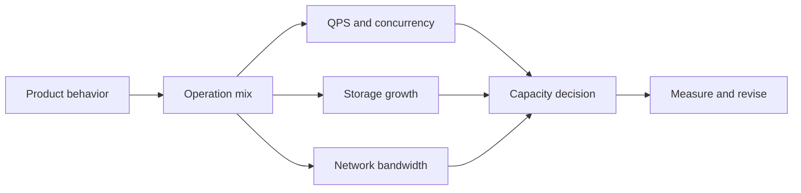
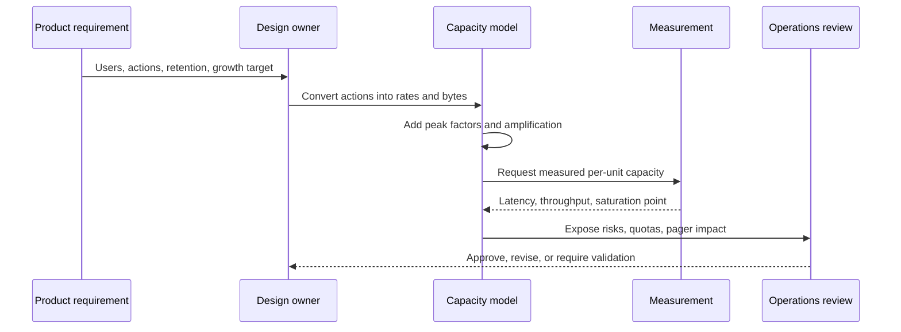
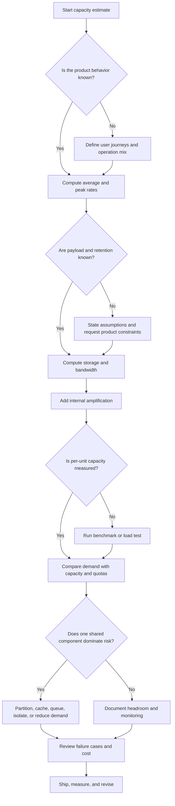

# Chapter 01 — Estimation and Capacity Modeling

TL;DR — Capacity modeling is not the art of guessing machine counts. It is the discipline of turning product behavior into explicit load, storage, bandwidth, growth, and failure assumptions so a design can be challenged before users challenge it for you. A good model says what is known, what is assumed, what must be measured, what would break first, and what decision follows. The numbers are less important than the chain of reasoning: users create events, events become operations, operations consume resources, resources meet limits, and limits force architecture choices.

## Mental model

An estimate is a map from user behavior to system pressure. Start with the product surface, identify the operations users perform, convert those operations into rates and bytes, account for amplification inside the system, then compare the resulting demand with measured capacity and operational constraints. The model is useful only if every number has a source: product requirement, historical measurement, benchmark, contract, or clearly labeled assumption.

The important habit is to keep logical demand separate from implementation capacity. "We expect 700 peak reads per second" is a workload statement. "One application instance can safely handle 140 reads per second" is a measured capacity statement. Combining them too early hides uncertainty and makes the design look more precise than it is.

## How it works

A capacity model follows a sequence of narrowing questions. First define the boundary: what system, user journey, region, tenant, operation, and time window are being estimated? A daily-active-user count is not enough; the system needs to know which operations those users perform and how often. Second, build the operation mix: reads, writes, uploads, searches, fanout, background jobs, retries, cache misses, index updates, replication, and administrative tasks. Third, convert the operation mix into rates, usually average and peak throughput for each path. Fourth, estimate bytes: request size, response size, stored record size, index overhead, replication, backups, retention, and compression if it is known. Fifth, connect rates to concurrency and latency. Little's Law gives a useful relationship for stable systems: average in-flight work is average throughput multiplied by average time in system. In design work, use that as a sanity check, not as proof that queues will behave well under bursty traffic.

The model then moves from first-order demand to amplification. A single user write might cause one database write, one cache invalidation, one message enqueue, three downstream notifications, and a search index update. A read might be cheap when cached and expensive when the cache is cold. A capacity model that counts only external API calls misses the internal pressure that usually breaks the design first.

Finally, the estimate becomes a decision. The decision might be "single primary database is enough for the first launch," "we need a separate search index," "we need queue-based ingestion," "we need a quota increase," or "we cannot promise this latency target with this dependency." The model should also name the measurement plan: what load test, production telemetry, or cost report will prove or disprove the assumption?

Keep the model alive after launch. Pre-launch estimates are hypotheses. Production traffic, billing data, saturation tests, and incident reviews are the feedback loop. A stale capacity model is worse than no model because it gives a design review the comfort of rigor without the discipline of measurement.

## Design Review Lens

- What problem is this actually solving? It turns vague scale requirements into testable engineering constraints: expected throughput, latency-sensitive paths, storage growth, bandwidth, dependency load, cost exposure, and failure headroom.
- What assumptions does it depend on (and when do they break)? It depends on the user mix, operation frequency, payload sizes, peak shape, cache hit rates, retry behavior, retention policy, and measured service capacity. These break when the product changes, a large tenant arrives, a client retries aggressively, caches go cold, data becomes skewed, or a dependency changes its limits.
- What breaks FIRST at 10x scale? Usually the first failure is not the number of servers. It is a shared bottleneck: database write throughput, hot partition, cache memory, search indexing lag, queue backlog, connection pool exhaustion, a cloud quota, or on-call inability to distinguish normal growth from an incident.
- What breaks FIRST at 100x scale? The architecture boundary breaks. Data placement, ownership, regionality, cost allocation, operational tooling, and team structure become part of the system. A single global database, one shared queue, one platform team approving every scaling change, or one spreadsheet of capacity assumptions will not keep up.
- How would Netflix vs Amazon vs a 5-person startup each approach this differently, and why? Netflix-scale consumer streaming would model by viewing session, region, device, content popularity, edge capacity, and failure isolation because user experience and traffic shape dominate. Amazon-scale commerce would model by tenant or marketplace, order-critical paths, dependency isolation, seasonal peaks, and strict operational ownership because correctness and peak events dominate. A 5-person startup should model the top few user journeys, obvious storage growth, and the first paid cloud limits, then validate with simple load tests because speed of learning matters more than exhaustive modeling.

## Variants / approaches

| Approach | Strengths | Costs |
|---|---|---|
| Back-of-the-envelope model | Fast, good for interviews and early design reviews, exposes missing assumptions quickly. | Easy to over-trust; weak on skew, burstiness, and internal amplification unless carefully called out. |
| Product-funnel model | Ties capacity to user journeys, activation, retention, and tenant behavior. | Requires product data that may not exist before launch; can miss backend maintenance and background jobs. |
| Trace-derived model | Uses production telemetry to quantify operation mix, fanout, and dependency cost. | Only available after traffic exists; biased toward current behavior and can hide future product shifts. |
| Benchmark-calibrated model | Converts workload estimates into instance counts, partition counts, and headroom using measured capacity. | Benchmarks are expensive to run well and can mislead if traffic, data, or cache state is unrealistic. |
| Queueing or simulation model | Useful when burstiness, queues, or concurrency limits dominate. | More complex; requires careful validation and can give precise-looking wrong answers. |
| Cost model | Connects traffic, storage, bandwidth, and retention to unit economics. | Can optimize for spend before correctness and operability are understood. |

The best teams combine approaches. Early in a project, a back-of-the-envelope model is enough to find the dangerous unknowns. Before launch, benchmark calibration and quota review matter. After launch, trace-derived and cost models should replace guesses.

## Worked example (with capacity model)

Scenario: a collaborative notes service for small teams. Users create text notes, read notes, search their workspace, and occasionally upload image attachments. This is a hypothetical product scenario for modeling practice; the numbers below are planning assumptions, not benchmark claims.

Assumptions:

| Input | Assumption | Basis |
|---|---:|---|
| Registered users | 2,000,000 | Product launch target |
| Daily active users | 25% of registered = 500,000 | Product assumption |
| Reads per daily active user | 20 note reads per day | Product assumption |
| Writes per daily active user | 4 note creates or edits per day | Product assumption |
| Searches per daily active user | 1 search per day | Product assumption |
| Attachment upload rate | 0.2 uploads per daily active user per day | Product assumption |
| Average compressed note response | 8 KB | Payload assumption |
| Average note write request | 6 KB | Payload assumption |
| Average search response | 12 KB | Payload assumption |
| Average attachment size | 2 MB | Product constraint |
| Read latency target | 200 ms | Example product/SLO target for concurrency sanity check |
| Peak factor | 5x daily average for interactive API calls | Planning assumption until measured |
| Attachment peak factor | 8x daily average | Planning assumption because uploads are burstier |
| Growth | 10% user growth per quarter | Business forecast assumption |

QPS estimate:

Daily reads = 500,000 daily active users * 20 reads = 10,000,000 reads/day.

Average read throughput = 10,000,000 / 86,400 seconds = 115.7 reads/second.

Peak read throughput = 115.7 * 5 = 578.5 reads/second, rounded up to 580 reads/second.

Daily writes = 500,000 * 4 = 2,000,000 writes/day.

Average write throughput = 2,000,000 / 86,400 = 23.1 writes/second.

Peak write throughput = 23.1 * 5 = 115.5 writes/second, rounded up to 116 writes/second.

Daily searches = 500,000 * 1 = 500,000 searches/day.

Average search throughput = 500,000 / 86,400 = 5.8 searches/second.

Peak search throughput = 5.8 * 5 = 29 searches/second.

Daily attachment uploads = 500,000 * 0.2 = 100,000 uploads/day.

Average attachment upload throughput = 100,000 / 86,400 = 1.16 uploads/second.

Peak attachment upload throughput = 1.16 * 8 = 9.3 uploads/second.

Total average interactive API throughput excluding attachment object transfer = 115.7 + 23.1 + 5.8 = 144.6 requests/second, rounded up to 145 requests/second.

Total peak interactive API throughput excluding attachment object transfer = 580 + 116 + 29 = 725 requests/second.

Concurrency sanity check:

If the target end-to-end latency for note reads is 200 ms, and peak read throughput is 580 reads/second, then average in-flight read requests at that target are approximately 580 * 0.2 seconds = 116 concurrent reads. This does not prove the system can handle the load; it tells the reviewer that thread pools, connection pools, and downstream limits must be sized and measured against at least this concurrency level, with headroom.

Storage estimate:

Each note write stores 6 KB of content plus an assumed 2 KB of metadata, for 8 KB of logical primary data per write.

Daily note primary data = 2,000,000 writes * 8 KB = 16,000,000 KB = 16 GB/day using decimal units.

Assume indexes, version metadata, and internal storage overhead add 2x the primary note data. This is a planning assumption to be replaced with measurement from the chosen database.

Daily note storage with overhead = 16 GB/day * 2 = 32 GB/day.

Daily attachment data = 100,000 uploads * 2 MB = 200,000 MB = 200 GB/day.

Daily logical storage growth = 32 GB note data and indexes + 200 GB attachments = 232 GB/day.

One-year logical storage growth = 232 GB/day * 365 = 84,680 GB = 84.7 TB.

If the storage architecture keeps three physical copies for durability, physical storage for one year of retained data is 84.7 TB * 3 = 254.1 TB before backups, snapshots, compaction overhead, or lifecycle tiering. The model should keep logical and physical storage separate because product retention decisions operate on logical data while infrastructure cost often follows physical copies.

Network and bandwidth estimate:

Read response egress = 10,000,000 reads/day * 8 KB = 80,000,000 KB = 80 GB/day.

Write request ingress = 2,000,000 writes/day * 6 KB = 12,000,000 KB = 12 GB/day.

Search response egress = 500,000 searches/day * 12 KB = 6,000,000 KB = 6 GB/day.

Attachment upload ingress = 100,000 uploads/day * 2 MB = 200,000 MB = 200 GB/day.

Assume attachment downloads average 0.5 downloads per daily active user per day. Daily attachment download egress = 500,000 * 0.5 * 2 MB = 500,000 MB = 500 GB/day.

Total external transfer = 80 GB + 12 GB + 6 GB + 200 GB + 500 GB = 798 GB/day.

Average external bandwidth = 798 GB/day / 86,400 seconds = 0.00924 GB/second = 9.24 MB/second.

Peak external bandwidth using the higher attachment peak factor as a conservative planning simplification = 9.24 MB/second * 8 = 73.9 MB/second. This simplification is intentionally conservative for early planning; later models should separate API JSON traffic, object upload traffic, and object download traffic because they use different infrastructure.

Internal amplification:

Assume each write also enqueues one indexing event and invalidates one cache key. Daily queue messages = 2,000,000 writes/day. Average enqueue rate = 2,000,000 / 86,400 = 23.1 messages/second. Peak enqueue rate = 23.1 * 5 = 115.5 messages/second, rounded up to 116 messages/second.

Assume 80% of note reads are served by an application or database cache after launch. This is a product and architecture assumption, not a guarantee. Database read demand from cache misses = 10,000,000 reads/day * 20% = 2,000,000 database reads/day. Average database read throughput = 2,000,000 / 86,400 = 23.1 reads/second. Peak database read throughput = 23.1 * 5 = 115.5 reads/second, rounded up to 116 reads/second. During cold cache or cache outage, the database read path may need to absorb the full 580 peak reads/second, so the failure model must decide whether to provision for that, shed load, or degrade reads.

Growth projection:

Business forecast assumes 10% user growth per quarter. One-year multiplier = 1.10 * 1.10 * 1.10 * 1.10 = 1.4641.

After one year, daily active users = 500,000 * 1.4641 = 732,050.

After one year, peak interactive API throughput = 725 requests/second * 1.4641 = 1,061.5 requests/second, rounded up to 1,062 requests/second.

After one year, daily logical storage growth = 232 GB/day * 1.4641 = 339.5 GB/day.

If growth is linear between today's 232 GB/day and next year's 339.5 GB/day, average daily growth during the year is (232 + 339.5) / 2 = 285.75 GB/day. Additional logical data during that year = 285.75 * 365 = 104,299 GB = 104.3 TB. With three physical copies, that year's physical storage addition is 104.3 TB * 3 = 312.9 TB before backups.

Decision from the model:

The first launch does not require exotic traffic handling for the API path, but it does require attention to storage lifecycle, object bandwidth, cache failure behavior, search indexing lag, and measured database capacity. The model also identifies what must be tested: peak read latency at about 580 reads/second today and 1,062 reads/second after a year, write plus indexing behavior around 116 writes/second today, and cold-cache database behavior if the cache miss assumption fails.

## Failure Walkthrough

Single node failure: If the service is stateless at the application tier and provisioned with N+1 headroom, users may see a few failed or slow requests while load balancers stop routing to the node. Detection comes from health checks, instance metrics, and error-rate alerts. Recovery is replacement or restart by the scheduler, followed by traffic rebalancing and cache warmup. RTO is usually bounded by detection plus replacement time. RPO is not relevant for stateless nodes; if the failed node held unflushed writes or local-only cache state, the design has already violated the model's durability assumptions.

Network partition: Users on one side of the partition may see timeouts, stale reads, failed writes, or partial feature loss depending on which dependencies are reachable. Detection comes from asymmetric error rates, failed health checks, missing heartbeats, and dependency-specific latency alerts. Recovery may involve routing around the affected zone, failing closed for writes, entering read-only mode, or isolating the partitioned dependency until consistency can be restored. RPO depends on whether writes were accepted during the partition and how they were replicated. RTO depends on traffic shifting and reconciliation time, not just link repair.

Full regional failure: If the system is single-region, users see a regional or global outage. The capacity model should make that explicit rather than hiding it behind average QPS. Detection comes from regional synthetic checks, control-plane alerts, traffic loss, and dependency alarms. Recovery is DNS or load-balancer failover, restore from backup, or activation of a warm standby depending on the architecture. RPO is the amount of acknowledged data not present in the recovery region. RTO is the time to route traffic, restore dependencies, warm caches, and verify correctness. A useful capacity model asks whether the surviving region can absorb peak traffic, not merely average traffic.

Critical dependency outage: If the database, cache, queue, identity provider, search service, or object store fails, users see feature-specific degradation: failed writes, slower reads, missing search results, login failures, or delayed background work. Detection comes from dependency SLOs, saturation signals, error budgets, queue depth, and request traces. Recovery may be failover, bypass, cached reads, read-only mode, queued writes, degraded responses, or load shedding. RPO depends on whether writes were durably accepted before the dependency failed. RTO depends on how quickly the service can stop waiting on the dependency and enter a planned degraded mode.

Data corruption / poison data: Users may see wrong results, repeated crashes on a specific object, search results that cannot be opened, or background jobs that retry forever. Detection comes from validation errors, unusual retry patterns, dead-letter queues, canary reads, checksum mismatches, support reports, and data-quality monitors. Recovery is to quarantine the bad record or batch, stop the writer if corruption is ongoing, replay from a clean source, restore from backup, or rebuild derived data such as indexes. RPO is the gap between the last known-good state and the recovery point. RTO includes diagnosis, blast-radius assessment, and safe reprocessing, which often dominates restore time.

## Decision Framework

Use this tree when the design question feels too large. It forces the conversation back to the missing link in the chain: product behavior, bytes, amplification, measured capacity, shared bottleneck, or operating plan.

## Tradeoffs & alternatives

Main recommendation: use an explicit, assumption-driven capacity model and revise it with measurement.

WHY use it: It exposes the reasoning behind architecture choices. It lets reviewers challenge assumptions directly instead of arguing about vague scale words. It connects product requirements to engineering limits, cloud quotas, cost, reliability, and migration timing.

What it COSTS: It takes time, and it can create false confidence if reviewers treat assumptions as facts. It also requires coordination across product, application teams, infrastructure, finance, and SRE. The model must be maintained as product behavior changes.

ALTERNATIVES: You can rely on production telemetry from an existing system, run load tests without a written model, scale reactively through autoscaling, or use managed services with generous limits. These alternatives are useful, but they do not remove the need to understand workload shape. Autoscaling does not fix hot keys, quota ceilings, cold caches, runaway retries, or storage retention surprises.

WHEN NOT to use it: Do not overbuild a detailed capacity model for a throwaway prototype, a feature with no meaningful traffic or storage risk, or a system whose limits are already dominated by a fixed external contract. In those cases, write down the few constraints that matter, measure after launch, and spend the saved effort on faster feedback.

## Staff & Principal lens

Capacity modeling is an organizational interface. It tells product what growth assumptions mean, tells finance what demand costs, tells platform teams what limits are being approached, tells SRE what will page, and tells application teams where ownership boundaries sit. A Staff engineer should make those boundaries explicit: who owns the model, who updates it after product changes, who approves peak factors, who files quota requests, and who decides that degradation is acceptable.

Operational burden is the part most early designs hide. If the model assumes 80% cache hits, the team that owns the cache now owns a capacity dependency. If the model assumes queue buffering during dependency outage, someone owns queue depth alerts, replay tools, dead-letter handling, and poison-message recovery. If the model assumes failover to another region, someone owns regular failover tests and the cost of idle or warm capacity. The pager follows the assumption.

Cost governance should be built into the model before cost becomes an incident. Storage retention, object transfer, cross-region replication, logs, traces, and idle failover capacity can grow faster than request QPS. A Principal engineer should ask for unit economics: cost per active user, cost per write, cost per GB retained, and cost per region. These are not finance-only questions; they shape architecture.

Maintainability matters because capacity models decay. A model embedded in one launch document is useful once. A model tied to dashboards, load tests, and release reviews becomes a living control. The migration lens is equally important: when the model says the database will need partitioning in 18 months, the question is not whether partitioning is theoretically possible. The question is when to introduce routing keys, tenant boundaries, backfill tooling, and operational ownership so the migration is not attempted during a growth emergency.

## Interview answer vs production reality

What interviewers expect to hear: Start with users, daily active users, requests per user, read/write ratio, average and peak QPS, storage per record, retention, bandwidth, and growth. State assumptions, do arithmetic out loud, then use the estimate to justify caching, databases, queues, sharding, or load balancing.

What actually happens in production: The first model is wrong in several places. Large tenants behave differently from average users. Background jobs compete with foreground traffic. Retries amplify outages. Cache misses are more expensive than expected. Storage overhead comes from indexes, versions, logs, backups, and derived data. Quotas and operational ownership can matter as much as raw machine capacity.

Simplifications that are fine in an interview but wrong in prod: It is fine to use a single peak factor, one average record size, and decimal arithmetic in an interview. In production, peak shape varies by region and operation, record size has a distribution, p95 and p99 latency matter, tenants are skewed, and every external dependency has its own limits. In an interview, "add cache" may be enough. In production, the question is what happens when the cache is cold, corrupt, full, partitioned, or suddenly much more expensive to miss.

## Common pitfalls & misconceptions

- Treating registered users as load. Users create load only through actions, clients, background work, and retries.
- Using average QPS as capacity. Average traffic hides peaks, bursts, batch jobs, and regional concentration.
- Forgetting internal amplification. One external request can trigger many database operations, events, cache writes, logs, metrics, and downstream calls.
- Ignoring payload size. A system with modest QPS can be network- or storage-heavy if objects are large.
- Mixing logical and physical storage. Product retention is usually logical; infrastructure cost includes replicas, backups, indexes, logs, and compaction overhead.
- Assuming cache hit rate is a fact. Cache hit rate is an observed property under a specific workload and failure state.
- Sizing for steady state only. Deploys, node loss, regional failover, cold start, and dependency outages change the effective capacity requirement.
- Presenting fake precision. "725 peak requests per second under stated assumptions" is honest. "We need exactly five servers" is not honest unless measured capacity and headroom policy are stated.
- Forgetting humans. If only one person understands the model, the organization does not have capacity planning; it has a private spreadsheet.

## Interview questions

Mid: A product manager says a new service will have 1 million users. How do you estimate QPS?

MODEL answer: I would not start from registered users alone. I would ask for daily active users, operations per active user, read/write mix, and peak factor. If 20% are daily active, that is 200,000 daily active users. If each performs 10 reads and 2 writes per day, reads are 2,000,000/day and writes are 400,000/day. Average read QPS is 2,000,000 / 86,400 = 23.1, and average write QPS is 400,000 / 86,400 = 4.6. If we assume a 5x peak until measured, peak reads are about 116 QPS and peak writes about 23 QPS. I would label the 20%, operation counts, and 5x peak as assumptions.

Senior: Your estimate says the service has only 700 peak QPS. Why might it still fail?

MODEL answer: External QPS can be small while internal pressure is large. Each request may fan out to multiple database queries, cache calls, search requests, queue messages, logs, and downstream services. The load may be concentrated on one tenant or hot key. Payloads may be large, making bandwidth or memory the bottleneck. Retries can multiply traffic during dependency failures. The service may also hit connection pool limits, cloud quotas, storage growth, or cold-cache behavior before it hits CPU limits.

Staff: How would you introduce capacity modeling across several teams without turning it into bureaucracy?

MODEL answer: I would standardize a lightweight model template: operation mix, average and peak rates, storage, bandwidth, amplification, measured capacity, quotas, failure headroom, and cost drivers. Each service team owns its model, while platform or SRE provides review patterns, dashboards, and load-test support. I would tie updates to meaningful events: launch reviews, large tenant onboarding, quarterly planning, major architecture changes, and incidents. The goal is not central approval for every change; it is shared language, visible assumptions, and early discovery of cross-team risks.

Principal: A fast-growing product will outgrow its single-region database in the next year. How do you use the capacity model to drive the migration?

MODEL answer: I would first separate the growth drivers: write throughput, read throughput, storage, hot tenants, retention, and regional latency. Then I would identify the architectural decision that must happen before the limit is reached: partitioning, read replicas, archival, multi-region replication, or a different data model. The model should define migration triggers such as sustained write load, storage growth, failover risk, or cost per user. Organizationally, I would assign ownership for routing keys, backfill tools, dual writes or change streams, validation, rollback, and on-call readiness. Cost and operational burden matter: a theoretically scalable design that triples storage or creates an unstaffed pager problem is not a complete migration plan.

## Connections

Prerequisites: None. This chapter establishes the estimation vocabulary used by the rest of the handbook.

Related chapters: [Chapter 02 - Performance vs Scalability, Latency vs Throughput](../chapter-02-performance-vs-scalability-latency-vs-throughput/), [Chapter 03 - Availability and the Nines](../chapter-03-availability-and-the-nines/), [Chapter 15 - Caching: Where to Cache](../chapter-15-caching-where-to-cache/), [Chapter 24 - Sharding and Partitioning](../chapter-24-sharding-and-partitioning/), [Chapter 31 - Backpressure and Load Shedding](../chapter-31-backpressure-and-load-shedding/), [Chapter 52 - FinOps and Cloud Economics](../chapter-52-finops-and-cloud-economics/).

Builds toward: [Chapter 26 - Design Walkthrough: URL Shortener](../chapter-26-design-walkthrough-url-shortener/), [Chapter 64 - Design Walkthrough: Rate-Limited Public API](../chapter-64-design-walkthrough-rate-limited-public-api/), [Chapter 68 - Design Walkthrough: Scaling to Millions of Users](../chapter-68-design-walkthrough-scaling-to-millions-of-users/), and every later chapter that uses QPS, storage, bandwidth, growth, or failure headroom as input.

## Further reading

- John D. C. Little, ["A Proof for the Queuing Formula: L = λW"](https://pubsonline.informs.org/doi/abs/10.1287/opre.9.3.383), Operations Research, 1961.
- Google SRE Book, ["Addressing Cascading Failures"](https://sre.google/sre-book/addressing-cascading-failures/).
- Google SRE Book, ["Launch Coordination Checklist"](https://sre.google/sre-book/launch-checklist/).
- AWS Well-Architected Framework, ["Reliability Pillar"](https://docs.aws.amazon.com/wellarchitected/latest/reliability-pillar/welcome.html).
