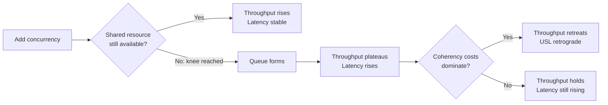
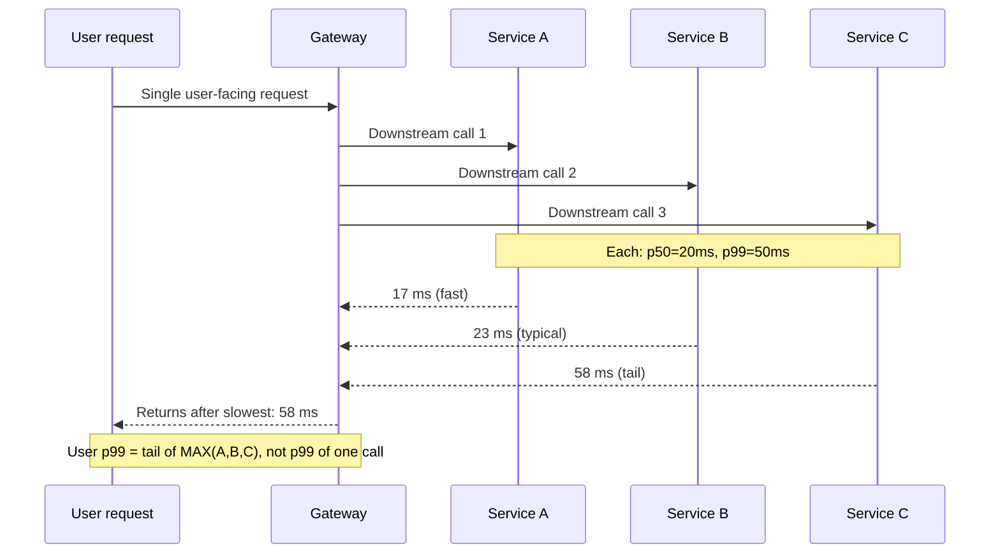
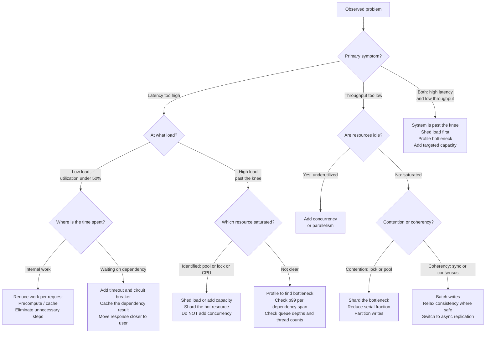

# Chapter 02 — Performance vs Scalability, Latency vs Throughput

TL;DR — Performance and scalability are not the same property, and fixing one does not fix the other. Latency is the elapsed time for one operation; throughput is the rate of completed operations. Adding concurrency raises throughput until a shared resource saturates, after which latency climbs, throughput plateaus, and eventually coherency costs cause throughput to go retrograde. The diagnostic skill is identifying which constraint is actually active: a latency problem at low load needs less work per request, a cache, or a shorter network path; a throughput problem needs more concurrency or reduced contention; high utilization with worsening latency means you are already past the knee, and adding concurrency at that point makes it worse. The right fix depends on which regime you are in — and measuring is the only way to know.

## Mental model

A system can be fast without being scalable, and scalable without being fast. These are independent properties that require different diagnoses and different fixes.

Latency and throughput both measure performance, but they respond differently to the same changes. Below a system's saturation point, adding concurrency raises throughput while latency stays near the per-request service time. At the saturation point — the knee of the curve — a shared resource is fully occupied and arriving requests begin to queue. Latency now includes queue wait in addition to service time. Above the saturation point, throughput plateaus while latency grows without bound under sustained load. At extreme concurrency, coherency costs — the overhead of coordinating shared state — can reduce throughput below its peak value. This is called retrograde throughput, and it means adding capacity can make a system slower if the bottleneck is synchronization rather than raw processing.

Latency and throughput are also not always adversarial. Batching is the canonical counterexample: grouping many small operations into one larger operation amortizes per-operation overhead, raising throughput at the cost of higher per-item latency. This is useful when a downstream resource is the bottleneck and individual item latency is not user-visible; it is harmful when a user is waiting synchronously for each item.

## How it works

### Little's Law as a steady-state sanity check

Little's Law states that in a stable system, the average number of requests in flight (L) equals the average arrival rate (λ) multiplied by the average time each request spends in the system (W): L = λW. This relationship holds for any stable queuing system regardless of arrival and service-time distributions, making it a robust check on whether measured concurrency, throughput, and latency are internally consistent. If you observe 400 in-flight requests and measure average end-to-end latency at 200 ms, the arrival rate consistent with those observations is 400 / 0.2 = 2,000 req/s. If measured throughput is only 1,400 req/s, the gap means either the system is not stable — the queue is growing — or the measurement windows do not align.

Little's Law does not predict what happens past saturation, because past saturation the system is not stable: arrival rate exceeds service rate and the queue grows without bound. Stability is a precondition, not a result, of applying the formula.

### The knee of the curve and queue formation

Below saturation, each request finds the shared resource available and starts immediately. Service time dominates latency, and throughput scales roughly with concurrency. At saturation, every unit of the shared resource is occupied. A new arriving request must wait for one to free. The wait time added to service time is the queue delay. As utilization approaches 100%, even small fluctuations in service time create queues that grow much faster than utilization — a consequence of basic queuing dynamics. This nonlinearity is why systems that run at 90% utilization experience far more tail latency than systems running at 70%, even though the throughput difference is small.

The practical implication is that planning for a shared resource at 100% of measured capacity means planning for unbounded latency at peak. A conservative heuristic — labeled as such — is that queuing effects become material at roughly 70–80% of theoretical capacity, where variance in service times begins to create visible queue delay. Systems should be provisioned and auto-scaled against that threshold, not against the theoretical maximum.

### Amdahl's Law and the serial fraction

Amdahl's Law (1967) quantifies the ceiling on throughput from parallelism. If a fraction S of the work is inherently serial and (1-S) can be parallelized across N workers, the maximum speedup relative to single-worker throughput is 1 / (S + (1-S)/N). As N grows large, speedup approaches 1/S. If 10% of work is serial (S = 0.10), the maximum achievable speedup is 10x regardless of how many processors are added.

Every global lock, every single-writer queue, every synchronous notification, and every sequential migration step is a serial fraction that caps scalability. The correct fix is not more hardware; it is reducing S through partitioning, pipelining, or async processing.

### The Universal Scalability Law and retrograde throughput

Neil Gunther extended Amdahl's model with the Universal Scalability Law (USL), which adds a second penalty term representing coherency cost — the work that nodes or threads must do to agree on shared state. USL models throughput X at concurrency N as:

X(N) = γN / (1 + α(N−1) + βN(N−1))

where γ is single-worker throughput, α is the contention penalty (analogous to Amdahl's serial fraction), and β is the coherency penalty. When β is non-zero, throughput does not merely plateau; it peaks and then retreats as N grows. This retrograde behavior has been observed in cache-coherent multiprocessors, distributed databases under cross-shard transactions, and consensus systems under heavy write load. It is the mechanism behind "adding more servers made things worse" incidents. The fix is to reduce β — fewer cross-node coordination points — not to add nodes.

### Tail latency and fan-out amplification

Latency should be reported in percentiles, not only averages. The p50 (median) describes typical behavior; the p95 and p99 describe the tail that real users experience. The p999 describes the slowest 0.1% of requests. Averages distort because a small number of very slow requests shift the mean far above the median without appearing in dashboards that only watch averages.

Fan-out amplification makes tail latency the central design concern for composite systems. When a single user-facing request triggers N independent downstream calls — to a database, a cache, a ranking service, and a search index — the request cannot complete until the slowest of those N calls returns. If each downstream call has p99 latency of 50 ms, the probability that any single call completes within 50 ms is 0.99. The probability that all 10 calls complete within 50 ms is 0.99^10 = 0.904, meaning approximately 9.6% of composite requests will exceed 50 ms even if every individual call is within its p99. The user-visible p99 is determined by the distribution of the maximum of many random variables, not by the p99 of any individual call. Dean and Barroso (CACM, 2013) show that at hyperscale, where fan-out depths of tens to hundreds of services are routine, even small improvements in individual leaf-service tail latency produce large improvements in composite response times — and that techniques like hedged requests (issuing a duplicate call to a second replica if the first does not respond within a threshold) are practical mitigations.

## Design Review Lens

- What problem is this actually solving? It gives designers a vocabulary to distinguish whether a system is too slow per request, cannot handle enough concurrent requests, or cannot scale when resources are added — and to choose the correct intervention for each.
- What assumptions does it depend on (and when do they break)? Amdahl's Law assumes the workload can be cleanly separated into serial and parallel fractions. USL assumes contention and coherency costs are stable fractions. Little's Law assumes a stable system. These break when workload composition changes mid-traffic (product launches, batch jobs mixing with interactive traffic), when the serial fraction is hidden in a dependency (a shared lock held by code outside the team's control), or when the system is genuinely unstable — the queue is growing faster than it drains.
- What breaks FIRST at 10x scale? The shared bottleneck that the original design tolerated. Most systems have one hot resource: the primary database's write path, a global session lock, a single-threaded event consumer, or one overloaded shard. At 10x, that resource saturates and tail latency degrades for everyone, while the rest of the system remains underutilized. The failure looks like "the database is slow" when the actual cause is that the design places all writes through one serialization point.
- What breaks FIRST at 100x scale? The assumption that load is homogeneous and average behavior is representative. At 100x, hot tenants, large objects, bursty uploads, and regional concentrations become the majority of traffic — not edge cases. A design that optimizes for average-request behavior breaks at 100x because the tail of the workload distribution is what the system must actually sustain.
- How would Netflix vs Amazon vs a 5-person startup each approach this differently, and why? Netflix-scale consumer streaming optimizes aggressively for p99 tail latency in the playback path, because buffering stalls are the user-visible symptom of tail degradation. They invest in hedged requests, bounded fan-out depth, and proactive load shedding. Amazon-scale commerce treats order-write paths as latency-critical and batch/reporting paths as throughput-optimized, with separate SLOs per path and explicit dependency contracts at boundaries. A 5-person startup should not optimize either metric before measuring; the first step is to instrument and find the actual bottleneck, because the wrong optimization wastes weeks on a constraint that is not actually binding.

## Variants / approaches

| Approach | Strengths | Costs |
|---|---|---|
| Reduce work per request | Directly lowers latency; survives load spikes without added infrastructure. | Requires understanding which work is avoidable; risks skipping correctness checks if done carelessly. |
| Cache results | Removes expensive computation or I/O from the request path; multiplies effective throughput. | Adds cache invalidation complexity; cold-start floods the downstream resource after any restart. |
| Move closer to the user | Reduces network round-trip latency; absorbs throughput at the edge or CDN layer. | Limited to cacheable or precomputable responses; consistency and personalization are hard. |
| Increase concurrency | Raises throughput when resources are underutilized. | Contention and coherency costs grow with N; past the knee, more concurrency raises latency without raising throughput. |
| Shard the bottleneck | Removes contention by distributing work; enables near-linear scaling of the hot resource. | Cross-shard operations become expensive; routing and rebalancing add operational complexity. |
| Async processing and queues | Decouples the write path from downstream processing; absorbs throughput spikes without shedding. | Adds latency to user-visible outcomes; requires idempotency and dead-letter handling. |
| Batching | Raises throughput by amortizing per-operation overhead. | Adds per-item latency up to the batch accumulation window; inappropriate when users wait synchronously. |
| Load shedding | Protects the system from overload; keeps the request path fast for accepted requests. | Rejected requests are errors; requires prioritization logic and explicit degradation contracts. |

## Worked example (with capacity model)

Scenario: a document search service in a single data center. Users issue search queries resolved with an in-memory index lookup followed by a database fetch for document metadata. This is a hypothetical scenario for reasoning practice; all numbers are planning assumptions unless otherwise noted.

**Assumptions**

| Input | Assumption | Basis |
|---|---:|---|
| Daily active users | 100,000 | Product target |
| Searches per daily active user | 20 per day | Product assumption |
| Average search response payload | 12 KB | Payload assumption |
| Service time per request at low load | 25 ms | Heuristic from typical database-backed search at p50; must be verified with load testing |
| Database connection pool size | 40 connections | Infrastructure assumption |
| Thread pool maximum | 80 threads | Infrastructure assumption |
| Peak factor | 5x daily average | Planning assumption until measured |
| Growth | 15% per quarter | Business forecast assumption |

**QPS and peak traffic**

Daily searches = 100,000 * 20 = 2,000,000 searches/day.

Average QPS = 2,000,000 / 86,400 = 23.1 req/s.

Peak QPS = 23.1 * 5 = 115.5 req/s, rounded up to 116 req/s.

**Bandwidth**

Daily outbound = 2,000,000 * 12 KB = 24 GB/day.

Average outbound bandwidth = 24 GB / 86,400 s = 0.278 MB/s. Peak = 0.278 * 5 = 1.39 MB/s. At this scale the service is compute- and connection-bound, not bandwidth-bound.

**Storage**

Search index grows by 2 GB/day (planning assumption based on estimated document ingestion; must be replaced by measured index size per document after launch). At 15% quarterly growth, daily ingestion at year-end is 2 * 1.15^4 = 2 * 1.749 = 3.5 GB/day. Approximating growth as linear between start and end of year, average daily ingestion is (2 + 3.5) / 2 = 2.75 GB/day. Total new index data over one year = 2.75 * 365 = 1,004 GB ≈ 1 TB before replication.

**Growth projection**

After four quarters at 15% per quarter: 1.15^4 = 1.749.

Peak QPS after one year = 116 * 1.749 = 202.9 req/s, rounded up to 203 req/s.

**Throughput and latency analysis: the knee of the curve**

The theoretical maximum throughput this connection pool can sustain is: 40 connections / 0.025 s service time = 1,600 req/s.

At current peak (116 req/s), average in-flight requests by Little's Law = 116 * 0.025 = 2.9. The connection pool uses 3 connections on average — well under the 40-connection limit. Throughput and latency are unconstrained today.

The knee becomes relevant as load grows. Using the 70–80% heuristic for where queuing effects become material, they appear at approximately 0.75 * 1,600 = 1,200 req/s.

At 1,200 req/s (approaching the knee):

Average in-flight = 1,200 * 0.025 = 30 requests (30 of 40 connections used). Queue begins forming during bursts. p50 latency: still near 25 ms. p99 latency: starts climbing as requests arriving during a burst wait for a free connection.

At 1,600 req/s (pool fully saturated):

Average in-flight = 1,600 * 0.025 = 40 — all connections occupied. Every arriving request queues immediately. p50 latency: 45–55 ms (service time plus mean queue wait). p99 latency: 150 ms or more; requests at the tail of the queue wait behind many others. Total throughput does not increase beyond this point.

Adding more threads at this stage does not help. More threads compete for the same 40 connections, increasing scheduling overhead without increasing database throughput — the USL coherency term grows while the useful-work term does not. This is the canonical "adding servers made it worse" regime.

The correct intervention past the knee is to either add database connections (if the database can sustain them), add a read replica to distribute read load, add a caching layer to reduce database call frequency, or partition the database so each shard handles a fraction of the requests.

**Fan-out amplification at this service**

Assume search results also call a personalization service and a ranking adjustment service — a two-call fan-out per search request — and each downstream call has p99 latency of 40 ms.

P(both complete within 40 ms) = 0.99^2 = 0.9801.

P(a user doing 20 searches in a session sees at least one slow fan-out response) = 1 − 0.9801^20.

0.9801^20: ln(0.9801) ≈ −0.0201; 20 × (−0.0201) = −0.402; e^(−0.402) ≈ 0.669.

1 − 0.669 = 0.331, approximately 33%.

Nearly a third of users will experience at least one visibly slow search per session if p99 is the only design target and the fan-out depth is two. This is not a tail-trimming problem; it is a structural property of how fan-out multiplies tail probability.

**Decision from the model**

At current load the service is neither latency-bound nor throughput-bound from connection pool saturation. The priority is to measure actual p99 latency in production, instrument the fan-out calls individually, and establish SLO thresholds before growth pushes load toward 1,200 req/s. The growth projection gives approximately 18–24 months before queuing effects become material, which is enough time to design a caching or read-replica strategy before it becomes an incident.

## Failure Walkthrough

Single node failure: surviving nodes absorb the failed node's share of traffic. If the system was running near the knee before the failure, the redistributed load pushes survivors past saturation. Latency spikes and the connection pool fills faster. Detection comes from health checks, load balancer error counters, and p99 latency alerts. Recovery is traffic rebalancing across the surviving nodes. The key question the capacity model must answer is whether N−1 nodes can sustain peak traffic without crossing the knee — if not, the failure of one node cascades to a latency incident for all users.

Network partition: requests that fan out to a partitioned downstream service see timeouts instead of responses. The calling thread holds a connection waiting for the timeout window to expire. If the timeout is long (say, 30 seconds) and the fan-out depth is high, thread pools exhaust quickly. Detection comes from per-dependency error rates, elevated p99 across the fan-out path, and queue depth metrics. Recovery requires a circuit breaker to the partitioned dependency, a fallback to a degraded response, and explicit timeout bounds on every downstream call. The operational lesson is that unbound downstream timeouts convert a dependency outage into a process-wide thread-exhaustion incident.

Full regional failure: all traffic shifts to the surviving region. That region may immediately be past the knee if it was not provisioned for 2x traffic. Detection is fast from synthetic monitors and traffic volume drop. Recovery requires DNS or load-balancer routing, cache warmup in the surviving region, and a decision about whether to shed non-critical traffic. RPO depends on replication lag; RTO depends on routing propagation and cache warmup, not application restart time. A capacity model that has not accounted for cross-region failover headroom will fail this scenario regardless of how well the application is written.

Critical dependency outage: when the database, cache, or a downstream API becomes unavailable, requests pile up retrying. The retry accumulation increases effective concurrency at the application tier, pushing it past the knee even after the dependency recovers. The first wave of retries after recovery can re-saturate a dependency that just came back online — the thundering-herd effect. Detection comes from dependency error rates, queue depth, and concurrency monitors. Recovery requires bounded retries with exponential backoff and jitter, circuit breaking, and controlled load admission after recovery rather than admitting all queued requests simultaneously.

Data corruption / poison data: a corrupted record or malformed index entry may cause certain queries to take orders of magnitude longer than normal — a query that normally takes 25 ms may spend seconds parsing or retrying a corrupt record before timing out. These slow requests hold threads and connections for their full duration. p99 and p999 latency rise sharply while p50 remains near normal, making the problem invisible in average-only dashboards. Detection requires per-query latency histograms, slow-query logs, and analysis of which specific queries are consistently slow. Recovery is to quarantine the offending record, stop the writer if corruption is ongoing, and rebuild the affected index segments from a clean source. Poison-slow requests harm all users through resource occupancy, not only those who requested the corrupt data.

## Decision Framework

## Tradeoffs & alternatives

Main recommendation: diagnose the active constraint before choosing an intervention.

WHY: The right fix depends entirely on which constraint is binding. Caching solves a read-heavy latency problem caused by expensive computation or I/O. Sharding solves a write-heavy contention problem. Reducing fan-out depth solves a tail-latency problem. Adding concurrency solves an underutilization problem. Each intervention is harmful or irrelevant when applied to the wrong constraint: adding cache to a write-bottleneck system wastes engineering time; adding concurrency past the knee increases latency without increasing throughput.

What it COSTS: Diagnosis requires instrumentation — per-request traces, per-dependency latency histograms, connection pool metrics, and queue depth monitors. Teams without this infrastructure spend more time arguing about the bottleneck than fixing it. The instrumentation investment is a prerequisite, not a nice-to-have.

ALTERNATIVES: Vertical scaling (larger instances) defers the bottleneck without architectural change and is a reasonable short-term choice when the correct architectural fix will take months, provided cost and lock-in are acceptable. Managed services with generous autoscaling limits can hide throughput bottlenecks at the cost of per-unit spend and operational opacity.

WHEN NOT to optimize: Do not optimize latency or throughput before measuring; the wrong optimization targets the wrong bottleneck and produces no user-visible improvement. Do not optimize for a feature that will be replaced or decommissioned. Do not reduce tail latency by skipping work that is doing something necessary — some requests are slow because they are handling large or complex inputs, and that is expected behavior.

## Staff & Principal lens

Latency, throughput, and scalability have different owners, and making ownership explicit prevents incidents from becoming blame exercises. Latency in the request path is usually owned by the application team. Throughput ceilings from shared infrastructure — database connection limits, queue topic throughput, shared cache memory — are usually owned by a platform or database team. Scalability limits from architectural choices — global locks, sequential migrations, single-writer patterns — often cross team boundaries and require Staff or Principal involvement to address because the change scope exceeds any one team.

The pager follows the bottleneck, which means the pager assignment in an on-call rotation is an implicit claim about where the bottleneck is expected to be. When the real bottleneck shifts — a shared database starts saturating because of application growth — the wrong team gets paged and the response is slow. Making the dependency contract explicit (this service's p99 SLO assumes the database is below X% utilization) turns an invisible operational assumption into a reviewable one.

Cost governance separates throughput and latency optimization because they have different cost curves. Adding concurrency costs little — threads are cheap. Adding cache capacity costs memory. Partitioning a database costs storage, migration risk, and operator time. Edge serving costs CDN fees and adds invalidation complexity. A Principal should ask what the cost per unit of latency improvement is and whether the SLO improvement justifies the investment relative to competing priorities.

Long-term maintainability is shaped by which optimizations are layered in. Adding cache adds a cache invalidation problem. Adding async processing adds a retry, ordering, and deduplication problem. Partitioning adds a cross-partition query problem and a rebalancing maintenance surface. None of these are reasons to avoid the optimization, but each must have an owner who understands and operates the complexity introduced. A design that piles optimizations without assigning ownership creates compounding technical debt.

The migration timing question is the most frequently underestimated. The capacity model should say not only when a limit will be hit but when the migration must begin so it can finish before the limit arrives. A partitioning migration for a hot database takes months of dual-write, validation, and cutover work. If the growth model says the database will saturate in six months, the migration must start today — not when the limit is visible in production metrics.

## Interview answer vs production reality

What interviewers expect to hear: Define latency as time per request, throughput as requests per second, scalability as the ability to handle more load. State that you can trade latency for throughput with batching. Mention caching for latency and horizontal scaling for throughput. Note that Amdahl's Law limits parallel speedup and that a serial fraction caps scalability.

What actually happens in production: The bottleneck is almost never where the design review assumed. Connection pool exhaustion, hot cache keys, lock contention in an ORM layer, a single-threaded event consumer, or a missing index are typical real culprits. p99 latency is often 5–20x p50 latency in production, not 2x as assumed in simplified models. Fan-out paths degrade non-linearly because each layer of the call graph multiplies tail probability. Retrograde throughput from USL coherency costs is observable in real systems — adding nodes to a cluster under heavy cross-shard transaction load has reduced overall cluster throughput.

Simplifications that are fine in an interview but wrong in prod: "Add a cache" is fine in an interview without specifying eviction, warming strategy, or failure behavior. In production, a cold cache after restart can flood the database with 100% of peak read traffic simultaneously. "Horizontal scaling" is fine in an interview. In production, a service with a global write-lock cannot be scaled by adding instances — the bottleneck is the lock, and more workers only increase contention on it. Treating latency and throughput as a simple trade-off is fine in an interview. In production, the relationship depends on where you are on the concurrency curve: below the knee, raising concurrency raises throughput with stable latency; above the knee, it raises latency without gaining throughput.

## Common pitfalls & misconceptions

- Treating latency and throughput as simple inverses. Batching raises both simultaneously in the right conditions. They become adversarial only at and past saturation, when queuing delay accumulates.
- Conflating scalability with performance. Scalability is about how performance changes as load grows. A slow system can be perfectly scalable; a fast system can be completely non-scalable if it depends on a global serialization point.
- Using average latency as the design target. p99 is the relevant metric for user-visible experience, especially with fan-out. Average latency can be healthy while p99 is an operational problem.
- Adding concurrency past the knee. Once a shared resource is saturated, more threads or processes compete for the same bottleneck, increasing scheduling and coherency overhead without increasing useful throughput — and actively worsening latency.
- Assuming throughput scales linearly with resources. Amdahl's Law and the USL both show that the serial fraction and coherency costs prevent linear scaling. Linear scaling is an achievement, not a default.
- Measuring under ideal conditions. Load tests that use a single large client, uniform request distribution, or a pre-warmed cache will produce results that do not match production with skewed tenants, cold restarts, or retry storms.
- Ignoring the fan-out multiplier on tail latency. The p99 of a composite request that fans out to N services is not the p99 of a single call; it is a function of N and the shape of each service's tail distribution.
- Optimizing the wrong bottleneck. Reducing CPU time when the bottleneck is I/O wait, or adding cache when the bottleneck is write contention, produces no measurable improvement and delays the actual fix.

## Interview questions

Mid: What is the difference between latency and throughput, and when does improving one hurt the other?

MODEL answer: Latency is the elapsed time for one operation; throughput is the rate of completed operations. Below a system's saturation point, they are largely independent: adding concurrency raises throughput while latency stays near the per-request service time. At saturation they become adversarial: more concurrency builds a queue, and queue wait adds to latency without increasing throughput. Batching is the counterexample where both move in the same direction — throughput rises because per-item overhead is amortized, but individual item latency rises by up to the batch accumulation window. That trade-off is useful when the downstream resource is the bottleneck and latency is not user-visible.

Senior: A service's p99 latency is 15x its p50 latency. The team wants to add more application servers. Will that help?

MODEL answer: Probably not, and possibly not at all. A large p99/p50 ratio usually points to queuing at a shared resource, slow dependency calls for a subset of requests, or work variation — for example, some requests hit cold cache or large data. I would first check whether the service is past its saturation point: if the connection pool, thread pool, or a downstream dependency is fully occupied, more application servers increase the number of callers competing for the bottleneck without reducing contention. More servers would help only if the bottleneck is application-layer CPU or memory. I would use distributed tracing to identify which span is slow for the slow requests, check per-dependency p99 latency, and look at resource utilization before deciding on the intervention.

Staff: How would you introduce a latency SLO for a service that currently has no latency target and no p99 instrumentation?

MODEL answer: I would start by adding instrumentation: p50, p95, p99, and p999 latency histograms at the service boundary and per-dependency boundary. Run that for at least two weeks across peak and off-peak periods to understand the baseline distribution, including the effect of deploys, cache restarts, and traffic spikes. Then work with product to define what latency degradation users would notice — typically a few hundred milliseconds for interactive paths. Set the SLO at a percentile that covers normal variance but fires for genuine degradation. Assign ownership of the SLO to the team that controls the bottleneck, which means the SLO review must identify what dependency the SLO depends on. Organizationally, SLOs without ownership are aspirations; ownership without instrumentation is guesswork. Both are required before the SLO is meaningful.

Principal: A distributed database cluster shows retrograde throughput as write load grows — adding nodes is reducing cluster write throughput. How do you diagnose and resolve this?

MODEL answer: Retrograde throughput under increasing concurrency is the signature of coherency costs dominating — the USL's β term. In a distributed database, the likely culprits are cross-shard distributed transactions, a synchronous replication protocol that requires acknowledgment from multiple nodes before committing, a global sequence generator, or a coordination service (like ZooKeeper or etcd) that every write path touches. I would instrument write latency broken down by phase — local write time, replication acknowledgment time, coordination round-trip time — to identify which phase grows with N. If it is replication, the fix may be moving to asynchronous replication with read-replica consistency, or reducing replication factor for non-critical writes. If it is a global sequence generator, replace it with per-shard sequences or UUIDs. If it is cross-shard transactions, the architecture needs shard-local transactions with a saga or outbox pattern for cross-shard operations. Organizationally, this problem usually surfaces as "the database team says to add more nodes, but throughput drops" — which means the root cause is in the protocol design, not the hardware, and fixing it requires cross-team architectural authority and a migration plan with clear rollback points.

## Connections

Prerequisites: [Chapter 01 — Estimation and Capacity Modeling](../chapter-01-estimation-and-capacity-modeling/). Little's Law, the peak-factor model, and the measurement-first discipline are assumed here and used directly.

Related chapters: [Chapter 03 — Availability and the Nines](../chapter-03-availability-and-the-nines/), [Chapter 15 — Caching: Where to Cache](../chapter-15-caching-where-to-cache/), [Chapter 24 — Sharding and Partitioning](../chapter-24-sharding-and-partitioning/), [Chapter 29 — Resilience Patterns: Timeouts, Retries, Circuit Breakers, Bulkheads](../chapter-29-resilience-patterns-timeouts-retries-circuit-breakers-bulkheads/), [Chapter 31 — Backpressure and Load Shedding](../chapter-31-backpressure-and-load-shedding/).

Builds toward: [Chapter 35 — Consensus With Raft](../chapter-35-consensus-with-raft/) (where USL coherency costs become concrete in the form of log replication round trips and leader bottlenecks), [Chapter 26 — Design Walkthrough: URL Shortener](../chapter-26-design-walkthrough-url-shortener/), [Chapter 68 — Design Walkthrough: Scaling to Millions of Users](../chapter-68-design-walkthrough-scaling-to-millions-of-users/).

## Further reading

- Gene M. Amdahl, "Validity of the Single Processor Approach to Achieving Large Scale Computing Capabilities," AFIPS Spring Joint Computer Conference Proceedings, 1967. Available via ACM Digital Library.
- Neil J. Gunther, *Analyzing Computer System Performance with Perl::PDQ*, 2nd ed., Springer, 2011. Primary source for the Universal Scalability Law; Gunther also maintains papers and derivations at perfdynamics.com.
- Jeffrey Dean and Luiz André Barroso, ["The Tail at Scale"](https://dl.acm.org/doi/10.1145/2408776.2408794), Communications of the ACM, vol. 56, no. 2, February 2013.
- John D. C. Little, ["A Proof for the Queuing Formula: L = λW"](https://pubsonline.informs.org/doi/abs/10.1287/opre.9.3.383), Operations Research, vol. 9, no. 3, 1961.
