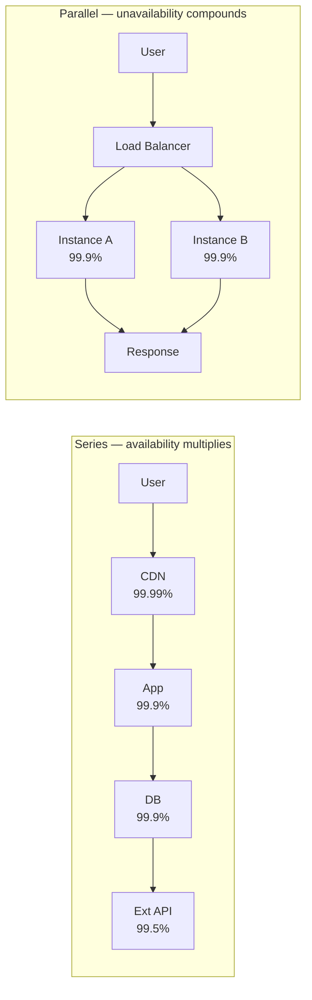
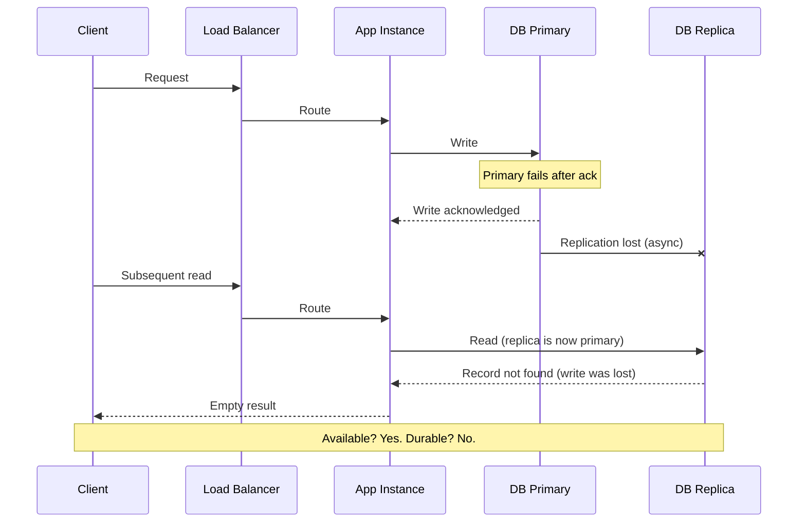
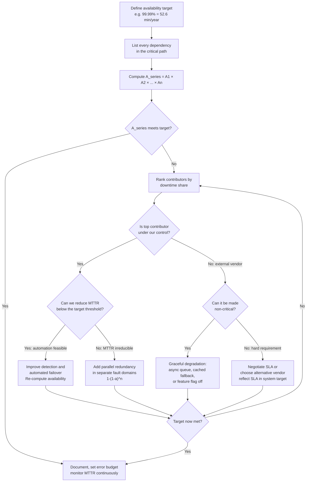

# Chapter 03 — Availability and the Nines

TL;DR — Availability is the fraction of time a system can serve its users within the promised service boundary. Every critical dependency in a request path multiplies the failure probabilities, so five components each at 99.9% compose to roughly 99.5% — lower than any individual link. Adding parallel redundancy inverts this: two independent instances at 99.9% give 99.9999%. The two operational levers are reducing mean time to recovery (MTTR) and adding redundancy in genuinely separate fault domains. Availability is not reliability and not durability — a system can be available while giving wrong answers, or durable while being temporarily unavailable — and conflating these properties leads to the wrong architectural fix.

## Mental model

Availability is multiplicative in series and exponential in parallel redundancy. Both facts follow directly from probability: the probability that a series chain succeeds is the product of each component succeeding; the probability that a redundant pair fails is the product of each instance failing independently.

The series chain in the top path has combined availability 0.9999 × 0.999 × 0.999 × 0.995 ≈ 99.28% — lower than the weakest component at 99.5%. The parallel pair in the bottom path has combined unavailability (0.001)² = 0.000001, giving 99.9999%.

Every component added to the critical path lowers system availability unless (a) the component's own availability is high enough that its contribution is negligible, or (b) you add parallel redundancy at that hop. Making a dependency non-critical — so that its failure degrades but does not break the user-facing function — is equivalent to removing it from the critical path.

## How it works

### The definition

Availability is the fraction of time a system is able to perform its required function for users within the promised service boundary. Two precision points matter operationally. First, "required function" must be specified: a payment service that accepts requests but silently drops them is not available, even if it returns HTTP 200. Second, "promised service boundary" determines what counts as an outage: a service may be running internally while users in one region cannot reach it; from those users' perspective the service is unavailable.

### MTBF, MTTR, and the steady-state formula

For a single repairable component, steady-state availability is:

**A = MTBF / (MTBF + MTTR)**

MTBF is the mean time between failures — how long a component operates on average before failing. MTTR is the mean time to recovery — the average elapsed time from failure onset to full service restoration, including detection, diagnosis, fix, and validation.

Component at MTBF = 1,000 h, MTTR = 1 h:

A = 1,000 / (1,000 + 1) = 1,000 / 1,001 = 0.999001 ≈ **99.9%**

Same component, MTTR reduced to 6 minutes (0.1 h) through better alerting and automated rollback:

A = 1,000 / (1,000 + 0.1) = 1,000 / 1,000.1 = 0.9999 = **99.99%**

One additional nine, same failure rate, from faster recovery. MTBF improvement requires better hardware or software quality — slow, expensive work. MTTR improvement requires better monitoring, automation, and runbook discipline — work a team can act on immediately. MTTR is usually the more actionable lever.

### The nines table

Annual downtime = (1 − A) × 525,960 minutes, computed from 365.25 days × 24 h × 60 min = 525,960 min/year:

| Availability | Unavailability | Annual downtime |
|---|---|---|
| 99% (two nines) | 1% | 5,259.6 min — 87.7 hours |
| 99.9% (three nines) | 0.1% | 525.96 min — 8.77 hours |
| 99.99% (four nines) | 0.01% | 52.596 min — 52.6 minutes |
| 99.999% (five nines) | 0.001% | 5.2596 min — 5.26 minutes |
| 99.9999% (six nines) | 0.0001% | 0.526 min — 31.6 seconds |

Each step is a 10× improvement in allowed downtime. Five nines permits 5.26 minutes per year — less time than most deploy pipelines take to validate a release. A deploy that triggers a two-minute restart has consumed 38% of the five-nines budget for the year.

### Series availability

When a request must pass through components C₁, C₂, …, Cₙ in sequence and any failure makes the request fail:

**A_series = A₁ × A₂ × … × Aₙ**

This is the product rule for independent events. For small unavailabilities the total unavailability is approximately the sum of the individual unavailabilities — a useful approximation for ranking which component contributes the most downtime. The formula assumes statistically independent failures; in practice, correlated failures (same power circuit, same AZ, same software deployment) make the actual series availability worse. Use series math as an optimistic ceiling.

### Parallel availability and independence

When either of n redundant instances can serve the request — the request fails only if all n fail simultaneously:

**A_parallel = 1 − (1 − A)ⁿ**

Two instances at 99.9%:

A_parallel = 1 − (1 − 0.999)² = 1 − (0.001)² = 1 − 0.000001 = **0.999999 = 99.9999%**

Three instances at 99.9%:

A_parallel = 1 − (0.001)³ = 1 − 0.000000001 = **99.9999999%**

The improvement is dramatic, but the formula assumes statistically independent failures. Two instances in the same availability zone share physical power, cooling, and network hardware — a zone failure takes both. True independence requires separate fault domains: different physical hosts, separate network paths, separate AZs or separate regions. Same-AZ redundancy does not deliver six-nines combined availability during zone-level events.

### Availability, reliability, and durability are distinct

These terms are defined precisely in this handbook and must not be used as synonyms.

**Availability** (this chapter) is about responsiveness: can users initiate and complete their intended operation?

**Reliability** (Chapter 04) is about correctness over time: does the system continue producing correct results under expected conditions and credible failures? A service can be available — responding quickly — while giving wrong answers or silently losing writes. Reliability is harder to measure because it requires an oracle for what the correct answer is.

**Durability** (Chapter 04) is about data persistence: will acknowledged writes survive infrastructure failures, corruption, or operator error? A database can be highly available to subsequent reads while returning empty results because it lost the writes in a crash. That is not a durability guarantee regardless of its availability figure.

Conflating these three properties leads to the wrong fix. A team that diagnoses "we have an availability problem" when the actual problem is that cached stale reads are producing wrong results (reliability) will invest in redundancy that does not address the root cause.

## Design Review Lens

- What problem is this actually solving? It quantifies how often a service boundary fails to respond from the user's perspective, and identifies which architectural decisions are responsible for that rate.
- What assumptions does it depend on (and when do they break)? The series and parallel formulas assume statistically independent failures. They break when components share physical infrastructure, software versions, configuration, or deployment pipelines. The MTBF/MTTR model assumes failures are Poisson-distributed; real failure rates cluster around deployments, traffic spikes, and maintenance events, which can make MTTR worse than average at the worst times.
- What breaks FIRST at 10x scale? The number of dependencies in the critical path grows as the system is decomposed into more services. Each new mandatory dependency must be explicitly analyzed for its availability contribution, or it silently degrades the series product. At 10x, the critical-path dependency graph is typically no longer maintained by any single person.
- What breaks FIRST at 100x scale? A shared global dependency becomes the availability ceiling for the whole organization. A single-region configuration service, a shared global primary database, or a centralized identity provider that every service must reach synchronously will set the upper bound on the availability of everything that depends on it. Removing that ceiling requires architectural decomposition, not just redundancy.
- How would Netflix vs Amazon vs a 5-person startup each approach this differently, and why? Netflix designs for regional independence: each region can serve users without cross-region coordination, so regional failures cause geographic degradation rather than global outage. Recommendations and search degrade gracefully when specific backends are slow. Amazon assigns explicit availability tiers (P0/P1/P2) to customer-facing paths and enforces that critical paths have redundancy and low MTTR as a condition of launch. A 5-person startup should identify one or two paths that must not fail — the checkout, the login — make those redundant first, and explicitly accept lower availability for non-critical paths rather than attempting uniform high availability across everything.

## Variants / approaches

| Approach | Strengths | Costs |
|---|---|---|
| Active-passive redundancy | Simple; passive instance has no load; clear primary. | Failover takes time (RTO > 0); passive capacity is idle; failover must be tested regularly. |
| Active-active redundancy | Full capacity always serving; failover is traffic rebalancing, not instance promotion. | Requires stateless design or shared session management; both instances must handle all traffic. |
| Geographic redundancy (multi-region) | Survives full regional failure; reduces latency for global users. | Cross-region data replication adds latency and consistency complexity; cost doubles the infrastructure. |
| Graceful degradation | Removes a dependency from the critical path; a partial failure becomes a reduced experience, not a full outage. | The degraded path must be implemented, tested, and monitored; product must accept feature loss. |
| Circuit breaking | Stops calling a failing dependency automatically; prevents cascading failure across services. | Requires calibrated thresholds; open circuit masks partial recovery; fallback must be defined and tested. |
| Automated MTTR reduction | Faster detection, automated rollback, practiced runbooks move components from 99.9% to 99.99% without new hardware. | Requires investment in monitoring, runbook documentation, and regular failover drills. |

## Worked example (with capacity model)

Scenario: a user-facing checkout service for an e-commerce platform. A checkout request passes through five components in series. All figures are planning assumptions labeled at each step; availability values represent SLA commitments or internal measurements, not guarantees.

**Components in the critical path**

| Component | Availability | Basis |
|---|---|---|
| CDN | 99.99% | Planning assumption: typical multi-PoP CDN SLA |
| Load balancer | 99.99% | Planning assumption: managed load balancer |
| Checkout service | 99.9% | Measured: MTBF = 1,000 h, MTTR = 1 h → 1,000/1,001 |
| Product database | 99.9% | Measured: MTBF = 1,000 h, MTTR = 1 h → 1,000/1,001 |
| Payment gateway | 99.5% | Vendor SLA (planning assumption; actual compliance varies) |

**Step 1: compute the series availability**

A_series = 0.9999 × 0.9999 × 0.999 × 0.999 × 0.995

CDN × LB = 0.9999 × 0.9999 = **0.99980001**

× Checkout = 0.99980001 × 0.999 = 0.99980001 − 0.00099980001 = **0.99880021**

× Database = 0.99880021 × 0.999 = 0.99880021 − 0.00099880021 = **0.99780141**

× Payment = 0.99780141 × 0.995 = 0.99780141 − 0.00498900705 = **0.99281240**

System availability: **99.28%**

Annual downtime: (1 − 0.99281240) × 525,960 = 0.00718760 × 525,960 = **3,780 min ≈ 63.0 hours/year**

Five components, each at 99.5% or better individually, compose to 99.28% — roughly two and a half nines.

**Step 2: rank the risk contributors**

For small unavailabilities the per-component contributions approximate the total system unavailability:

| Component | Per-component unavailability | Annual downtime contribution |
|---|---|---|
| Payment gateway | 0.005 × 525,960 | 2,629.8 min — 43.8 hours |
| Checkout service | 0.001 × 525,960 | 525.96 min — 8.77 hours |
| Product database | 0.001 × 525,960 | 525.96 min — 8.77 hours |
| CDN | 0.0001 × 525,960 | 52.6 min |
| Load balancer | 0.0001 × 525,960 | 52.6 min |

The values approximately sum to the total system unavailability because the cross-terms (uᵢ × uⱼ) are negligible at these magnitudes. The payment gateway dominates; its 99.5% SLA contributes 43.8 hours of system downtime per year even if every other component is perfect.

**Step 3: remove the payment gateway from the critical path (graceful degradation)**

Route payment attempts through a durable queue rather than a synchronous call. The checkout response acknowledges the order immediately; payment processing completes asynchronously. If the payment gateway is unavailable, orders queue and drain when it recovers. The payment gateway is no longer in the synchronous critical path.

New series: CDN × LB × Checkout × Database

= 0.9999 × 0.9999 × 0.999 × 0.999 = **0.99780141**

System availability: **99.78%**

Annual downtime: (1 − 0.99780141) × 525,960 = 0.00219859 × 525,960 = **1,156 min ≈ 19.3 hours/year**

Improvement: 63.0 h → 19.3 h. Still short of three nines (8.77 h). Checkout and database now dominate equally.

**Step 4: add parallel redundancy at checkout service and database**

Two independent checkout instances in separate fault domains:

A_checkout_r = 1 − (1 − 0.999)² = 1 − 0.000001 = **0.999999**

Primary database with hot standby in a separate fault domain, synchronous replication:

A_db_r = 1 − (1 − 0.999)² = 1 − 0.000001 = **0.999999**

Revised series: CDN × LB × A_checkout_r × A_db_r

CDN × LB = 0.99980001

× 0.999999 = 0.99980001 − 0.00000099980001 = 0.99979901

× 0.999999 = 0.99979901 − 0.00000099979901 = **0.99979801**

System availability: **≈ 99.98%**

Annual downtime: (1 − 0.99979801) × 525,960 = 0.00020199 × 525,960 = **106.2 min ≈ 1.77 hours/year**

Improvement: 19.3 h → 1.77 h. The formula assumes the redundant pairs fail independently. If both checkout instances are in the same AZ, the true availability reverts to single-instance behavior during zone-level events — the architecture must verify the independence assumption.

**Step 5: MTTR as an alternative or complement**

Instead of adding a standby database instance, invest in automated failover to an existing read replica with sub-minute detection and promotion. If MTTR falls from 1 hour to 6 minutes (0.1 h):

A_db_fast = 1,000 / (1,000 + 0.1) = **0.9999 = 99.99%**

One full nine gained at the database without new hardware, purely from faster recovery. Combined with the async payment path and checkout redundancy, the system approaches 99.99% while keeping infrastructure cost lower than a synchronous standby.

**Growth and storage**

Storage and throughput inputs use the capacity model from Chapter 01. The availability calculation does not depend on traffic volume directly — it depends on which components are in the critical path and their failure characteristics. What traffic volume does affect is the blast radius: at higher load, a checkout outage affects more users per minute, which raises the urgency of each percentage point of availability improvement.

**Decision from the model**

The correct order of interventions for this checkout path: (1) async payment processing to remove the dominant risk contributor, (2) MTTR improvement through automated failover and runbooks, (3) checkout service redundancy in separate fault domains. Together these move the system from 99.28% to approximately 99.98% without requiring every component to be over-engineered.

## Failure Walkthrough

Single node failure: one checkout service instance fails. The load balancer stops routing to it within one or two health-check intervals (typically 10–30 seconds — planning assumption; the actual window depends on check frequency and threshold configuration). In-flight requests on the failed instance time out; clients retry on the surviving instance. The survivor absorbs all traffic. If the survivor was provisioned with N−1 headroom, users see a brief latency increase at worst. If not, the survivor may saturate. Detection: health check failure plus error-rate spike. Recovery: instance replacement by the scheduler, registration with the load balancer, traffic normalization. RTO: health check interval plus replacement time.

Network partition: clients in one segment cannot reach the service despite the service running normally. Detection: asymmetric error rates from specific origin IPs, synthetic monitor failures in affected regions. Recovery: DNS or load-balancer rerouting to a reachable path. If the database is also partitioned from the application, writes may be refused (if the application requires quorum) or accepted locally (if configured for availability over consistency — a decision covered in Chapter 06). RPO: if writes are refused during the partition, no data loss. RTO: usually controlled by external network recovery or DNS propagation, not internal repair.

Full regional failure: the entire region hosting the service becomes unavailable. Users see connection timeouts or DNS failure. Detection: regional synthetic monitors, external health check services, traffic volume drop to near zero. Recovery: DNS failover to a secondary region (minutes if pre-configured, 5–30 minutes if manual), database promotion of the secondary region's replica. RPO: data acknowledged before failure minus any asynchronous replication lag — acknowledged writes that had not yet replicated may be lost. RTO: DNS propagation delay plus replica promotion time plus application warm-up. A cold standby adds warm-up time from a blank cache state.

Critical dependency outage: the payment gateway becomes unavailable. With the async design in place, new orders continue to be accepted and queued. The queue depth grows. If the gateway is unavailable for hours, the backlog can take longer to drain than the outage lasted, creating payment delays after the gateway recovers. Detection: payment service error rate, queue depth, dead-letter queue growth. Recovery: queue drains at consumer rate when gateway recovers; retries must be idempotent (covered in Chapter 28). The failure mode to plan for is a partial gateway recovery — the gateway returns success for some payment methods but fails others — which can produce a mixed-state backlog.

Data corruption / poison data: a malformed product record causes the checkout service to throw an unhandled exception for orders containing that SKU. All orders for that product fail; other orders continue normally. p50 availability looks healthy while a specific class of users sees 100% failure. Detection: error rate by product category, structured log correlation showing the same exception and SKU across multiple requests, customer support reports. Recovery: quarantine the bad record, fix or remove it, validate the service returns healthy for affected SKUs. If the bad record replicated to the hot standby before detection, both primary and replica serve the corrupted data — a reminder that redundancy does not protect against application-level corruption, only infrastructure-level failures.

## Decision Framework

## Tradeoffs & alternatives

Main recommendation: compute the series availability of the critical path explicitly, rank the contributors, and address the largest risks through MTTR reduction, parallel redundancy, or graceful degradation in that order.

WHY: Availability compounds silently. Each dependency that looks fine individually can combine with others to produce a system that fails users for dozens of hours per year. Making the arithmetic explicit surfaces that risk before users experience it.

What it COSTS: Redundancy increases infrastructure cost — typically 2× compute and memory for each tier made active-active. Graceful degradation requires implementing, testing, and monitoring the degraded path. MTTR investment requires engineering time for runbooks, monitoring, and failover automation. Each addition increases operational complexity and must have an owner.

ALTERNATIVES: Managed services with vendor-published SLAs shift some of the availability engineering to the vendor, but add a dependency on the vendor's actual compliance with their SLA and on their credit terms, which do not compensate users for the experience of an outage. Accepting lower availability for a bounded time while shipping faster can be the right choice if the business impact of downtime is low and the cost of redundancy is high.

WHEN NOT to optimize: Not every path needs high availability. A batch analytics job, an internal developer tooling service, or a feature used by a small fraction of users does not justify the cost and complexity of five-nines architecture. Explicitly deciding which paths are critical and accepting lower availability elsewhere is better than attempting uniform high availability across a system, which spreads engineering effort thin and leaves no path truly reliable.

## Staff & Principal lens

Availability targets are organizational commitments, not engineering preferences. A published SLA of 99.99% that the underlying architecture can deliver only 99.28% is a liability — one that will be violated, produce customer credits, and erode trust. A Principal engineer reviewing a launch should require the series availability calculation against any committed SLA before the commitment is made public.

The ownership problem in microservices is that each team publishes an SLA for its own service, but the user-visible availability is the product of all services in the critical path — a number no single team owns. Staff and Principal engineers must identify the cross-team critical paths, compute the series products, and drive alignment on which team is responsible for each link. Without this, the system meets every team's local SLA while missing the user-facing target.

Operational burden follows the architecture. Active-active redundancy requires load balancing, session management, and traffic shaping — someone must own, monitor, and tune that. Automated failover must be regularly tested; a failover mechanism that has never been exercised in production is not a failover, it is a theory. The team that builds the redundancy must also own the test regimen.

Cost governance must account for the redundancy overhead before the architecture is finalized, not after the first invoice arrives. Two checkout instances instead of one roughly doubles the compute cost at that tier. A hot standby database duplicates the storage tier. Multi-region adds cross-region replication bandwidth and doubles every tier. A good capacity model (Chapter 01) estimates these as explicit line items alongside QPS and storage, so the availability level is chosen with awareness of its cost.

Migration complexity is highest when moving from no redundancy to active-active. The transition requires stateless design or consistent session handling, load balancer configuration changes, and validation that each instance can independently serve the full traffic load. Attempting this migration reactively — when availability is already bad — is the worst time to discover that the application relied on local session state.

## Interview answer vs production reality

What interviewers expect to hear: Define the nines as powers of ten in allowed downtime. State that series availability is multiplicative and parallel redundancy uses 1 − (1 − a)ⁿ. Identify MTBF and MTTR as the two levers, and note that MTTR is often more actionable. Name graceful degradation for external dependencies. Connect redundancy to fault domain independence.

What actually happens in production: Failures correlate. Two instances in the same AZ do not give 99.9999% availability; they give approximately 99.9% during zone-level failures because they share fate. MTTR is dominated by detection time — a 3 AM failure may go undetected for 15–20 minutes before an alert fires, consuming most of the MTTR budget before a human looks at a screen. Planned maintenance counts against availability from the user's perspective even when it is scheduled. Vendor SLA credits do not compensate for the user experience of an outage; they compensate for the billing period.

Simplifications that are fine in an interview but wrong in prod: treating the nines table as memorized facts rather than computed from (1 − A) × 525,960. Assuming redundant instances are independent when the infrastructure does not actually separate them. Setting an availability target by rounding up to "five nines" without computing whether the dependency chain can deliver it. Treating the series formula as additive — "we just need each service to be better" — when the actual series product of four 99.9% services is only 99.6%.

## Common pitfalls & misconceptions

- Treating availability, reliability, and durability as synonyms. Availability is about responsiveness; reliability is about correctness; durability is about persistence. A system can fail on all three independently.
- Assuming same-AZ redundancy delivers independent failure probabilities. It does not. Zone-level events — power failures, network failures, cooling issues — take all instances in the zone simultaneously.
- Setting an SLA before computing the series availability of the dependency chain. The SLA should follow from the architecture's demonstrated capability, not precede it.
- Optimizing MTBF when MTTR is the faster win. Cutting MTTR from 1 hour to 6 minutes adds one full nine without changing failure frequency.
- Treating graceful degradation as free. The fallback path must be built, tested, and monitored. An untested degradation path that has never fired in production is not available when it is needed.
- Ignoring planned downtime. Maintenance windows, rolling deploys, and database vacuums count against availability from the user's perspective even when they are deliberate.
- Confusing high latency with unavailability. A service that responds slowly but correctly is not unavailable; it has a performance problem (Chapter 02). An availability problem means the service does not respond or returns errors.
- Treating per-component SLAs as composable without the series calculation. A vendor that provides a 99.9% SLA on each of three services does not guarantee 99.9% for any workflow that requires all three.

## Interview questions

Mid: Three services, each with 99.9% availability, all required for a request to succeed. What is the combined availability, and what is the annual downtime?

MODEL answer: 0.999³ = 0.997003, approximately 99.7%. Annual downtime = 0.003 × 525,960 = 1,578 minutes, about 26.3 hours. Each nine costs more than the one before: going from 99.7% to 99.9% for the composed system requires either adding redundancy at one or more hops or improving each component to approximately 99.967% individually.

Senior: Your team's service has measured MTBF of 800 hours and MTTR of 2 hours. What is its current availability, and what single change would have the biggest impact?

MODEL answer: A = 800 / (800 + 2) = 800 / 802 = 0.9975 = 99.75%. The MTTR is relatively high. If I can cut MTTR from 2 hours to 12 minutes (0.2 h) through automated rollback and better alerting, the new availability is 800 / (800 + 0.2) = 800 / 800.2 = 0.99975 = 99.975%. That is more than one additional nine purely from faster recovery. MTBF improvement to 1,600 hours with the same 2-hour MTTR would give 1,600 / 1,602 = 0.99875 — better than baseline but still 99.87%, well below the MTTR improvement result.

Staff: Your platform has 40 microservices in various critical paths. No team has computed the end-to-end series availability of any user-facing workflow. How do you fix this?

MODEL answer: I would start by mapping the two or three most business-critical user journeys — checkout, login, the core read path — and building the dependency graph for each. For each service in those graphs, collect the measured or SLA-declared availability. Compute the series product. This immediately surfaces which services are dragging the composed availability below the target. I would publish the computation so every team can see how their service affects the end-to-end number, because teams that cannot see the impact of their SLA on user experience have no reason to improve it. Structurally, I would standardize an SLO format (Chapter 40) and require that any service in a P0 critical path maintain a measured error budget. The goal is to convert cross-team availability from an accident into an explicit, visible, owned property.

Principal: A customer contract requires 99.99% availability starting in 90 days. Your architecture review shows the critical path computes to 99.78%. What do you do?

MODEL answer: I would not allow the contract to be signed without a clear remediation plan. The gap between 99.78% and 99.99% represents the difference between 19.3 hours of downtime per year and 52.6 minutes — a contractual exposure of roughly 18 hours of annual SLA credit per customer. I would bring the series calculation to the business with a ranked list of interventions: async processing for the largest risk contributor (likely an external dependency), MTTR automation for the internal components, and redundancy where MTTR reduction is insufficient. Each intervention has a cost, a timeline, and an owner. If the business cannot wait 90 days for all interventions, the contract should include an explicit carve-out for the gap period, a remediation timeline, and a reduced credit rate during that window. Signing a contract against an architecture that cannot meet it is a business risk the business must understand and accept explicitly, not have hidden from them.

## Connections

Prerequisites: [Chapter 01 — Estimation and Capacity Modeling](../chapter-01-estimation-and-capacity-modeling/) for the measurement-first discipline and the discipline of making assumptions explicit. [Chapter 02 — Performance vs Scalability, Latency vs Throughput](../chapter-02-performance-vs-scalability-latency-vs-throughput/) for the distinction between latency problems and availability problems.

Related chapters: [Chapter 04 — Durability and Reliability](../chapter-04-durability-and-reliability/) for the precise definitions that distinguish availability from durability and reliability. [Chapter 05 — Consistency Models](../chapter-05-consistency-models/) and [Chapter 06 — CAP and PACELC](../chapter-06-cap-and-pacelc/) for the tension between availability and consistency in distributed systems. [Chapter 40 — SLI, SLO, SLA, and Error Budgets](../chapter-40-sli-slo-sla-and-error-budgets/) for the operational framework that makes availability targets measurable and actionable.

Builds toward: [Chapter 22 — Replication and Quorums](../chapter-22-replication-and-quorums/) (quorum sizing is an availability decision), [Chapter 42 — Chaos Engineering](../chapter-42-chaos-engineering/) (validating the independence assumptions this chapter depends on), [Chapter 50 — Multi-Region Architectures](../chapter-50-multi-region-architectures/), [Chapter 51 — Disaster Recovery (RPO/RTO)](../chapter-51-disaster-recovery-rpo-rto/).

## Further reading

- Google SRE Book, ["Embracing Risk"](https://sre.google/sre-book/embracing-risk/), Chapter 3. Covers the cost of reliability, risk tolerance as a product decision, and the error-budget model that converts availability targets into release-risk decisions.
- Google SRE Book, ["Service Level Objectives"](https://sre.google/sre-book/service-level-objectives/), Chapter 4. Defines SLIs, SLOs, and SLAs with examples from Google's production systems and explains why SLOs should be set below 100%.
- Amazon Web Services, [Amazon Compute Service Level Agreement](https://aws.amazon.com/compute/sla/). A primary-source example of how a cloud provider formally defines availability, excluded events, and the credit schedule for SLA violations.
