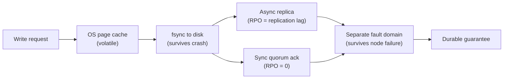
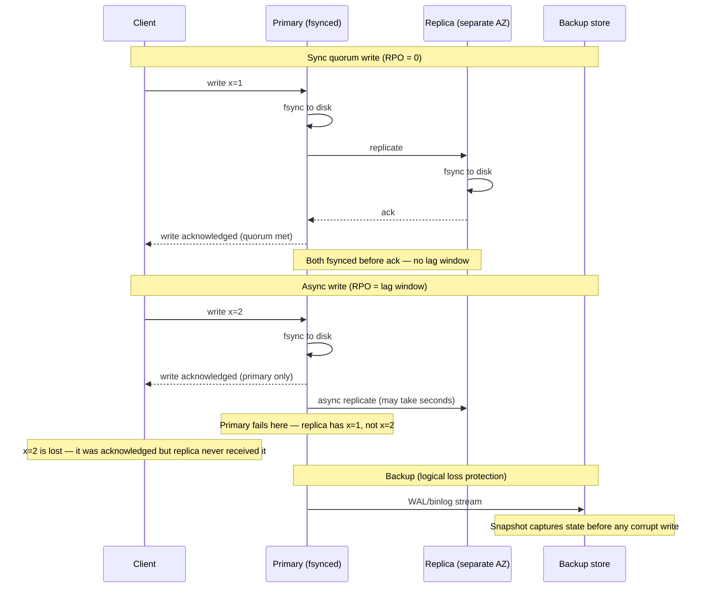
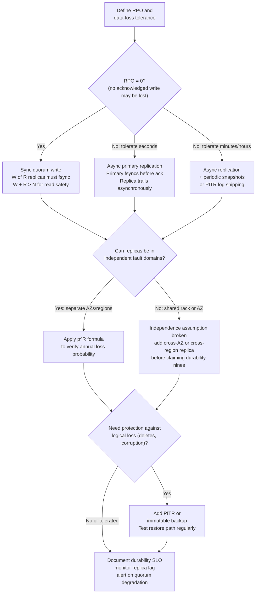

# Chapter 04 — Durability and Reliability

TL;DR — Durability is the guarantee that acknowledged data will not be lost despite hardware failure, corruption, or operator error. Reliability is the guarantee that a system continues producing correct results over time, not merely that it stays reachable. Both are distinct from availability (Chapter 03), and a system can fail any one of the three independently. Durability comes from storing multiple copies across genuinely independent failure domains and choosing write-acknowledgment semantics that match the RPO target. Every skipped fsync, every async replication lag window, and every replica pair that shares a fault domain is a gap between the stated durability number and the real one.

## Mental model

A write travels through several layers before it is safe. At the first layer the OS accepts the write into a page cache — data lives only in volatile RAM and dies on power loss. At the second layer fsync flushes the write to the storage device — data survives a process crash or reboot. At the third layer the write is replicated to another node — data survives the failure of the local machine. At the fourth layer the replicas are in separate failure domains — data survives the failure of an entire rack or zone.

Each layer is a distinct guarantee. A database that acknowledges a write after the page cache but before fsync is not durable. A database that fsyncs locally but replicates asynchronously has an RPO window equal to the replication lag. A database with three replicas on the same physical rack gains almost nothing over one replica if the rack's power supply fails.

Reliability builds on durability but adds more. Data can persist correctly and still produce wrong results if the application reads a stale replica, a background job overwrites records with bad values, or a silent bit-flip passes undetected. Reliability requires durability as a precondition, but durability alone is not sufficient.

## How it works

### Durability defined

Durability is the degree to which acknowledged data is preserved and can be recovered despite failures, corruption, operator error, or loss of infrastructure. The key word is *acknowledged*: a write that was never confirmed to the client is not in scope for the durability guarantee. The guarantee covers exactly what the system accepted as committed.

### Reliability defined

Reliability is the ability of a system to continue delivering correct behavior over time under expected operating conditions and credible failures. For a data system, reliability failures look different from availability failures: a split-brain scenario where two primaries accept concurrent writes is a reliability failure even if both primaries are reachable. Bit rot — data silently corrupting in storage and returning a wrong value to reads — is a reliability failure even if the system has perfect availability. Reliability requires detecting and containing incorrect behavior, not only staying up.

### How availability, durability, and reliability differ

These three properties are independent and must not be conflated.

| Property | Failure form | Symptom |
|---|---|---|
| Availability | System unreachable | Requests time out or return errors |
| Durability | Acknowledged data lost | Reads return "not found" or empty after a write that was confirmed |
| Reliability | System produces wrong results | Reads return incorrect values; background jobs corrupt records; timestamps are misordered |

A system can be highly available while losing data (async primary-only replication, primary crashes, replica promotes with lag). A system can be durable while being unavailable (all replicas survive but network is partitioned). A system can be available and durable while being unreliable (stale read from an out-of-date replica, or corrupted data that passed checksum). Each property requires its own design work.

### Write-acknowledgment semantics and RPO

Recovery Point Objective (RPO) is the maximum acceptable data loss measured in time: the furthest back in time you are willing to accept as the recovery point after a failure.

Four common ack semantics ranked by RPO guarantee:

| Semantics | What is confirmed | RPO | Write latency |
|---|---|---|---|
| Page-cache ack | OS received the write | Data lost on process crash | Lowest — in-memory |
| fsync ack | Write flushed to local storage | Data survives crash, lost if hardware fails | Low — one disk flush |
| Async-replication ack | Primary fsynced; replicas trail asynchronously | RPO = replication lag (seconds to minutes) | Low — primary only |
| Sync-quorum ack | W of N replicas have fsynced | RPO = 0 for acknowledged writes | Higher — W replicas must respond |

Page-cache acknowledgment is the default in many databases when durability settings are relaxed for throughput. PostgreSQL's `synchronous_commit = off`, for instance, trades a small acknowledgment window for higher write throughput. This is a documented, deliberate trade-off — not a bug — but must be understood when reasoning about durability.

Sync-quorum acknowledgment gives RPO = 0 for acknowledged data, but any replica failure that reduces available replicas below the write quorum W makes further writes fail until the replica recovers. The write-availability/durability trade-off: tighter acknowledgment semantics reduce RPO at the cost of write availability under node failures.

### Replication factor and annual data-loss probability

Durability is correctly expressed as the annual probability that acknowledged data is lost, not as uptime. For R independent replicas, each with annual failure probability p, and failures statistically independent across replicas:

**P(data loss per year) = p^R**

This assumes the data is lost only when all R replicas fail before any failed replica can be repaired. Independence requires each replica to be in a separate failure domain — separate physical server, separate power feed, separate network path, and ideally a separate AZ.

Annual data-loss probability expressed as durability nines:

| Replicas R | P(loss/year) at p = 0.01 | Durability |
|---|---|---|
| 1 | 0.01 = 1% | ~2 nines |
| 2 | 10^-4 | ~4 nines (99.99%) |
| 3 | 10^-6 | ~6 nines (99.9999%) |
| 4 | 10^-8 | ~8 nines |
| 5 | 10^-10 | ~10 nines |

These nines represent annual probability of any given record being lost, not system uptime. At R=3 and a store of 1 billion records, expected annual record loss = 10^9 × 10^-6 = 1,000 records per year — unacceptable for most services without additional safeguards.

### Erasure coding versus full replication

Full replication at R=3 stores three complete copies: storage overhead is 3×. Erasure coding splits data into k data shards and adds m parity shards such that the original can be reconstructed from any k of the k+m shards. Storage overhead is (k+m)/k.

For erasure coding k=6, m=3 (any 3 of 9 shard losses tolerated):
- Storage overhead: 9/6 = 1.5×
- Data lost only when more than 3 of 9 shards fail simultaneously
- Dominant loss term: C(9,4) × p^4 × (1−p)^5 ≈ 126 × 10^-8 × 0.95 ≈ 1.2 × 10^-6 (at p=0.01)

Compared to full R=3 replication: 10^-6. EC k=6, m=3 achieves similar durability at 1.5× storage overhead versus 3× for full replication — half the storage cost for comparable guarantees.

Amazon S3 uses erasure coding across multiple facilities within a region to deliver 11 nines of durability at commodity storage costs. The 11-nines claim reflects the full multi-AZ, geo-redundant architecture; no single replication factor or coding formula produces it in isolation.

### Backups as a separate durability layer

Replication protects against hardware failure. It does not protect against logical data loss: an accidental delete propagates to all replicas immediately; a data corruption event that passes application-level validation propagates before any checkpoint. Point-in-time recovery (PITR) and immutable backups are the protection for these scenarios.

Backup RPO = backup interval. A daily backup gives RPO of up to 24 hours of data. A continuous PITR log (WAL shipping in PostgreSQL, binlog in MySQL) reduces RPO to seconds at the cost of retaining and managing the log stream.

## Design Review Lens

- What problem is this actually solving? It protects against the gap between "the system said it saved my data" and "the data is actually gone." Every layer of the guarantee — fsync, quorum, fault domain separation, PITR — closes a different part of that gap.
- What assumptions does it depend on (and when do they break)? The p^R formula assumes failure independence. It breaks when replicas share power, cooling, hardware, or deployment pipelines. The fsync guarantee assumes storage device firmware correctly implements fsync; some consumer devices do not. The quorum guarantee assumes at least W replicas are reachable; under a network partition with fewer than W available, writes fail (which is the correct choice for durability — accept no write rather than accept an unacknowledged one).
- What breaks FIRST at 10x scale? Correlated failures. At 10x, more data sits in each AZ, a single AZ event affects more data simultaneously, and the independence assumption for the p^R formula is harder to maintain. The repair time for a failed replica also grows with data volume, increasing the window during which a second failure could cause data loss.
- What breaks FIRST at 100x scale? The operational model for backups and PITR. At 100x data volume, full backups become expensive and slow. Restore time from a backup (RTO for data recovery) can exceed the business's acceptable downtime. Incremental backups, erasure coding, and lifecycle tiering become structural requirements.
- How would Netflix vs Amazon vs a 5-person startup each approach this differently? Netflix-scale streaming stores video as immutable objects with erasure coding across multiple AZs; durability at this scale is dominated by the infrastructure engineering of the object store, not application-level decisions. Amazon S3 publishes 11-nines durability built on cross-AZ erasure coding; user data durability is delegated to this guarantee. A 5-person startup should enable fsync, use managed databases with automatic replication, take daily backups, and test restore — in that order — before worrying about erasure coding or quorum tuning.

## Variants / approaches

| Approach | Strengths | Costs |
|---|---|---|
| Single node with fsync | Survives process crash; simple. | Any hardware failure loses all data. |
| Async primary-replica replication | Low write latency; survives one node failure after replication. | RPO = replication lag; data lost during lag window if primary fails. |
| Sync quorum replication | RPO = 0 for acknowledged writes; survives W−1 failures. | Higher write latency; writes fail if quorum is unreachable. |
| Multi-AZ synchronous replication | Survives full AZ failure with RPO = 0. | Cross-AZ write latency (typically 1–5 ms additional per hop); cost of multi-AZ infrastructure. |
| Erasure coding | Similar durability to 3× replication at ~1.5× storage cost. | Read reconstruction adds CPU; rebuilding after failure requires reading k shards; not suitable for small objects without grouping. |
| PITR / continuous backup | Protects against logical data loss (deletes, corruption); any point in time recoverable. | Storage cost for WAL/binlog retention; restore time (RTO) can be long; must be tested. |
| Immutable backups | Protects against ransomware and malicious deletion. | Cost of separate storage; must verify and test restore path regularly. |

## Worked example (with capacity model)

Scenario: a document database storing financial transaction records for a payments platform. Records are written once on transaction commit and must survive any credible infrastructure failure without loss. This is a hypothetical scenario for reasoning practice; all failure rates are planning assumptions.

**Assumptions**

| Input | Assumption | Basis |
|---|---:|---|
| Annual node failure rate | p = 0.01 (1%) | Planning heuristic based on typical enterprise server annual failure rates; actual rates depend on hardware quality and data center operations |
| Node failures are independent | Requires separate racks, power, network, AZ | Architecture assumption — must be verified |
| Records in the store | 500 million | Product scale assumption |
| Average record size | 2 KB | Application data model |
| Daily write rate | 10 million transactions | Business forecast |
| Async replication lag | 2–10 seconds typical, up to 60 s at peak | Network assumption; must be measured |

**Step 1: durability by replication factor**

P(any single record lost per year) = p^R = 0.01^R:

R=1: P = 0.01. Expected records lost per year = 500 × 10^6 × 0.01 = **5 million records/year**. Unacceptable.

R=2: P = 10^-4. Expected records lost = 500 × 10^6 × 10^-4 = **50,000 records/year**. Still unacceptable for financial data.

R=3: P = 10^-6. Expected records lost = 500 × 10^6 × 10^-6 = **0.5 records/year** — roughly one record every two years from hardware failure. Acceptable for most financial use cases if combined with backups.

R=5: P = 10^-10. Expected records lost = 500 × 10^6 × 10^-10 = **0.00005 records/year** — one record every 20,000 years. More than sufficient.

**Step 2: independence assumption — what correlated failure costs**

If all three R=3 replicas are in the same AZ:

P(AZ failure, planning estimate) ≈ 0.001 (0.1% per year per AZ — heuristic; actual cloud provider AZ failure rates are not publicly disclosed as a specific number). Then:

P(data loss from AZ failure, not node failure) ≈ 0.001

That is 1,000× worse than the 10^-6 independent-node estimate. The formula p^R = 0.01^3 = 10^-6 does not apply if all three nodes share fate. True R=3 durability requires three genuinely independent AZs.

**Step 3: effect of write-acknowledgment semantics on RPO**

Configuration A — async replication:
- Primary fsyncs write, returns ack to client
- Replica receives write 2–10 seconds later (under normal load)
- RPO = 2–10 seconds of transactions in the replication lag window

Daily write rate = 10 million transactions/day = 115.7 transactions/second average.

Data in RPO window at 10-second lag: 115.7 × 10 = 1,157 transactions. For financial records, losing 1,157 transactions on primary failure is likely unacceptable. Under peak load or replication slowdown, the lag window can grow.

Configuration B — sync quorum (W=2 of R=3 must ack, each with fsync):
- Write is not acknowledged until 2 of 3 replicas have fsynced
- RPO = 0 for acknowledged transactions
- Write latency increases by cross-replica round-trip time (within-AZ: 1–2 ms; cross-AZ: 1–5 ms — planning assumptions)
- Writes fail if fewer than 2 of 3 replicas are reachable

**Decision from Step 3:** Financial records with strict regulatory requirements → sync quorum across AZs. The durability cost (higher write latency, reduced write availability under replica failure) is justified by the RPO = 0 requirement.

**Step 4: erasure coding comparison**

For the 500 million records at 2 KB each: total logical data = 10^9 KB = 1 TB.

Full replication R=3: physical storage = 1 TB × 3 = **3 TB**.

Erasure coding k=6, m=3: physical storage = 1 TB × 1.5 = **1.5 TB**.

Annual loss probability for EC k=6, m=3 (data lost when 4+ of 9 shards fail, dominant term):

P ≈ C(9,4) × 0.01^4 × 0.99^5 = 126 × 10^-8 × 0.951 = **1.2 × 10^-6**

Comparable to R=3 replication (10^-6) at half the storage overhead. For a 1 PB data store, the difference is 500 TB of storage cost per year — significant at scale, negligible for small data volumes where management simplicity of full replication wins.

**Step 5: backup as logical-loss protection**

Daily backup with 30-day retention:
- RPO for accidental delete or data corruption: up to 24 hours of transactions
- Recovery time (RTO) from daily backup at 1 TB total: depends on restore bandwidth; at 1 GB/s = 1,000 seconds = 17 minutes. At 100 MB/s = 10,000 seconds ≈ 2.8 hours.
- PITR (WAL shipping) with 30-day log retention: RPO = seconds; RTO = backup restore time + log replay time
- WAL/binlog size at 115.7 writes/second × 2 KB/write = 231 KB/s = 19.9 GB/day = 597 GB/month of log retention for 30 days

**Storage summary**

| Layer | Size | Purpose |
|---|---|---|
| Primary data (logical) | 1 TB | Base |
| Replication overhead (R=3) | 2 TB additional | Failure survival |
| Backup (30-day daily) | 1 TB × 30 = 30 TB | Logical-loss recovery |
| WAL/PITR log (30-day) | 597 GB | Point-in-time recovery |
| Total physical (planning) | ~33.6 TB | Before compression |

## Failure Walkthrough

Single node failure: one replica fails. The other R−1 replicas continue serving reads and accepting writes (if W ≤ R−1). Detection: disk health monitoring, heartbeat failure, missing replication acknowledgments. Recovery: replacement node is provisioned, data is replicated from a surviving replica, node re-joins the quorum. RPO: 0 for sync quorum writes made before the failure. RTO: time to rebuild the replica (bounded by network bandwidth and data volume; 1 TB at 100 MB/s = ~2.8 hours). During the rebuild, the remaining replicas must not also fail — this is the highest-risk window.

Network partition: the replica cluster is split and replicas on opposite sides cannot communicate. Sync quorum writes will fail if fewer than W replicas are reachable — the correct behavior for durability. Async systems may continue accepting writes on both sides, creating a split-brain divergence that must be reconciled. Detection: quorum failure, missing heartbeats, write timeout. Recovery: partition heals, logs are compared, conflicting writes are resolved (last-write-wins, merge, or reject depending on the conflict resolution policy). RPO: for sync systems, 0; for async systems, depends on writes accepted during the partition.

Full regional failure: all replicas in one region are unavailable. If replicas are distributed across regions, the surviving replicas continue serving. If the deployment was single-region, all data becomes unavailable and potentially permanently lost if local storage is destroyed. Detection: regional health checks, traffic loss, cloud provider events. Recovery: fail over to replicas in a surviving region; promote a replica to primary; point application traffic to the surviving region. RPO: equal to cross-region replication lag for async setups; 0 for synchronous multi-region quorum. RTO: DNS propagation plus promotion time plus cache warm-up.

Critical dependency outage: the storage device controller or cloud block storage service fails. Writes begin failing or hanging. Detection: I/O errors, write timeouts, storage metrics. Recovery: failover to a replica hosted on a different block storage volume; restore from backup if the storage is unrecoverable. RPO: depends on whether writes were in the page cache (lost) or fsynced (safe). RTO: failover or restore time.

Data corruption / poison data: a bug causes records to be written with wrong values; the corruption passes application validation and replicates to all replicas. All reads now return the corrupted value. Backups and PITR are the only recovery path. Detection: data quality checks, checksum mismatch, support reports of wrong values. Recovery: identify the point in time before corruption began, restore from backup to that point, replay any valid writes after that point using PITR. RPO = time since the last clean backup or PITR point before corruption. RTO = restore plus replay time. This scenario makes clear why immutable backups and PITR are not redundant with replication — they protect against a different class of failure.

## Decision Framework

## Tradeoffs & alternatives

Main recommendation: choose the write-acknowledgment semantics that match the RPO target, place replicas in independent fault domains, and add PITR for logical-loss protection.

WHY: The only way to prove a durability claim is to trace the write from client acknowledgment through each layer — page cache, fsync, replication, fault domain — and verify that no single-layer failure can lose the data.

What it COSTS: Sync quorum replication adds cross-replica write latency (1–5 ms within an AZ, higher across regions). Multi-AZ and multi-region deployments increase infrastructure cost. PITR requires retaining and managing WAL/binlog data, which grows with write volume.

ALTERNATIVES: Cloud-managed databases (Amazon RDS Multi-AZ, Google Cloud Spanner, CockroachDB) handle replication, fsync, quorum, and PITR as built-in features, shifting the durability engineering to the vendor. The trade-off is cost and vendor lock-in in exchange for operational simplicity.

WHEN NOT to invest in high durability: Ephemeral data — session tokens, computed cache values, queued work that can be replayed — does not need quorum replication or PITR. The durability investment should match the business cost of losing the data. Treating all data as equally durable is as wasteful as treating all data as equally disposable.

## Staff & Principal lens

Durability SLOs must be owned and published, not assumed. A team that has not computed the annual data-loss probability of their storage configuration does not have a durability guarantee — they have a hope. The number (R, p, independence verification, backup cadence, PITR window) should be in the service's runbook and reviewed at launch.

The organizational risk is that durability regressions are usually silent. An availability regression causes immediate alerts and user reports. A durability regression — async replication silently falling behind, a backup job failing without alert, a quorum configuration changing in a deploy — may not be discovered until a failure occurs months later. Staff engineers must require durability monitoring: replication lag alerting, backup success alerts, and scheduled restore tests.

Cost governance for durability: storage for backups and replicas often grows faster than primary data because retention windows accumulate old versions while primary data size is bounded by deletions and compaction. A 30-day PITR window with high write throughput can cost more than the primary store. The capacity model must include durability-layer storage as an explicit cost line.

Migration complexity for changing write-acknowledgment semantics: switching a production system from async to sync replication is a configuration change with non-trivial availability impact (writes fail on quorum loss) and latency impact (every write is now slower by a cross-replica RTT). It requires testing under realistic load, measuring tail write latency, and confirming that the write availability reduction is acceptable before switching.

## Interview answer vs production reality

What interviewers expect to hear: durability is about data not being lost; achieve it through replication across independent nodes; sync replication gives stronger guarantees than async; the number of replicas and the independence of failure domains determine the durability number.

What actually happens in production: durability regressions are usually invisible until a failure happens. Async replication falls behind under load and the lag window grows without anyone noticing until a primary fails. Backups fail silently, and the failure is discovered during an actual recovery — the worst time. Shared fault domains are common: "three replicas" on the same physical host (containers), the same AZ, or the same RAID array. The p^R formula assumes independence; if two of three nodes share a power circuit, the formula produces a number that is wildly optimistic.

Simplifications that are fine in an interview but wrong in prod: treating replication factor as a complete durability specification without specifying fault domain independence. Assuming a database's default configuration is safe — many databases default to asynchronous replication or page-cache acknowledgment for throughput. Treating backup and replication as alternatives rather than complements: replication does not protect against logical data loss.

## Common pitfalls & misconceptions

- Treating fsync and replication as the same thing. fsync protects against crashes on one node; replication protects against loss of one node. Both are required for durability against hardware failure.
- Treating replicas in the same AZ as independent. AZ-level events take all replicas in the AZ simultaneously. The p^R formula only applies to replicas in separate failure domains.
- Trusting a database's "three replicas" claim without verifying write-acknowledgment semantics. Three async replicas do not give RPO = 0.
- Assuming replicated data is protected against logical loss. An accidental delete or a corrupted write propagates to all replicas. PITR is the separate protection layer for this.
- Not testing backup restore. A backup that has never been restored is a guess, not a guarantee.
- Confusing durability and availability. Data can be durable (all replicas intact) while being unavailable (network partition). Data can be available (system responding) while being non-durable (all copies lost in a zonal event if replicas were not geo-distributed).
- Treating reliability and durability as synonyms. Reliable data systems produce correct results; durable data systems preserve stored data. These fail independently.

## Interview questions

Mid: What is the difference between durability and availability? Give a concrete example of a system that has one but not the other.

MODEL answer: Availability is whether the system responds to requests right now. Durability is whether acknowledged data will still be there after a failure. A system with three replicas that are all reachable is highly available; if those three replicas are on the same physical rack and the rack loses power, all data is lost — low durability, despite prior high availability. Conversely, a system in maintenance mode is unavailable to requests but its replicated, fsynced data remains durable.

Senior: A database engineer says they've set the replication factor to 3 and that gives 6 nines of durability. What questions would you ask?

MODEL answer: Are all three replicas on separate physical machines, separate racks, and separate AZs? If they share a failure domain, the p^3 formula does not apply. What is the write-acknowledgment semantics — do all three replicas fsync before the write is acknowledged, or is only the primary confirmed? If async, the RPO is the replication lag, not zero. What is the backup strategy — if a bug corrupts data and propagates to all three replicas, what is the recovery path? Have you verified the actual annual node failure rate p for these specific nodes, and does the fault domain independence assumption hold under the maintenance and deployment practices of this team?

Staff: Your team runs a financial data store with async replication. The replication lag is typically 5 seconds, spiking to 60 seconds under peak load. The business says zero data loss is required. How do you address this?

MODEL answer: The current configuration cannot meet the requirement. Async replication with a 5–60 second lag means up to 60 seconds of acknowledged transactions are vulnerable if the primary fails during that window. I would move to sync quorum replication: at least two of the three replicas must fsync before each write is acknowledged. I would measure the p99 write latency increase — cross-AZ sync typically adds 1–5 ms — and bring that number to the product team as the cost of the RPO = 0 requirement. I would also add PITR log shipping to a separate backup store, because zero data loss requires both replication (hardware failure protection) and PITR (logical loss protection). Finally, I would set up alerting on replication lag (for the transition period), backup job success, and quorum health.

Principal: You are designing a multi-tenant data platform that must offer 99.999999% annual durability for tenant data. Walk through the architecture decisions.

MODEL answer: 8 nines of annual durability (P(loss) = 10^-8) requires more than simple replication. I would start by separating the durability layers: object storage with erasure coding across 3+ AZs for the primary data (similar to S3's architecture), synchronous cross-AZ writes for metadata, and continuous WAL shipping to an immutable backup store in a separate region. For the object layer, erasure coding k=6, m=4 at p=0.01 gives P(loss) ≈ 10^-8, matching the requirement at ~1.67× storage overhead versus 3× for full replication. All writes are quorum-acknowledged before clients receive confirmation. The backup layer protects against logical failures (deletes, corruption) that replication cannot. Organizationally, I would require restore-path testing monthly, replication lag alerting, backup success monitoring, and a published durability SLA with explicit assumptions and exclusions. The SLA must name what durability it does not cover: operator error above the API boundary, data deleted by the tenant themselves, and events exceeding the geographic scope of the multi-AZ deployment.

## Connections

Prerequisites: [Chapter 03 — Availability and the Nines](../chapter-03-availability-and-the-nines/) for the failure-domain and series-composition reasoning that underpins the p^R durability formula.

Related chapters: [Chapter 05 — Consistency Models](../chapter-05-consistency-models/) (write-acknowledgment semantics interact with consistency guarantees — sync quorum implies a form of strong consistency for accepted writes). [Chapter 22 — Replication and Quorums](../chapter-22-replication-and-quorums/) (the formal treatment of quorum sizing and the W + R > N condition). [Chapter 28 — Idempotency and Deduplication](../chapter-28-idempotency-and-deduplication/) (safe retry semantics are required when sync replication causes write-path failures).

Builds toward: [Chapter 22 — Replication and Quorums](../chapter-22-replication-and-quorums/), [Chapter 33 — Distributed Transactions](../chapter-33-distributed-transactions/), [Chapter 51 — Disaster Recovery (RPO/RTO)](../chapter-51-disaster-recovery-rpo-rto/).

## Further reading

- Sanjay Ghemawat, Howard Gobioff, and Shun-Tak Leung, ["The Google File System"](https://research.google/pubs/the-google-file-system/), ACM SOSP 2003. Primary source for large-scale append-only distributed storage durability design.
- Giuseppe DeCandia et al., ["Dynamo: Amazon's Highly Available Key-value Store"](https://www.allthingsdistributed.com/files/amazon-dynamo-sosp2007.pdf), ACM SOSP 2007. Covers quorum-based replication, eventual consistency, and the durability trade-offs in a high-availability key-value store.
- Amazon Web Services, [Amazon S3 FAQs — Durability and Reliability](https://aws.amazon.com/s3/faqs/). First-party description of the multi-AZ architecture and the 99.999999999% durability design basis.
- Google SRE Book, ["Data Integrity: What You Read Is What You Wrote"](https://sre.google/sre-book/data-integrity/), Chapter 26. Covers the operational practices for data integrity at scale, including backup, restore testing, and logical-loss protection.
