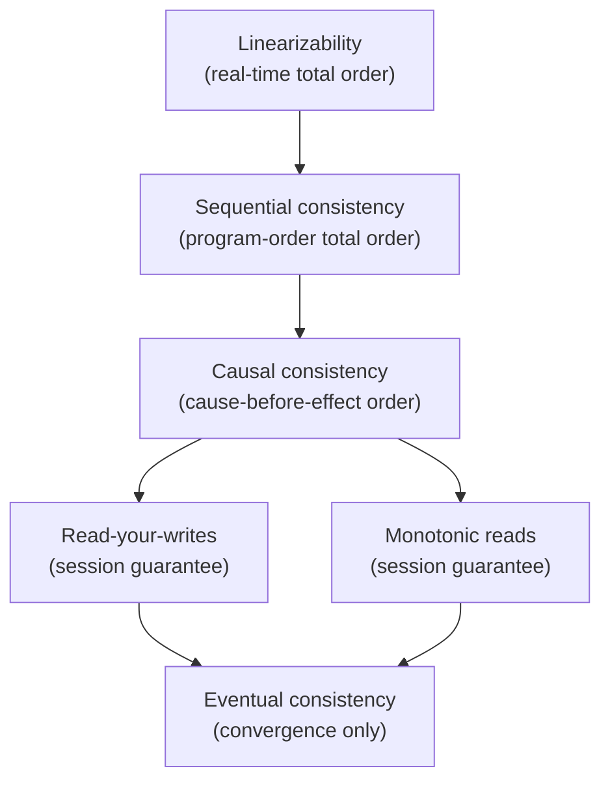
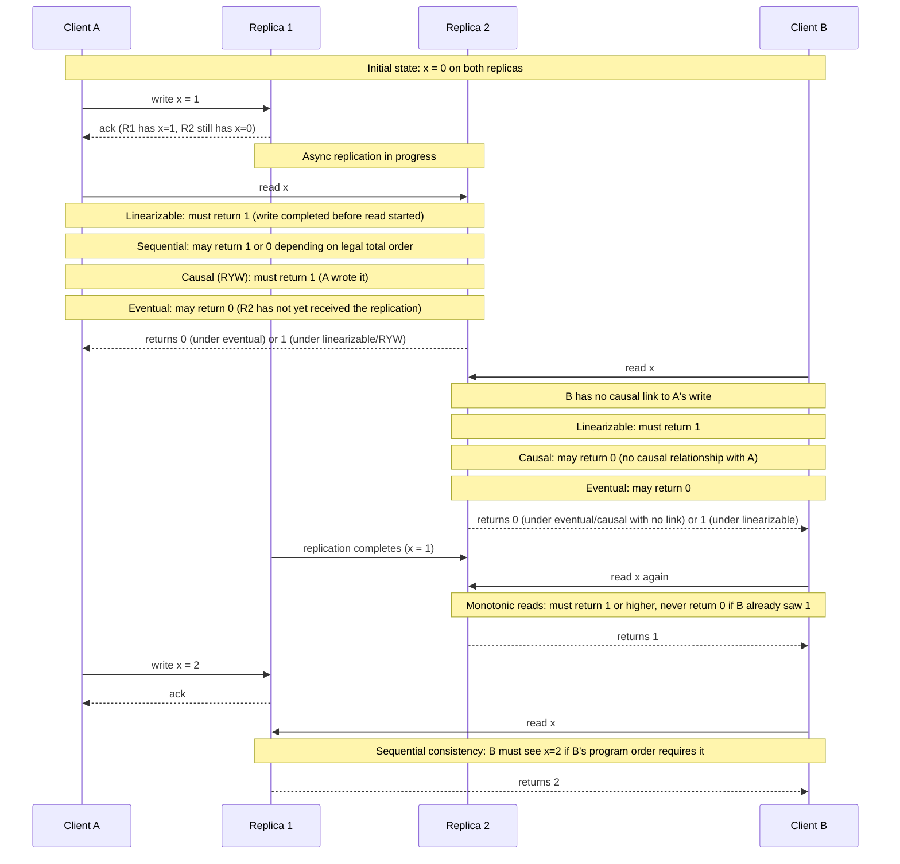
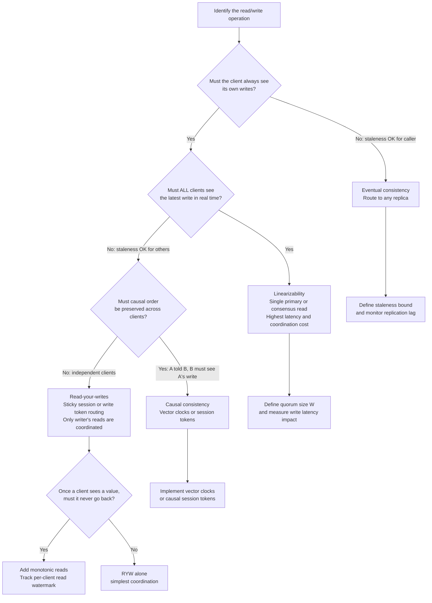

# Chapter 05 — Consistency Models

TL;DR — Consistency in distributed systems is the guarantee a system provides about what value a read may observe relative to prior writes. Models form a strict hierarchy: linearizability is the strongest and most intuitive; sequential consistency relaxes real-time ordering; causal consistency relaxes cross-client ordering while preserving cause-and-effect; eventual consistency makes only a convergence promise. "Strong consistency" usually means linearizability. Client-centric guarantees — read-your-writes and monotonic reads — are session-level properties weaker than full causal consistency but practically important for user-facing systems. This is the distributed-replica sense of consistency, which is entirely distinct from the C in ACID and from isolation levels — do not conflate them.

## Mental model

Consistency models answer one question: after a write completes, which subsequent reads are allowed to return the old value? At the strong end, linearizability says no read ever returns a stale value once a write completes — every read reflects the globally most recent state. At the weak end, eventual consistency says only that if writes stop arriving, all replicas will eventually agree — there is no bound on how long that takes or how stale a read can be in the meantime.

The hierarchy is nested: every linearizable execution is also sequentially consistent; every sequentially consistent execution is also causally consistent; every causally consistent execution is also eventually consistent. The trade-off going down the hierarchy is more staleness and more complexity of reasoning for the application, in exchange for lower latency and better availability under partitions.

One critical distinction: the consistency discussed here is about replica agreement in a distributed data store — what value does a read return when replicas may be behind? This is different from the C (consistency) in ACID, which means a transaction leaves the database in a valid state satisfying declared invariants. It is also different from isolation levels (covered in Chapter 18), which describe how concurrent transactions in a single database interact. Do not conflate these three meanings of "consistency."

## How it works

### Linearizability

Linearizability (Herlihy and Wing, 1990) is the strongest single-object consistency model. An execution is linearizable if every operation appears to execute atomically at a single point in real wall-clock time between when the client called it and when the client received the response. From the client's perspective, the system behaves as if there is a single copy of the data that all reads and writes touch in order.

Formally: a linearizable execution can be mapped to a sequential history of operations such that (a) the sequential order respects the real-time precedence of non-overlapping operations, and (b) each read returns the value of the most recent preceding write in that sequential order.

Achieving linearizability in a distributed system requires coordination: either a single authoritative primary that all reads and writes go through, or a consensus protocol (Raft, Paxos — Chapter 35) that agrees on the order of operations before committing them. This coordination adds latency and reduces availability during partitions: CAP's C is linearizability (Chapter 06 explores this formally).

### Sequential consistency

Sequential consistency is weaker than linearizability. An execution is sequentially consistent if all operations appear in some total order that respects each individual client's program order, but that total order need not match real-time wall-clock order.

Concretely: if client A writes x=1 and then x=2, those two writes must appear in that order for everyone. But the moment when A's write x=1 becomes visible to client B relative to B's own operations is not constrained to match the clock time of A's write.

### Causal consistency

Causal consistency tracks which operations causally preceded which others. If A writes x=1 and then sends a message to B telling it about the write, B's subsequent read must see x≥1. If B independently reads x without any communication with A, B may see x=0 — the two operations are not causally related.

Causal consistency is the strongest consistency model that is compatible with full availability under network partitions (Bailis et al., 2013 — COPS). An eventually consistent system with causal enforcement can continue accepting reads and writes during a partition while preserving the cause-and-effect ordering that applications most commonly rely on.

### Client-centric guarantees

Two session-level guarantees are practically important for user-facing systems:

**Read-your-writes (RYW):** a client always sees the results of its own previous writes. If a client writes x=1 and then reads x, it always receives 1 or a more recent value, regardless of which replica serves the read.

**Monotonic reads:** once a client observes a value, subsequent reads never return an older value. If a client reads x=5 from a replica and then reads x again (even from a different replica), it receives 5 or higher — never 4 or 3.

These two guarantees can be provided without full causal consistency by tracking each client's write tokens and routing reads to replicas that have caught up to those tokens (sticky sessions), or by attaching write timestamps to client cookies and rejecting stale-replica reads.

### Eventual consistency

Eventual consistency guarantees only convergence: if no new writes arrive, all replicas will eventually return the same value. There is no bound on how long convergence takes, no guarantee that any two concurrent reads return the same value, and no guarantee that a read returns the most recent write. A client may read its own write successfully and then read a stale value in the next request if a different replica is selected.

Eventual consistency is the weakest commonly-used model. It is appropriate for use cases where temporary divergence is acceptable: social media "like" counts, caches, analytics aggregations, and session state in stateless applications.

### The ACID C is not this

ACID consistency means a transaction moves the database from one valid state to another, satisfying all declared constraints (foreign keys, uniqueness constraints, application-defined invariants). This is entirely an application-level correctness property enforced by the database's constraint machinery, not a property of replica agreement. A single-node database with no replication can have ACID consistency while the distributed replica model is irrelevant.

## Design Review Lens

- What problem is this actually solving? It specifies the contract between the data store and the application: after a write completes, which reads are guaranteed to return the updated value? Without this contract, applications must defensively handle arbitrarily stale reads.
- What assumptions does it depend on (and when do they break)? Linearizability assumes a coordination protocol (a single primary or a consensus group) that adds latency and single points of failure. Session guarantees (RYW, monotonic reads) assume the client maintains a session token and the system can route reads to a replica that has caught up. These break when clients lose their session tokens (logout, load balancer changes) or when the routing layer cannot honor the session constraint under failover.
- What breaks FIRST at 10x scale? The coordination overhead for linearizability grows as the system partitions data. Cross-partition linearizable reads require distributed transactions or global ordering, which does not scale linearly. At 10x scale, the pressure to relax linearizability to causal or eventual on some paths is strong.
- What breaks FIRST at 100x scale? Application correctness assumptions become visible. At 100x scale with eventual consistency, the probability of a user seeing a stale read on any given session rises enough that edge cases in the application — posting a comment and immediately not seeing it — become common user complaints. The product must explicitly design the degraded-consistency experience or move stronger paths to a linearizable store.
- How would Netflix vs Amazon vs a 5-person startup each approach this differently? Netflix serves recommendation and play-state data at scale and accepts eventual consistency for most paths (slightly stale "continue watching" lists are tolerable) while requiring linearizability for the few billing and entitlement paths. Amazon uses per-service consistency tuning: shopping cart uses eventual consistency (convergent replicated data types) while order placement requires linearizability. A 5-person startup should default to linearizable storage (a managed relational database with a single primary) until a specific measured bottleneck justifies relaxing to something weaker.

## Variants / approaches

| Model | Guarantee | Typical implementation | Suitable for |
|---|---|---|---|
| Linearizability | Every read returns the most recent write; operations appear atomic in real time | Single primary; Raft/Paxos consensus | Financial records, configuration, leader election |
| Sequential consistency | All ops in a total order consistent with program order | Sequentially consistent memory, some distributed queues | Multi-threaded local shared memory |
| Causal consistency | Causally related writes are seen in order; unrelated writes may be reordered | COPS, Causal+, vector clocks | Social feeds, collaborative editing |
| Read-your-writes | Client sees its own writes; others' writes may be stale | Sticky sessions; write token tracking | User profile updates, comment posting |
| Monotonic reads | A client never observes a value older than previously seen | Read from replica that matches session watermark | News feeds, activity streams |
| Eventual consistency | Replicas converge if writes stop | DynamoDB default, Cassandra with ONE consistency level | Like counts, view counters, non-critical caches |

## Worked example (with capacity model)

Scenario: a social photo-sharing application with two user-facing operations — posting a photo (write) and viewing a user's photo feed (read). The system has two replicas, R1 and R2, serving different geographic regions. This is a hypothetical scenario for reasoning; all timing values are planning assumptions.

**Setup**

| Input | Assumption |
|---|---|
| Inter-replica async replication lag | 50–500 ms typical, up to 5 s under load |
| Number of users | 50 million daily active |
| Read/write ratio | 100:1 reads per write |
| Peak write throughput | 5,000 writes/second |
| Peak read throughput | 500,000 reads/second |

**History under examination**

Starting state: Alice has 0 photos. Bob is viewing Alice's feed.

| Operation | Client | Replica | Result |
|---|---|---|---|
| Op 1 | Alice uploads photo | R1 | R1 stores photo; async replication starts |
| Op 2 | Alice views her own feed | R2 | ??? |
| Op 3 | Bob views Alice's feed | R2 | ??? |
| Op 4 | Bob views Alice's feed again | R1 | ??? |

**What each model allows for Op 2 (Alice reads her own upload)**

Linearizable: Op 1 completed before Op 2 started. Alice must see the photo. R2 must return it — this requires either routing Alice's read to R1 (which has the write), blocking until R2 receives the replication, or using a consensus protocol. Under the 50–500 ms lag assumption, this adds 50–500 ms to Alice's read latency.

Sequential consistency: there exists a legal total order where Alice's read can precede Alice's write in the system-wide order — Alice may see 0 photos. This is surprising to users and likely a bug in the application's expectation.

Causal consistency with RYW: Alice wrote the photo (Op 1 → Op 2 causal link). Alice must see the photo in Op 2. The system can enforce this by tracking Alice's write token (the replica and sequence number where the write landed) and routing Alice's reads to a replica that has that write or later.

Eventual consistency: R2 may return 0 photos during the replication window. Alice sees her upload disappear after posting. This is a poor user experience and a common complaint in eventually-consistent social platforms.

**What each model allows for Op 3 (Bob reads Alice's feed from R2)**

There is no causal link from Alice's write to Bob's read (Alice did not tell Bob to look). Under causal consistency, Bob may see 0 photos. Under linearizability, Bob must see the photo. Under eventual consistency, Bob may see 0 photos for up to 5 seconds (the lag bound).

**What each model allows for Op 4 (Bob reads Alice's feed from R1)**

By Op 4, replication may have completed. Under monotonic reads: if Bob saw 1 photo in Op 3, he must see at least 1 photo in Op 4, even from a different replica. Under eventual consistency with no monotonic read guarantee: Bob could read from R1 (which has the photo) in Op 3 and from a lagging R2 in Op 4 and see 0 photos — a "time-travel" experience.

**Throughput impact by model**

At 500,000 reads/second, the throughput difference between models is significant:

Linearizable reads: all reads must go to a primary or use quorum reads (read from W of R replicas). Quorum reads at R=2 mean every read touches both replicas — doubles read load on each replica. Alternatively, all reads route to the primary — one replica handles 500,000 reads/second while the other is idle.

RYW with eventual reads for others: only Alice's reads (5,000/second at the write rate) require routing enforcement. Bob's 495,000 reads/second are served from any replica with no coordination. This is a 99% reduction in coordination overhead compared to full linearizability.

**Decision from the model**

For a photo-sharing feed, RYW is the minimum required model for Alice's experience (she must see her own uploads). Bob's experience can tolerate eventual consistency for the feed itself (seeing Alice's photo a few seconds late is acceptable). Payments, follow/unfollow actions, and account settings should use linearizable storage. This is the standard tiered-consistency approach: use the weakest model that is still correct for each specific user-facing operation.

**Storage**

QPS, storage, and bandwidth follow the capacity model from Chapter 01. This chapter's contribution to the capacity model is: estimating what fraction of reads require coordination (linearizable or RYW-enforced) vs can be served from any replica without coordination, because that determines read replica load and cross-replica coordination traffic.

## Failure Walkthrough

Single node failure: one replica fails. Under linearizable configuration, reads and writes must route to surviving replicas. If the system uses a single primary and it fails, writes are unavailable until a new primary is elected (Chapter 37). Reads may also be unavailable if the system requires the primary for linearizability. Under eventual consistency, reads continue from the surviving replica; the consistency guarantee is unaffected. Detection: health check failure, missing heartbeat. Recovery: replica replacement, data backfill from surviving replica.

Network partition: replicas cannot communicate. A linearizable system must refuse writes (or reads) on the minority partition side to maintain consistency — Chapter 06 formalizes this as the CP choice. An eventually-consistent system continues accepting reads and writes on both partition sides, creating divergence that must be reconciled when the partition heals. RPO for CP: 0 for acknowledged writes, but write availability is reduced. RPO for AP: 0 for writes accepted on each side, but those writes may conflict.

Full regional failure: a region hosting a replica goes down. The system loses consistency if it required cross-region quorum. It retains eventual consistency with surviving replicas. RPO depends on whether cross-region replication was synchronous.

Critical dependency outage: the coordinator or primary fails. Linearizable systems stall until a new coordinator is elected. Strongly consistent reads stall. Eventually consistent systems continue serving stale reads from surviving replicas.

Data corruption / poison data: a write containing wrong data propagates to all replicas under any consistency model. Stronger consistency models replicate the corruption faster and more reliably than weak ones — high durability and consistency of a corruption is not an advantage. Detection and recovery follow from Chapter 04's pattern: identify the corruption point in time, restore from PITR, and replay valid writes.

## Decision Framework

## Tradeoffs & alternatives

Main recommendation: use the weakest consistency model that is still correct for the specific operation being designed.

WHY: Every step up the hierarchy adds latency, reduces availability under partitions, and increases coordination complexity. Linearizability on a hot read path that does not actually need it wastes resources and creates an unnecessary availability dependency on the coordinating primary.

What it COSTS: Weaker models push correctness responsibility to the application. Eventual consistency requires the application to handle stale reads, conflicts, and "time travel" without corrupting user experience or application state. This is often more complex to implement correctly than the stronger model it replaces.

ALTERNATIVES: Conflict-free replicated data types (CRDTs, Chapter 38) allow certain data structures to be updated concurrently on any replica and merged deterministically — providing eventual consistency with guaranteed convergence to the correct merged value, without coordination. This is appropriate for specific data types (counters, sets, last-write-wins registers) but not for arbitrary business logic.

WHEN NOT to relax consistency: Do not use eventual consistency for data where concurrent conflicting writes produce incorrect merged state — financial balances, inventory counts with sell-down logic, access control decisions. In these cases, the cost of a wrong answer exceeds the cost of the coordination required for linearizability.

## Staff & Principal lens

Consistency model choices are often made implicitly — a team picks a data store, uses the default settings, and discovers the consistency model in production when users report missing data. Staff engineers should require consistency model documentation as part of any data-tier design review: what model does the default configuration provide, what model does the production traffic actually require, and where is the gap?

The organizational consequence of eventual consistency is that the application must handle conflict resolution. That logic is business logic, not infrastructure logic. A team that adopts eventual consistency without implementing explicit conflict resolution has delegated business correctness decisions to "last-write-wins" — which is usually wrong for anything more complex than a counter.

Cross-team consistency is a common gap in microservice architectures. Service A exposes an eventually consistent API; Service B reads from it and uses the result in a linearizable decision. The composed correctness model is weaker than either service's internal model, and Service B's developer may not know that. Consistency model contracts should be part of the API documentation, not buried in the storage configuration.

Cost governance: moving from linearizable reads (primary-only) to RYW reads (replica-eligible) reduces read load on the primary and allows horizontal scaling of reads. This is a cost reduction tied to a consistency model change. A Principal engineer should model the read-throughput savings of read-replica enablement and use it to justify the implementation cost of RYW session routing.

## Interview answer vs production reality

What interviewers expect to hear: define linearizability (strong, real-time ordering), sequential consistency, causal consistency, and eventual consistency as a hierarchy. State that strong consistency adds latency and reduces availability under partitions. Note that different operations in the same system may need different consistency levels. Mention read-your-writes as a session guarantee.

What actually happens in production: teams choose eventual consistency for the throughput benefits and discover the consistency requirements later, when user complaints about missing data arrive. Monotonic reads are often not implemented, leading to "time-travel" bugs where refreshing a page shows an older state. Session token routing for RYW breaks silently when load balancers change or users are re-authenticated. Systems described as "consistent" in documentation may use weaker models in default configuration.

Simplifications that are fine in an interview but wrong in prod: calling a primary-replica setup "strongly consistent" without verifying read routing — if reads can go to replicas without RYW enforcement, the system provides eventual consistency on reads. Treating causal consistency and linearizability as interchangeable "strong" options — they differ significantly in what they allow and what they cost.

## Common pitfalls & misconceptions

- Conflating the C in ACID with the C in the CAP theorem. ACID's C is application-invariant preservation; CAP's C is linearizability. They are unrelated and must not be used interchangeably.
- Conflating consistency models with isolation levels. Isolation levels (Chapter 18) describe how concurrent transactions interact within a database. Consistency models describe replica agreement in a distributed system. A system can be serializable (highest isolation) while providing eventual consistency in a multi-replica read path.
- Treating "strong consistency" as a well-defined term. It usually means linearizability, but some vendors use it to mean sequential consistency or read-after-write consistency. Always ask for the precise model.
- Assuming that using a strongly-consistent data store makes an application strongly consistent. If the application reads from a replica, caches the result, and makes a decision, the decision is based on a potentially stale value regardless of the store's model.
- Forgetting that causal consistency requires the application to propagate causal information. If the client does not attach a write token to its read request, the system cannot enforce causal ordering.
- Treating eventual consistency as "fast but broken." For the right data types (counters, caches, feeds), eventual consistency is correct and the right choice. The model is not inherently wrong; it is wrong for the wrong use case.

## Interview questions

Mid: What does it mean for a distributed system to be "strongly consistent"? What does it guarantee that eventual consistency does not?

MODEL answer: Strong consistency usually means linearizability: every read returns the most recently written value, and all operations appear to execute at a single point in real time. Eventual consistency guarantees only that replicas will eventually agree if writes stop. In an eventually consistent system a client can read a value that was overwritten seconds ago, or post a comment and immediately not see it. Linearizability prevents both. The cost is that linearizability requires coordination — typically routing reads and writes through a single primary or using consensus — which adds latency and makes the system unavailable if coordination fails.

Senior: A user posts a comment on your platform. They immediately refresh and the comment is gone. What consistency model was in use, and what is the fix?

MODEL answer: The system lacks read-your-writes. A write went to one replica, the read came from a different, lagging replica. The consistency model was eventual consistency with no session guarantee. The fix is to implement RYW: track the replica and write sequence number (or a timestamp) of the user's last write and attach it as a session token to reads. The read path then routes to a replica that has processed up to that token, or waits until the serving replica catches up. This adds complexity in the routing layer but avoids the coordination cost of linearizability for the majority of reads (other users' reads need no session enforcement).

Staff: You are choosing between linearizable and eventually consistent storage for a new feature: a live vote counter displayed during a company all-hands. The counter updates every second and is displayed to 10,000 concurrent viewers. What do you choose and why?

MODEL answer: Eventual consistency. The vote counter is a display-only aggregate; a viewer seeing 5,234 votes instead of 5,237 for a second causes no business harm. Eventual consistency allows the read path to scale horizontally — 10,000 concurrent reads can be distributed across many read replicas without any coordination. Linearizable reads would require all 10,000 readers to go through a single primary or quorum, creating a bottleneck and a single point of failure for a display-only feature. The design would use a CRDT counter (Chapter 38) or a simple last-writer-wins counter with per-region aggregation, accepting temporary divergence between replicas as intentional and correct for this use case.

Principal: Your platform uses Cassandra at consistency level ONE (eventual) for a user-settings store. The product team wants to add a security feature that reads a user's two-factor authentication setting before allowing login. What do you do, and what does it mean organizationally?

MODEL answer: Using eventual consistency for a security check is incorrect: a stale read could return the pre-2FA state and bypass the authentication requirement. I would move 2FA reads to consistency level QUORUM in Cassandra (majority of replicas must respond, providing read-your-writes and monotonic reads in a single data center) or to a strongly consistent store if QUORUM is not sufficient given the topology. Organizationally, this surfaces a common gap: the team chose ONE for performance across the entire settings store, not recognizing that different fields have different correctness requirements. I would drive a review of all security-relevant reads in the codebase to identify other places where the consistency model is wrong for the operation. The conclusion is likely a tiered design: most settings at ONE, security-sensitive settings at QUORUM or in a separate linearizable store. This requires coordination across the feature teams that own those reads and a discipline of annotating operations with their consistency requirements at design time rather than discovering them in production.

## Connections

Prerequisites: [Chapter 04 — Durability and Reliability](../chapter-04-durability-and-reliability/) for the write-acknowledgment semantics that determine what is replicated and when. [Chapter 03 — Availability and the Nines](../chapter-03-availability-and-the-nines/) for the availability cost of requiring coordination on reads.

Related chapters: [Chapter 06 — CAP and PACELC](../chapter-06-cap-and-pacelc/) formally connects consistency models to partition behavior. [Chapter 18 — Database Transactions and Isolation Levels](../chapter-18-database-transactions-and-isolation-levels/) covers the separate (but named-similarly) concept of isolation. [Chapter 22 — Replication and Quorums](../chapter-22-replication-and-quorums/) covers the W + R > N quorum condition for linearizable reads. [Chapter 38 — CRDTs and Vector Clocks](../chapter-38-crdts-and-vector-clocks/) covers conflict-free data types that enable correct eventual consistency.

Builds toward: [Chapter 06 — CAP and PACELC](../chapter-06-cap-and-pacelc/), [Chapter 35 — Consensus With Raft](../chapter-35-consensus-with-raft/) (the mechanism that delivers linearizability in practice), [Chapter 65 — Design Walkthrough: Chat System](../chapter-65-design-walkthrough-chat-system/).

## Further reading

- Maurice P. Herlihy and Jeannette M. Wing, ["Linearizability: A Correctness Condition for Concurrent Objects"](https://dl.acm.org/doi/10.1145/78969.78972), ACM Transactions on Programming Languages and Systems, 1990. The original formal definition of linearizability.
- Kyle Kingsbury (Jepsen), [Consistency Models](https://jepsen.io/consistency). A rigorous, freely available map of the consistency model hierarchy with formal definitions, examples, and relationships between models.
- Martin Kleppmann, *Designing Data-Intensive Applications*, Chapters 5 and 9, O'Reilly, 2017. Practical treatment of replication lag, consistency guarantees, and linearizability in production systems.
