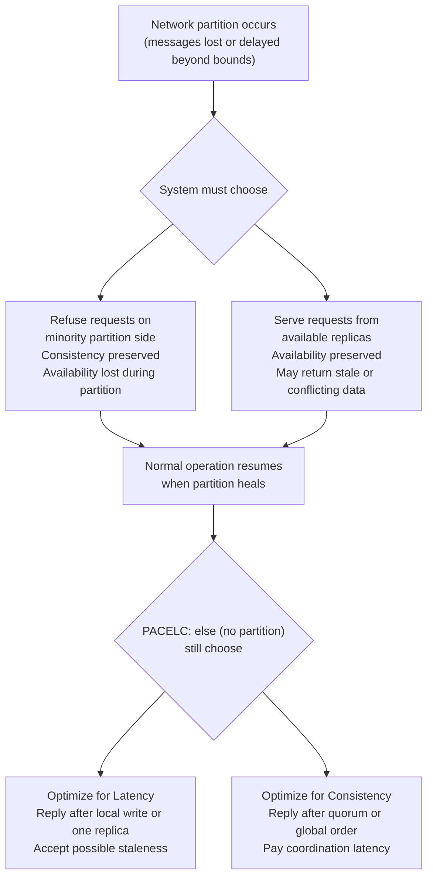
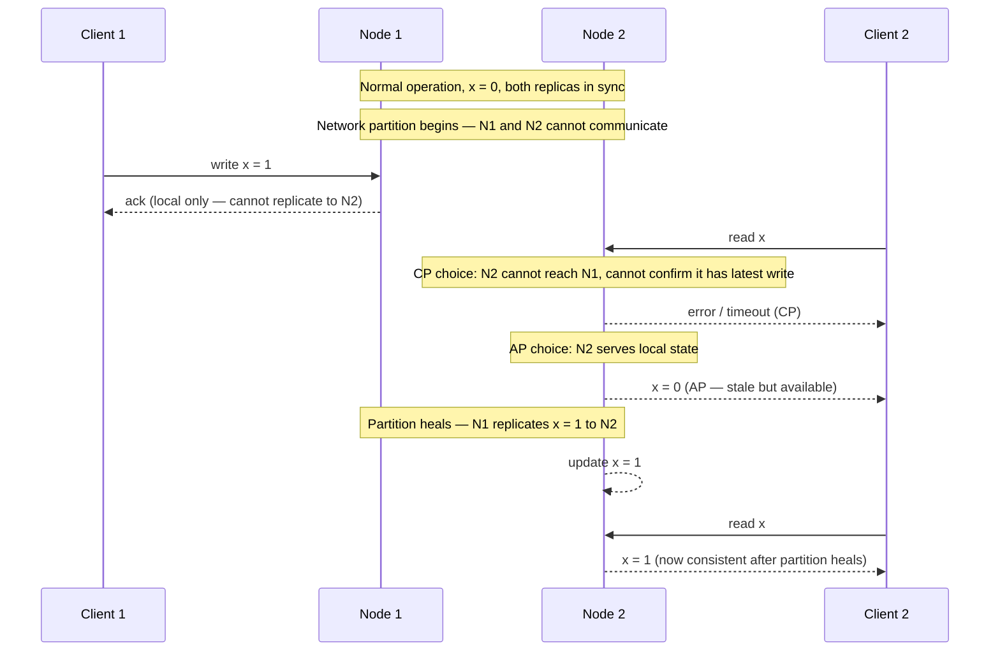
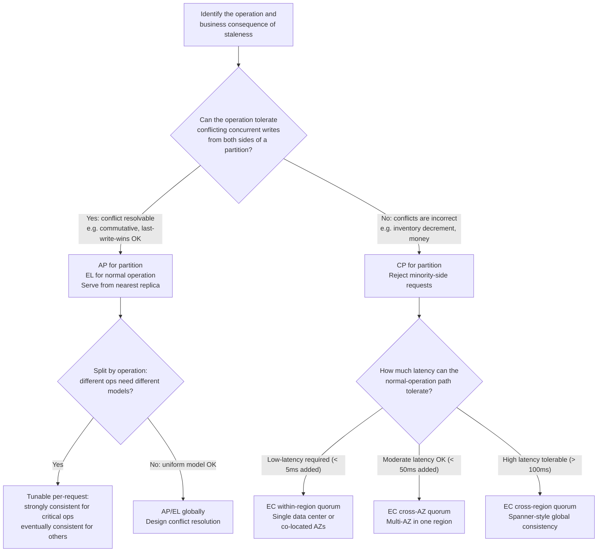

# Chapter 06 — CAP and PACELC

TL;DR — CAP says a distributed system cannot simultaneously guarantee Consistency (linearizability), Availability (every request receives a response), and Partition tolerance (the system continues operating despite communication failures between nodes). Since partitions are a fact of real networks, the practical choice is what you do *during* a partition: reject requests to preserve consistency (CP), or serve potentially stale data to preserve availability (AP). PACELC extends this: even when no partition exists, every system faces a Latency-versus-Consistency trade-off in normal operation — and that normal-operation trade-off is where systems spend 99.9% of their time. Spanner does not beat CAP; it engineers the cost of the C side down to practical levels. Most systems are tunable per request, making "this system is AP" an incomplete description.

## Mental model

Networks between machines fail — intermittently, asymmetrically, and without warning. Partition tolerance is not an optional property that some systems choose and others forgo. Every distributed system must decide what to do when it cannot confirm that its peers are alive and reachable. CAP's contribution is to name the forced choice: you can refuse to answer (sacrifice Availability) or answer with potentially stale data (sacrifice the Consistency guarantee of linearizability). You cannot do both, because doing both would require either communicating with unreachable nodes or accepting answers that may no longer be current.

The diagram above is the correct framing: partition tolerance is forced on every system that spans more than one machine; the real choices are at the two decision nodes.

## How it works

### CAP precisely stated

Gilbert and Lynch (2002) formalized Brewer's conjecture: no distributed data store can simultaneously provide all three of:

- **Consistency**: every read receives the most recent write or an error (CAP's C is linearizability — Chapter 05).
- **Availability**: every request receives a non-error response, though it may not be the most recent write.
- **Partition tolerance**: the system continues operating despite arbitrary message loss or delay between nodes.

Since partitions occur in real networks (link failures, overloaded switches, GC pauses that make a node appear unreachable), you cannot opt out of needing to handle them. P is not a design choice; it is a property of the environment. The actual trade-off is CA during a partition — exactly two at a time — not globally among three.

### What CAP's C really means

CAP's C is linearizability: the system behaves as if there is a single copy of the data and each operation takes effect atomically at a point in real time. This is *not* ACID's C (transaction invariant preservation) and not sequential consistency. "Consistent" in casual usage often means "does not return stale data," which is closer to CAP's C than to ACID's C, but the formal definition is linearizability. Chapter 05 covers the full hierarchy; CAP's C is the top.

### The forced choice during a partition

During a partition, a node in the minority partition (fewer than quorum replicas reachable) has two options:

**CP (Consistency + Partition tolerance):** refuse reads and writes until quorum is restored. Users on the minority side get errors or timeouts. Data remains consistent when the partition heals — no conflicting writes were accepted. Examples: ZooKeeper, etcd, HBase, traditional RDBMS with synchronous replication.

**AP (Availability + Partition tolerance):** continue serving reads from local state and accepting writes locally. When the partition heals, conflict resolution is needed. Conflicts may be resolved last-write-wins, merge, or surfaced to the application. Examples: Cassandra (default tuning), Riak, CouchDB, DynamoDB (default).

Most modern systems are tunable: Cassandra at consistency level QUORUM behaves as CP; at ONE it behaves as AP. DynamoDB supports strongly consistent reads (CP for that operation) and eventually consistent reads (AP). "This system is CP" means "this system is CP with its default configuration" — which can change.

### PACELC: the normal-operation trade-off

Abadi (2012) identified the gap in CAP: partitions are rare events; what is the system's behavior the other 99.9% of the time when there is no partition? PACELC classifies systems on two axes:

- During a Partition (P): choose Availability (A) or Consistency (C).
- Else (E, normal operation): choose Latency (L) or Consistency (C).

The Else branch is where architectural decisions about write acknowledgment (primary only vs. quorum), read routing (local vs. quorum), and replication synchrony live. It is where most performance and consistency trade-offs are made in practice.

**PACELC classification of common systems:**

| System | Partition | Else | Notes |
|---|---|---|---|
| DynamoDB (default) | A | L | Eventually consistent by default; strongly consistent reads available at higher latency |
| Cassandra (ONE) | A | L | Tunable; QUORUM changes to PC/EC |
| Cassandra (QUORUM) | C | C | Majority quorum required for reads and writes |
| Riak | A | L | Eventual consistency; CRDT support |
| ZooKeeper | C | C | Majority quorum; rejects writes when quorum unavailable |
| etcd | C | C | Raft consensus; strong consistency |
| Spanner | C | C | TrueTime-bounded linearizability; cross-region writes pay RTT |
| CockroachDB | C | C | Raft-based; serializable isolation |
| MongoDB (primary reads) | C | C | Primary always has latest write |
| MongoDB (secondary reads) | A | L | Stale reads from secondary |
| MySQL primary-replica (sync) | C | C | Sync replication; primary only for writes |
| MySQL primary-replica (async) | A | L | Async; stale reads from replica |
| Redis (cluster, async) | A | L | Async replication between cluster nodes |

The "tunable" caveat is critical: most systems above can be reconfigured for the opposite trade-off. The table shows the most common production defaults.

### Spanner does not violate CAP

Google Spanner is often cited as a system that provides "external consistency" (a property equivalent to linearizability) while being globally distributed. This is sometimes described as "beating CAP." It does not.

Spanner uses TrueTime — GPS and atomic clock hardware that bounds clock uncertainty to within ε milliseconds (typically single-digit milliseconds). Before committing a transaction, Spanner waits for ε milliseconds to ensure the commit timestamp is unambiguously after all prior commits (the "commit wait"). This engineers the coordination cost of linearizability to be as small as ε rather than a full cross-region round trip.

During a network partition, Spanner's Paxos-based consensus still requires a quorum. A minority partition cannot commit writes. Spanner makes the same CP choice as every consensus-based system — it just makes the non-partition latency cost of strong consistency small enough to be practical at global scale. The theorem still holds; the implementation minimizes the price of satisfying C.

### Two-replica partition scenario

Consider two replicas, N1 and N2, holding key x=0. A network partition isolates them from each other.

Client writes x=1 to N1. N1 accepts the write.
Client reads x from N2.

CP response: N2 refuses the read (cannot verify it has the latest write). Client receives an error or timeout. When the partition heals, N2 learns x=1 and can serve correct reads.

AP response: N2 serves x=0 (its local state, which is stale). Client receives a response immediately. When the partition heals, N2 receives the write and updates to x=1. If another client also wrote x=2 to N2 during the partition, there is a conflict to resolve.

Neither response is wrong — they reflect different, legitimate design choices with different user-experience implications.

## Design Review Lens

- What problem is this actually solving? It names the trade-offs every distributed system must make when the network fails, and extends them to normal operation where latency and consistency compete. Without this vocabulary, teams make implicit choices without recognizing them as choices.
- What assumptions does it depend on (and when do they break)? CAP assumes that consistency means linearizability and that availability means every request receives a response. Systems that weaken these definitions (e.g., "eventually linearizable" or "available to most requests") are not directly covered by the theorem. PACELC assumes that latency and consistency are the only axes; in practice, cost, operational complexity, and throughput also matter.
- What breaks FIRST at 10x scale? The cost of the EC side (consistency during normal operation). At 10x writes, cross-replica quorum latency becomes a write throughput bottleneck. Systems that were acceptably slow for strong consistency become visibly slow, driving teams to relax the consistency model without fully reasoning about the application-level consequences.
- What breaks FIRST at 100x scale? The global ordering bottleneck. Systems that route all operations through a single global primary for linearizability hit a hard throughput ceiling at 100x. Sharding (Chapter 24) is the architectural response, but sharding linearizable operations is complex and cross-shard linearizability is expensive.
- How would Netflix vs Amazon vs a 5-person startup each approach this differently? Netflix-scale streaming needs low read latency for recommendations (EL) and accepts staleness; it needs CP for entitlements (billing-correct) and configures those paths separately. Amazon runs a mixed architecture: shopping cart uses AP with conflict resolution (CRDT vectors, as described in the Dynamo paper); checkout uses CP. A 5-person startup should default to CP (a managed relational database with a single primary) and accept the availability cost of that choice until traffic justifies the complexity of a mixed AP/CP design.

## Variants / approaches

| Configuration | During partition | Normal operation | Suitable for |
|---|---|---|---|
| CP (consensus-based) | Reject minority-side requests | Pay quorum latency | Distributed locks, configuration, leader election, financial records |
| AP (conflict-tolerant) | Serve stale/local data | Low-latency local writes | Shopping carts, social feeds, view counters, session state |
| Tunable per-request | Choose per operation | Choose per operation | Multi-model stores (Cassandra, DynamoDB) with per-path configuration |
| Geo-distributed CP (Spanner-style) | Quorum required cross-region | Pay bounded TrueTime wait | Global financial data, compliance-sensitive records needing global linearizability |
| Single-region CP | Quorum within region | In-region quorum latency | Most applications that do not need cross-region linearizability |

## Worked example (with capacity model)

Scenario: an e-commerce inventory system with two operations — inventory read (how many units are available?) and inventory decrement (reserve a unit for an order). Two data centers, each with a replica. This is a hypothetical scenario; all latency figures are planning assumptions.

**The business requirement**

Inventory decrements must not oversell: if 100 units remain, at most 100 reservations can succeed. Inventory reads for browsing can be slightly stale — showing 100 instead of 98 for a few seconds is acceptable.

**Mapping to CAP/PACELC**

Decrement operations: must be CP. During a partition, accepting decrements on both sides independently risks overselling. A minority-side node must refuse decrements or accept them only with the knowledge that reconciliation will happen — but last-write-wins reconciliation on inventory counts produces oversells. CP is required.

Read operations for browsing: can be AP. A user seeing the inventory count 2 seconds stale causes no business harm. AP reads with EL trade-off allow reading from any local replica at low latency.

**Partition scenario**

During a partition isolating DC-A from DC-B:
- CP decrements: DC-A's node refuses decrements (cannot reach DC-B to form a quorum). Users in DC-A's region get errors for checkout. Browsing still works if reads are AP.
- DC-B's node similarly refuses decrements if quorum requires both DCs.
- When the partition heals, consensus resumes and decrements proceed.

This is the correct behavior for inventory. The alternative — letting both DCs accept decrements independently — would require a reconciliation policy that cannot safely resolve the oversell without canceling confirmed orders.

**PACELC classification for this system**

| Operation | P choice | E choice | Rationale |
|---|---|---|---|
| Inventory decrement | C (reject on minority) | C (quorum write) | Oversell risk; correctness critical |
| Inventory read (browse) | A (serve stale) | L (local replica) | Staleness tolerable; low latency valuable |
| Order record write | C (reject on minority) | C (quorum write) | Durability + correctness |
| Recommendation feed | A (serve stale) | L (local replica) | Staleness harmless |

**Latency impact of the EC (Else: Consistency) choice**

Within-AZ quorum for inventory decrements (assuming 2 replicas in 2 AZs):
Cross-AZ write round trip: 1–5 ms additional latency (planning assumption; actual varies by geography).
At 1,000 inventory decrements per second, cross-AZ sync adds 1–5 ms to each — still acceptable.

If the system were globally distributed (two continents):
Cross-continent write RTT: 100–200 ms (planning assumption). At 1,000 decrements/second, a 200 ms quorum write adds 200 ms of user-visible checkout latency. This is why globally distributed linearizability (Spanner-style) is usually reserved for data that must be globally consistent and cannot tolerate geographic partitioning of reads and writes.

**QPS and storage inputs**

Follow Chapter 01's capacity model. QPS, storage, and bandwidth are computed from product assumptions independently of the consistency model. The consistency model determines what fraction of reads require quorum (coordination cost) vs can be served locally (no coordination cost), and this affects replica load distribution and read latency percentiles.

## Failure Walkthrough

Single node failure: if a replica fails, CP systems lose quorum if the failed node was required. Writes are rejected until either the node recovers or the quorum is reconfigured. AP systems continue serving from surviving replicas. Detection: heartbeat failure, quorum health metric. Recovery: node replacement, data backfill, quorum restoration.

Network partition: the forcing condition of CAP. CP systems reject requests on the minority side; AP systems serve stale data. The partition duration determines the staleness window for AP and the outage window for CP. Detection: cross-replica health checks, quorum failure alerts. Recovery: partition heals, replicas sync, conflict resolution applied (for AP systems).

Full regional failure: equivalent to a permanent partition for that region. CP systems lose quorum if the failed region held required replicas. Recovery requires manual quorum reconfiguration or failover to the surviving region. AP systems continue from the surviving region; when the failed region comes back, reconciliation is needed.

Critical dependency outage: the consensus coordination service (e.g., etcd, ZooKeeper) fails. CP systems can make no progress — all writes and many reads stall. AP systems continue locally. Detection: consensus leader failure, missed heartbeat. Recovery: leader election, journal replay.

Data corruption / poison data: a corrupt write that reaches quorum is committed and durable under CP. Under AP, a corrupt write committed locally may be overwritten by a conflicting write from the other partition side — AP's conflict resolution may inadvertently "fix" a corruption by preferring the other value. In neither case is the consistency model a protection against logical corruption; backups and PITR are required.

## Decision Framework

## Tradeoffs & alternatives

Main recommendation: classify each operation by its conflict behavior (are concurrent conflicting writes resolvable?) and its latency budget, then configure the consistency model per operation rather than picking one model for the entire system.

WHY: Most systems have operations with different requirements. Choosing CP globally wastes latency on reads that could tolerate staleness; choosing AP globally risks correctness on operations that cannot.

What it COSTS: Per-operation consistency tuning requires a storage layer that supports it (Cassandra, DynamoDB, some relational databases with read-replica routing), application-level routing logic, and disciplined documentation of which operations use which model.

ALTERNATIVES: Single-primary relational databases (PostgreSQL, MySQL in primary-only mode) give CP without requiring explicit quorum configuration at the cost of write throughput scaling at a single node and higher availability cost under primary failure.

WHEN NOT to apply CAP/PACELC reasoning: single-node systems have no partition problem. The framework applies only to distributed systems with multiple nodes holding replicas. Over-applying CAP vocabulary to local concurrency problems introduces unnecessary confusion.

## Staff & Principal lens

CAP and PACELC are decision frameworks, not specifications. They do not tell you what to build — they name the forces you must balance. A Principal engineer's job is to translate business requirements ("we cannot oversell inventory") into consistency model choices ("inventory decrements must be CP with cross-AZ quorum") and communicate those choices to the teams building the data layer.

The organizational risk is inconsistent understanding. If the team that builds the inventory service understands the CP requirement but the team that builds the cart service independently chooses AP for their reservation layer, the composed system may produce inconsistent outcomes. Consistency model decisions must cross team boundaries, which requires engineering leadership involvement.

Operational burden: CP systems have a harder operational failure mode — under quorum loss, writes are refused and users see errors. Teams must design and practice the operational response: quorum health alerts, on-call runbooks for quorum restoration, and clear escalation paths. AP systems have a softer failure mode — stale reads — that is often invisible until a conflict materializes after a partition heals.

Cost governance: stronger consistency (EC) increases write latency, which reduces write throughput at a given server count, which increases the instance count or cluster size required to hit throughput targets. A Principal should quantify the EC latency cost (measured from load tests), its effect on write throughput, and the infrastructure cost of that throughput reduction compared to an EL configuration.

## Interview answer vs production reality

What interviewers expect to hear: explain the CAP theorem, state that P is unavoidable, describe the CP vs AP choice during a partition, give examples of CP systems (ZooKeeper, traditional RDBMS) and AP systems (Cassandra, DynamoDB defaults), and explain PACELC's extension to normal-operation latency vs consistency.

What actually happens in production: most teams pick a data store based on features or familiarity and discover the consistency model when an incident exposes it. AP conflict resolution is often left as "last write wins" — which produces incorrect results for non-commutative operations. CP systems under quorum loss produce errors that the application is not designed to handle gracefully, surfacing as 500s to users. The "tunable per request" capability of multi-model stores goes unused because no one documented which operations need which level.

Simplifications that are fine in an interview but wrong in prod: classifying a system as "CP" or "AP" without specifying the configuration. Saying Spanner "beats CAP" — it doesn't. Assuming that all operations in a system need the same consistency model.

## Common pitfalls & misconceptions

- Treating P as optional. Every system that runs on real networks must handle partitions. Opting out of P means opting out of distribution.
- Confusing CAP's C with ACID's C. CAP's C is linearizability; ACID's C is application invariant preservation. They are unrelated.
- Treating the CAP theorem as a design guide. It is a constraint, not a prescription. It does not say which trade-off to make — only that you must make one.
- Ignoring the Else branch of PACELC. Systems spend almost no time in a partition. The E (latency vs consistency) trade-off in normal operation dominates the user-visible behavior.
- Claiming "we chose CP so our data is consistent." CP means the system refuses requests on minority partitions, not that data is always correct. A CP system with a bug that produces wrong values is still a CP system.
- Forgetting that "tunable" systems are AP or CP at the moment of each request, not globally. A system configured at consistency ONE is AP for that request; at QUORUM it is CP for that request.

## Interview questions

Mid: What is CAP, and why can't a distributed system be all three?

MODEL answer: CAP says a distributed system cannot simultaneously guarantee Consistency (linearizability — every read sees the latest write), Availability (every request gets a response), and Partition tolerance (the system keeps working when nodes cannot communicate). It cannot be all three because during a partition, a node that cannot reach peers either serves its local state (stale — sacrifices consistency) or refuses (sacrifices availability). There is no third option that satisfies both while also handling the partition.

Senior: Cassandra is often called an "AP" system. Is that accurate?

MODEL answer: Partially. Cassandra at consistency level ONE is AP: it serves reads from any one replica and accepts writes locally, providing availability at the cost of potential staleness during a partition. At consistency level QUORUM, Cassandra requires a majority of replicas to respond for reads and writes — a CP choice for that request. "Cassandra is AP" is shorthand for "Cassandra defaults to an AP configuration," which is accurate for most deployments but misleading as a complete characterization. The correct statement is that Cassandra is a tunable system; its partition behavior depends on the consistency level configured per operation.

Staff: Two teams are building a global inventory system. Team A uses Cassandra at ONE for "performance." Team B owns checkout and needs no oversell. How do you resolve this?

MODEL answer: The configuration Team A chose is wrong for inventory. Cassandra at ONE is AP: during a partition, both data centers can accept inventory decrements independently, and last-write-wins reconciliation cannot safely resolve conflicting decrements. I would drive a cross-team design review with the specific conflict scenario: two users simultaneously check out the last unit of inventory, each in a different data center during a partition. Both are confirmed. One must be cancelled. That is the oversell. I would require that inventory decrements use QUORUM or LOCAL_QUORUM at minimum — within one data center, QUORUM provides CP behavior. For a true multi-region system that needs global inventory consistency, I would evaluate a geo-distributed CP store (Cloud Spanner, CockroachDB) where the quorum spans regions. The outcome of the review must be an explicit consistency-level policy documented in the service's architecture record, not a runtime configuration left to individual engineers.

Principal: Your company is considering migrating from a globally distributed CP system (Spanner) to a regionally distributed AP system (DynamoDB) to reduce latency. What is the evaluation framework?

MODEL answer: The migration pivots on one question: which of the current CP operations can safely become AP, and which cannot? I would enumerate every write operation in the system with its conflict behavior: is the operation commutative (order doesn't matter, merge is safe)? Or does it modify shared mutable state where concurrent writes from two partitions produce an incorrect merged result? Inventory decrements, financial balance changes, and access control modifications are not AP-safe. View counters, like counts, and session data are. If the fraction of non-AP-safe operations is small, I would design a split architecture: DynamoDB AP/EL for the majority of traffic, and a smaller CP store (or DynamoDB strongly consistent reads) for the non-AP-safe paths. I would then measure the latency gain of the AP path against the residual CP latency of the non-AP paths, and compute the operational cost of maintaining two consistency tiers. I would also quantify the conflict rate under synthetic partition scenarios to ensure the AP conflict resolution logic produces correct business outcomes before committing to the migration.

## Connections

Prerequisites: [Chapter 05 — Consistency Models](../chapter-05-consistency-models/) — CAP's C is linearizability; understanding the full consistency hierarchy is required to reason about what "sacrificing C" means. [Chapter 04 — Durability and Reliability](../chapter-04-durability-and-reliability/) — quorum writes connect consistency choice to durability guarantee.

Related chapters: [Chapter 22 — Replication and Quorums](../chapter-22-replication-and-quorums/) (W + R > N quorum conditions implement the consistency models). [Chapter 35 — Consensus With Raft](../chapter-35-consensus-with-raft/) (the consensus mechanism that delivers CP behavior). [Chapter 38 — CRDTs and Vector Clocks](../chapter-38-crdts-and-vector-clocks/) (conflict-free data types that make AP safe for specific data structures).

Builds toward: [Chapter 22 — Replication and Quorums](../chapter-22-replication-and-quorums/), [Chapter 33 — Distributed Transactions](../chapter-33-distributed-transactions/), [Chapter 35 — Consensus With Raft](../chapter-35-consensus-with-raft/), [Chapter 50 — Multi-Region Architectures](../chapter-50-multi-region-architectures/).

## Further reading

- Eric Brewer, ["Towards Robust Distributed Systems"](https://people.eecs.berkeley.edu/~brewer/cs262b-2004/PODC-keynote.pdf), PODC keynote, 2000. The original informal statement of the CAP conjecture.
- Seth Gilbert and Nancy Lynch, ["Brewer's Conjecture and the Feasibility of Consistent, Available, Partition-Tolerant Web Services"](https://dl.acm.org/doi/10.1145/564585.564601), ACM SIGACT News, 2002. The formal proof.
- Daniel J. Abadi, ["Consistency Tradeoffs in Modern Distributed Database System Design"](https://dl.acm.org/doi/10.1109/MC.2012.33), IEEE Computer, 2012. Introduces the PACELC framework.
- James C. Corbett et al., ["Spanner: Google's Globally Distributed Database"](https://research.google/pubs/spanner-googles-globally-distributed-database/), OSDI 2012. Primary source for TrueTime and how Spanner achieves global external consistency within the constraints of CAP.
