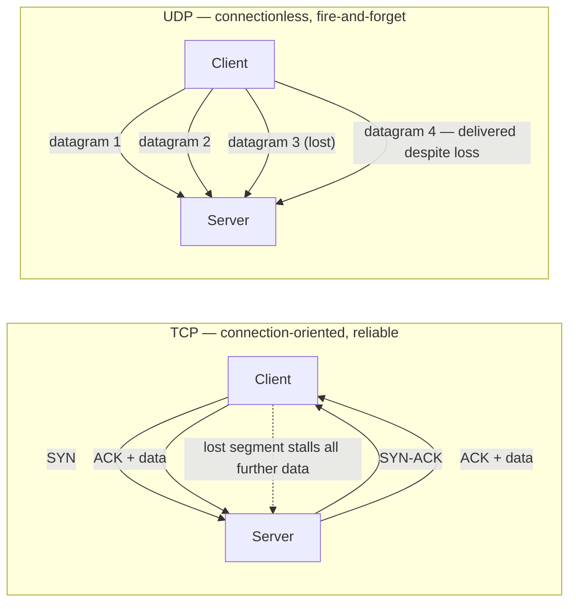
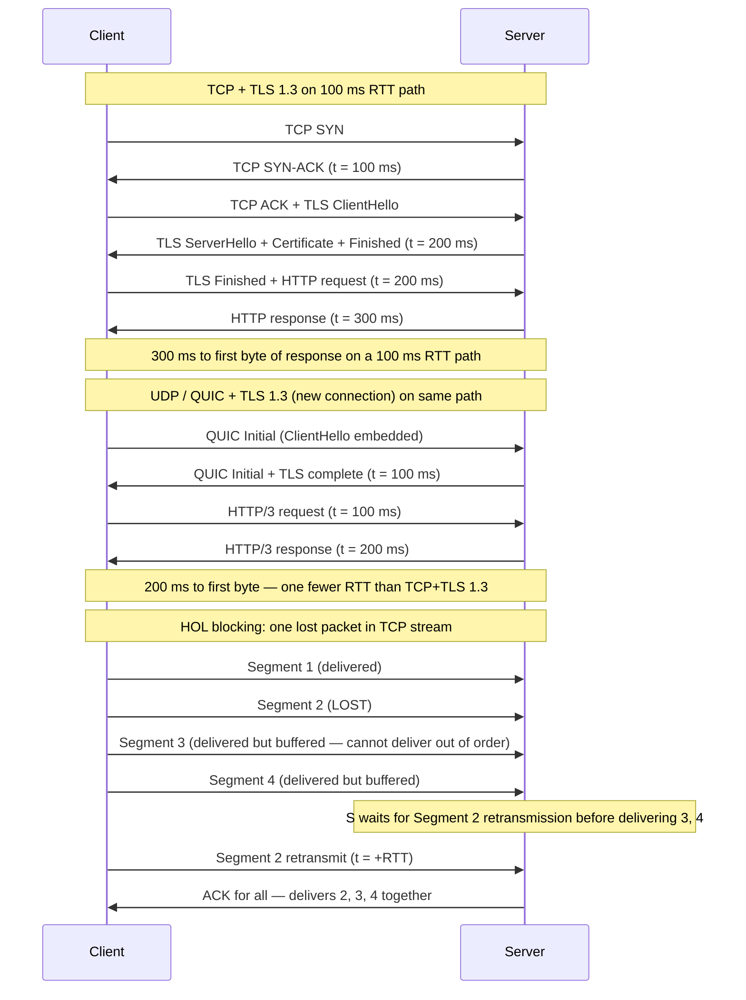
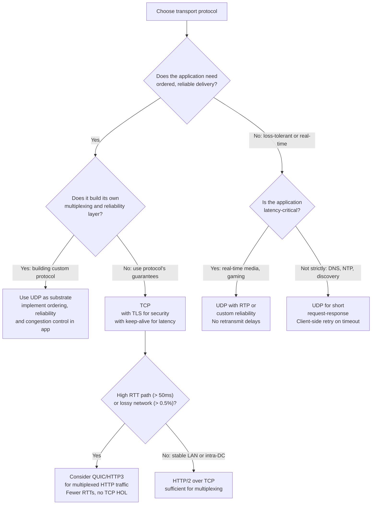

# Chapter 07 — TCP, UDP, and Connection Semantics

TL;DR — TCP delivers ordered, reliable, flow-controlled byte streams at the cost of connection setup latency, head-of-line blocking, and congestion-control overhead that makes it poorly suited for low-latency or loss-tolerant applications. UDP delivers individual datagrams with no ordering, reliability, or congestion control — it is correct when the application supplies those guarantees itself or deliberately omits them. The practical decision is not "TCP vs UDP" in isolation; it is whether the application needs the protocol's guarantees, can build them more efficiently itself, or does not need them at all. Connection reuse (keep-alive, connection pools) is the most important latency optimization available to applications that use TCP.

## Mental model

TCP is a contract: both endpoints agree to maintain connection state, acknowledge every byte, retransmit lost segments, and never deliver data out of order. That contract has a price: establishing the connection costs at least one round trip before any application data can flow, every lost packet blocks all subsequent data in the same stream until the loss is retransmitted, and the congestion control algorithm reduces throughput when it detects loss.

UDP is the absence of that contract: the sender fires a datagram and forgets it. No connection, no acknowledgment, no ordering, no retransmission. UDP is not "broken TCP" — it is deliberately minimal, and that minimalism is the right foundation for any application that manages its own reliability (DNS, which uses single request-response pairs), any application that cannot afford retransmission delays (real-time voice and video), or any application that wants to build a custom reliability layer (QUIC, covered in Chapter 08).

## How it works

### TCP: the reliability contract

TCP (RFC 9293) guarantees:

- **Ordered delivery**: bytes are delivered to the application in the order they were sent, regardless of how IP routers reordered the underlying packets.
- **Reliability**: every byte is acknowledged; unacknowledged bytes are retransmitted.
- **Flow control**: the receiver advertises a window size; the sender cannot transmit more bytes than the window allows, preventing a fast sender from overwhelming a slow receiver.
- **Congestion control**: TCP infers network congestion from packet loss and proactively reduces its send rate, sharing bandwidth with other flows.

These guarantees are delivered by maintaining state at both endpoints: sequence numbers, acknowledgment numbers, retransmit timers, and congestion windows.

### The handshake and its cost

Establishing a TCP connection requires a three-way handshake:

1. Client sends SYN.
2. Server responds with SYN-ACK.
3. Client sends ACK (and can include data in this third segment with TFO — TCP Fast Open).

The SYN-ACK exchange costs one round-trip time (RTT) before the client can send application data. For a server with 100 ms RTT from the client, each new TCP connection adds at least 100 ms of setup latency before the first byte of application data flows.

TLS adds further round trips over TCP. TLS 1.2 requires two additional RTTs (one for the cipher suite negotiation, one for the key exchange). TLS 1.3 reduces this to one additional RTT by collapsing the negotiation. On a 100 ms RTT path:

| Protocol | Round trips before data | Minimum latency before first byte |
|---|---|---|
| TCP (no TLS) | 1 | 100 ms |
| TCP + TLS 1.2 | 1 + 2 = 3 | 300 ms |
| TCP + TLS 1.3 | 1 + 1 = 2 | 200 ms |
| QUIC + TLS 1.3 (new connection) | 1 (combined) | 100 ms |
| QUIC + TLS 1.3 (0-RTT resumption) | 0 | 0 ms additional |

These are planning assumptions based on the protocol specifications; actual numbers depend on path RTT, server processing time, and packet loss. On a 10 ms in-datacenter path, the differences are small. On a 200 ms trans-continental path, a TLS 1.2 connection pays 600 ms before the first byte of application data.

### Connection reuse: the practical optimization

Every new TCP connection pays the handshake cost. HTTP/1.1 introduced keep-alive to reuse connections for multiple requests; connection pooling generalizes this to any TCP-based protocol. If the connection is already established, the RTT cost of setup is paid once and amortized across all subsequent requests over that connection.

The practical implication: the most important latency optimization available to a TCP-based application is often not algorithmic — it is ensuring that connections are reused and not torn down unnecessarily. Pools too small relative to peak concurrency stall requests; pools too large waste file descriptors and memory.

### Head-of-line blocking in TCP

TCP delivers bytes in order. If a segment in the middle of a stream is lost, all segments after it — even if they have arrived — must wait in the receive buffer until the missing segment is retransmitted. This is TCP-level head-of-line (HOL) blocking.

For HTTP/1.1 with one request per connection, HOL blocking means a slow or lost response on one connection does not affect other connections. For HTTP/2, which multiplexes multiple streams over one TCP connection, TCP-level HOL blocking means a single lost packet stalls all multiplexed streams simultaneously. This distinction is the central motivation for QUIC (Chapter 08).

### Congestion control: slow start and its consequences

TCP's congestion control begins each connection in a slow-start phase: the sender transmits a small number of segments (congestion window = initial window), doubles the window after each RTT until it detects loss, then backs off. For short-lived connections, slow start means the connection spends its entire lifetime in the ramp-up phase and never reaches full throughput. This is why persistent connections and connection reuse are important for throughput, not only latency.

A congested path with 1% packet loss can trigger TCP congestion control repeatedly, reducing effective throughput far below the nominal link bandwidth. Loss sensitivity is one of the main reasons UDP-based protocols (QUIC, WebRTC) are preferred for real-time media: they implement their own feedback loop that is tuned for latency rather than reliability.

### UDP: datagrams without guarantees

UDP (RFC 768) adds only port numbers and a checksum to IP datagrams. It provides:

- No connection state.
- No ordering.
- No reliability.
- No flow or congestion control.

This is the correct choice when:

- **Reliability is unnecessary**: DNS queries use single request-response pairs over UDP; if a response is lost, the client retries. The overhead of TCP's connection and ACK machinery is larger than a retry for a short query.
- **Latency matters more than reliability**: real-time voice and video can tolerate a lost frame better than a retransmitted one that arrives too late to be played. Retransmitting a 20 ms audio frame when it arrives 200 ms late is worse than nothing.
- **The application builds its own reliability**: QUIC uses UDP and implements its own reliable, multiplexed, ordered streams — but with independent stream delivery so one lost packet does not block others.
- **Broadcast or multicast**: UDP supports one-to-many delivery; TCP does not.

## Design Review Lens

- What problem is this actually solving? It determines what the network layer guarantees to the application: byte-stream ordering and reliability (TCP) or raw datagram delivery (UDP). Understanding this determines what correctness and latency guarantees the application must add itself.
- What assumptions does it depend on (and when do they break)? TCP assumes that packet loss signals congestion; in wireless networks, loss can occur without congestion (radio interference), causing TCP to reduce throughput unnecessarily. TCP assumes each connection has a stable 5-tuple (source IP, source port, destination IP, destination port, protocol); mobile devices change IP addresses as they roam between networks, breaking existing TCP connections. UDP assumes the application handles reliability, ordering, and congestion control where needed.
- What breaks FIRST at 10x scale? Connection establishment overhead. At 10x request rate, if each request opens a new TCP connection, the aggregate handshake cost becomes the dominant latency contributor. Connection pools and keep-alive configuration become critical.
- What breaks FIRST at 100x scale? The per-connection state maintained in OS kernel structures. A server with millions of concurrent TCP connections requires careful tuning of kernel parameters (file descriptor limits, socket buffers, TIME_WAIT recycling). UDP-based protocols that avoid per-connection state scale to higher connection counts more easily.
- How would Netflix vs Amazon vs a 5-person startup each approach this differently? Netflix serving video streaming uses HTTP/3 (QUIC over UDP) for the video delivery path because loss-resistant streams on unreliable mobile networks reduce stalls. Internal service-to-service communication uses HTTP/2 over TCP with long-lived connections and connection pools because the internal network is reliable and controlled. A 5-person startup should use HTTP/1.1 or HTTP/2 over TCP with managed load balancers and connection pooling as defaults; the complexity of QUIC is not justified until specific performance problems on unreliable paths are measured.

## Variants / approaches

| Protocol | Ordering | Reliability | Congestion control | Best for |
|---|---|---|---|---|
| TCP | Yes | Yes | Yes | Reliable byte streams, file transfer, HTTP |
| UDP (raw) | No | No | No | DNS, NTP, custom protocols, QUIC substrate |
| QUIC (UDP-based) | Per-stream | Per-stream | Yes (in QUIC) | HTTP/3, multiplexed reliable streams without HOL blocking |
| WebRTC | Selectable | Selectable | Yes (SCTP/RTP) | Real-time audio/video, P2P data channels |
| SCTP | Yes (multi-stream) | Yes | Yes | Multi-stream reliable delivery, telecoms, WebRTC signaling |
| TCP Fast Open | Yes | Yes | Yes | TCP with data in first SYN — saves one RTT on resumption |

## Worked example (with capacity model)

Scenario: an API gateway handling HTTPS requests from mobile clients globally. The service issues 1 million requests per day to a backend running in one data center. Mobile clients are geographically dispersed with RTTs ranging from 20 ms (same region) to 300 ms (remote regions). This is a planning scenario; all latency figures are assumptions.

**Assumptions**

| Input | Assumption | Basis |
|---|---:|---|
| Daily API requests | 1,000,000 | Product scale |
| Average RTT (client to edge) | 80 ms | Geographic distribution heuristic |
| Average RTT (edge to origin) | 10 ms | In-region network planning assumption |
| TLS version | TLS 1.3 | Architecture decision |
| Connection reuse rate | 70% of requests reuse an existing connection | Planning assumption; must be measured |

**Step 1: connection setup cost without keep-alive**

If every request opens a new TCP+TLS 1.3 connection:

RTTs per request = 1 (TCP) + 1 (TLS 1.3) = 2 RTTs before data flows.

Added latency per request = 2 × 80 ms = 160 ms.

Over 1,000,000 requests/day: total wasted latency = 10^6 × 0.16 s = 160,000 seconds = 44.4 hours of aggregate latency/day.

**Step 2: with 70% connection reuse**

30% of requests open new connections: 300,000 connections/day.

70% reuse an existing connection: 700,000 requests pay 0 setup RTTs.

Average setup overhead per request = 0.30 × 160 ms + 0.70 × 0 ms = 48 ms average.

Total aggregate wasted latency = 10^6 × 0.048 = 48,000 seconds = 13.3 hours/day.

Savings from 70% keep-alive rate vs 0%: 44.4 − 13.3 = 31.1 hours of aggregate latency saved per day. This is the value of connection reuse — not per-request, but in aggregate for the system.

**Step 3: impact of HOL blocking**

If 1% of TCP segments are lost on the client path (realistic for poor mobile connections — planning heuristic), each loss adds one RTT of retransmission delay to the connection affected. With HTTP/2 multiplexing 10 streams over one TCP connection, a single loss blocks all 10 streams for one RTT.

Under HTTP/2, per-request HOL blocking impact = 1% × 80 ms = 0.8 ms expected added latency per request from loss alone.

Under HTTP/3 (QUIC), a lost packet affects only the stream it was part of. The other 9 streams continue without delay. HOL blocking impact per request = 1% × 80 ms / 10 streams ≈ 0.08 ms expected added latency from loss.

For a 300 ms RTT mobile client with 2% loss: HTTP/2 HOL adds 6 ms expected; HTTP/3 adds ~0.6 ms expected. The benefit is larger on worse connections.

**Step 4: QPS and bandwidth**

Average QPS = 1,000,000 / 86,400 = 11.6 req/s.

Peak QPS (5× planning assumption): 58 req/s.

Average request payload: 2 KB (planning assumption).

Average response payload: 10 KB (planning assumption).

Daily bandwidth: 1,000,000 × (2 + 10) KB = 12,000,000 KB = 12 GB/day.

Average bandwidth: 12 GB / 86,400 s = 0.139 MB/s. This is not bandwidth-constrained — the latency cost of connection setup dominates.

**Decision from the model**

The primary optimization for this mobile API gateway is connection reuse (keep-alive) and TLS 1.3. HTTP/3 provides additional benefit on poor mobile connections by eliminating TCP-level HOL blocking, but requires infrastructure support. Connection reuse is available today and provides the larger gain. QUIC/HTTP/3 is the right second step for clients on high-RTT or lossy mobile networks.

## Failure Walkthrough

Single node failure: TCP connections to a failed application server are lost. Clients see connection resets or timeouts depending on whether the TCP stack has detected the failure. Detection: health check failure, TCP RST. Recovery: load balancer stops routing new connections to the failed node; existing connections must be re-established to a surviving node. Stateless applications can reconnect immediately; stateful applications may lose in-flight work.

Network partition: clients on one side of the partition cannot reach servers on the other side. TCP connections across the partition are idle until timeout — the client's OS TCP stack will eventually time out pending ACKs (default timeout minutes to hours in many OS configurations) unless the application sets a shorter timeout. Detection: application-level timeout is usually faster than kernel TCP timeout. Recovery: application retries to an available endpoint; DNS failover may provide an alternative address.

Full regional failure: all servers in a region become unreachable. Clients experience connection timeouts. Detection: DNS health checks remove the failed region's addresses; traffic shifts to surviving regions. Recovery: DNS propagation plus client reconnection to new addresses. TCP's stateful connection means each client must re-establish a session; QUIC's connection migration (based on connection ID rather than 5-tuple) allows connections to survive IP address changes, but not full endpoint loss.

Critical dependency outage: a firewall or NAT device between client and server fails. Existing TCP connections through the device may be silently dropped (stateful firewall losing its state) rather than reset, causing connections to appear alive on both endpoints but passing no data. Detection: application-level heartbeats or keepalive probes; TCP keepalive (socket option) at the OS level. Recovery: detect silent failure through timeout and reconnect.

Data corruption / poison data: TCP provides a 16-bit checksum per segment. Rare bit flips that pass the checksum can deliver corrupt data undetected. Applications handling data integrity with checksums at the application layer (e.g., TLS's MAC or application-level hashing) provide a second layer of detection. UDP's checksum is optional but TLS over UDP (DTLS/QUIC) provides equivalent protection.

## Decision Framework

## Tradeoffs & alternatives

Main recommendation: use TCP with TLS 1.3 and keep-alive by default; use QUIC (UDP-based) for client-facing HTTP when clients are on high-RTT or lossy mobile networks; use raw UDP when the application is real-time and loss-tolerant, or when building a custom reliability layer.

WHY: TCP's guarantees eliminate an entire class of application-level correctness bugs. The connection setup and HOL blocking costs are real but manageable with connection reuse. UDP is not simpler — it is differently complex, requiring the application to supply ordering, reliability, and congestion fairness where needed.

What it COSTS: TCP's handshake and congestion control add latency and reduce throughput on lossy paths. UDP-based protocols require implementing at least retry logic and, for production use, congestion control to be a good citizen on shared networks.

ALTERNATIVES: QUIC (Chapter 08) provides reliable, multiplexed, ordered streams over UDP without TCP's per-stream HOL blocking. WebRTC provides peer-to-peer UDP-based communication for real-time media without a server-side relay.

WHEN NOT to use TCP: do not use TCP for real-time media where a retransmitted packet that arrives late is worse than no packet; do not use TCP for short DNS-style request-response pairs where the handshake cost exceeds the data transfer; do not use TCP when connection state maintenance is the bottleneck and the application can safely handle datagram reordering or loss.

## Staff & Principal lens

Protocol choice is an infrastructure constraint that affects every engineering team's service-to-service communication and client-facing API design. A Principal engineer should confirm that connection pool sizing is reviewed as part of any service capacity planning: a pool that is too small under peak concurrency adds queuing delay equal to one RTT per extra request; a pool without keepalive configured re-pays the handshake cost on every request.

The operational burden of QUIC adoption is non-trivial: UDP traffic is often blocked or rate-limited by enterprise firewalls and NAT devices in ways that TCP is not, requiring fallback to TCP for those clients. QUIC's encryption of all transport-layer information (including packet numbers and connection IDs, which are visible in TCP headers) can interfere with network monitoring tools that rely on TCP header inspection. These operational constraints must be evaluated before adopting QUIC in environments with strict network policies.

Cost governance: connection pooling reduces TCP handshake frequency, which reduces CPU and memory in TLS handshake processing on servers. At high scale, moving from 0% to 70% connection reuse can reduce server-side TLS handshake CPU by 2–3×. This is a measurable cost reduction that justifies investment in connection pool tuning.

## Interview answer vs production reality

What interviewers expect to hear: TCP provides ordered, reliable byte-stream delivery with flow and congestion control; UDP provides best-effort datagrams. TCP costs a handshake RTT and HOL blocking; UDP has no setup cost but requires the application to handle reliability. Give examples of each: HTTP/database over TCP, DNS/video over UDP.

What actually happens in production: TCP keepalive and connection pool configuration are among the most common sources of performance issues — pools too small cause queuing, pools too large exhaust file descriptors, and keepalive timeouts mismatched between client and server cause connections to be silently dropped mid-use. TCP timeout parameters at the kernel level (TCP_KEEPIDLE, TCP_KEEPINTVL, SO_TIMEOUT) are often left at OS defaults that are far too conservative for latency-sensitive applications. QUIC adoption in production requires testing against real NAT and firewall configurations, which often behave differently from lab environments.

Simplifications that are fine in an interview but wrong in prod: treating connection setup as a one-time cost rather than a recurring cost for short-lived connections. Treating TCP as "reliable" without noting that it reliably delivers corrupt data that passes its 16-bit checksum. Assuming that UDP is simpler than TCP — for any protocol that needs reliability, ordering, and congestion control, it is more complex.

## Common pitfalls & misconceptions

- Assuming connection setup cost is negligible. On high-RTT paths or for short-lived requests, handshake RTTs dominate total request latency.
- Using UDP because "it's faster than TCP" without implementing congestion control. A UDP sender without congestion control saturates its path and is an unfair neighbor to TCP flows.
- Treating TCP keepalive as equivalent to application-level heartbeats. TCP keepalive (SO_KEEPALIVE) sends probes at OS-configured intervals (often 2 hours by default); application-level heartbeats operate on application-relevant timescales.
- Forgetting HOL blocking in HTTP/2 over TCP. HTTP/2 eliminates application-layer HOL blocking (one slow request no longer blocks the connection for subsequent requests) but not TCP-layer HOL blocking (one lost segment still blocks all streams until retransmitted).
- Assuming NAT and firewall transparency for UDP. Many enterprise networks allow TCP and block or rate-limit UDP. QUIC deployments must test with a TCP fallback.
- Treating "connectionless" as "stateless." UDP is connectionless at the transport layer, but application protocols over UDP often maintain their own state (QUIC connection IDs, DNS transaction IDs).

## Interview questions

Mid: Why does TCP require a three-way handshake before data can flow? What would break if you removed it?

MODEL answer: The handshake establishes that both endpoints are reachable and agree on sequence numbers before any data is sent. Without the ACK from the client, the server cannot confirm that its SYN-ACK was received and cannot safely assume the client is ready to receive data with the correct sequence numbers. Removing the handshake would make it impossible to distinguish a new connection from a delayed packet from a previous connection with the same 5-tuple, and would allow old, reordered SYN segments to create phantom connections on the server.

Senior: An API endpoint has 200 ms median latency on a 50 ms RTT path. The application logic takes 100 ms. Where are the other 100 ms?

MODEL answer: With a 50 ms RTT and TCP+TLS 1.3, if each request opens a new connection: 1 RTT for TCP handshake = 50 ms; 1 RTT for TLS 1.3 = 50 ms; then 100 ms of application logic; then the response: total ≈ 250 ms. If connections are reused, setup cost is 0 ms and total is 100 ms + one RTT for the request itself = 150 ms. The 200 ms median suggests connection reuse is working for about half of requests. I would check the connection pool hit rate, confirm TLS 1.3 is in use (not 1.2, which costs 2 RTTs), and look at whether the load balancer is closing and reopening connections on each request rather than passing through the pool.

Staff: You are designing a real-time multiplayer game backend. The game sends position updates 60 times per second and must deliver at most 20 ms end-to-end latency. Should you use TCP or UDP?

MODEL answer: UDP with application-layer reliability for the small subset of messages that need it. Position updates at 60 Hz are loss-tolerant: a position update that is 16 ms old is stale whether or not it is retransmitted; retransmitting it at the protocol level takes at least one RTT (potentially more than 20 ms on even a good path), which violates the latency budget and delivers data that is now too stale to use. A missed position update is simply masked by interpolating from surrounding frames, which the client already does. TCP's retransmission blocking would introduce visible stalls in other players' positions. The application should use UDP, implement its own loss detection (sequence numbers), and retransmit only critical events (join, score, respawn) — not the high-frequency, low-value position stream.

Principal: Your organization is evaluating QUIC adoption for the mobile API. Engineering says it will reduce p99 latency by 40% for mobile clients. What is the evaluation and rollout plan?

MODEL answer: The 40% claim needs validation in production conditions, not just a lab benchmark. My plan: first, run a shadow traffic experiment that sends duplicate requests over HTTP/2 and HTTP/3 and compares p50/p95/p99 latency by client RTT, network type, and geographic segment — mobile networks on cellular have different loss and RTT characteristics than WiFi. Second, validate that QUIC is not blocked or degraded by the firewalls and NAT devices in the client population's networks; some enterprise and carrier networks rate-limit UDP. If QUIC is blocked, the client must fall back to TCP, which must be implemented and tested. Third, measure server-side CPU impact — QUIC's encryption and packet processing is more expensive per byte than TLS-over-TCP and may require additional capacity. Fourth, confirm that network monitoring and security tooling can handle QUIC traffic, since QUIC encrypts transport-layer metadata that TCP exposes in plaintext. Only after these validations would I roll out QUIC to a small production traffic slice, monitor both client-side and server-side metrics, and expand. The rollout must retain the TCP fallback indefinitely for clients where UDP is blocked.

## Connections

Prerequisites: None for this chapter. It is a foundation for Chapters 08–14.

Related chapters: [Chapter 02 — Performance vs Scalability, Latency vs Throughput](../chapter-02-performance-vs-scalability-latency-vs-throughput/) for the latency/throughput framework that TCP's congestion control directly affects. [Chapter 08 — HTTP/1.1, HTTP/2, HTTP/3, and QUIC](../chapter-08-http-1-1-http-2-http-3-and-quic/) for the application-level consequences of TCP-layer HOL blocking.

Builds toward: [Chapter 08 — HTTP/1.1, HTTP/2, HTTP/3, and QUIC](../chapter-08-http-1-1-http-2-http-3-and-quic/) (HOL blocking and QUIC), [Chapter 10 — Load Balancing (L4/L7)](../chapter-10-load-balancing-l4-l7/) (TCP connection handling at load balancers), [Chapter 11 — Reverse Proxies and API Gateways](../chapter-11-reverse-proxies-and-api-gateways/) (connection pooling and keepalive at the proxy layer).

## Further reading

- RFC 9293, [Transmission Control Protocol (TCP)](https://www.rfc-editor.org/rfc/rfc9293), IETF, 2022. The current authoritative specification of TCP, updating RFC 793.
- RFC 768, [User Datagram Protocol](https://www.rfc-editor.org/rfc/rfc768), Jon Postel, 1980. The original, concise UDP specification.
- RFC 5681, [TCP Congestion Control](https://www.rfc-editor.org/rfc/rfc5681), IETF, 2009. Defines slow start, congestion avoidance, fast retransmit, and fast recovery.
- W. Richard Stevens, *TCP/IP Illustrated, Volume 1: The Protocols*, 2nd ed., Addison-Wesley, 2011. The definitive reference for packet-level behavior of TCP and UDP.
