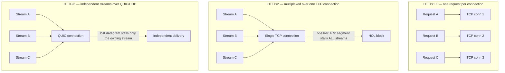
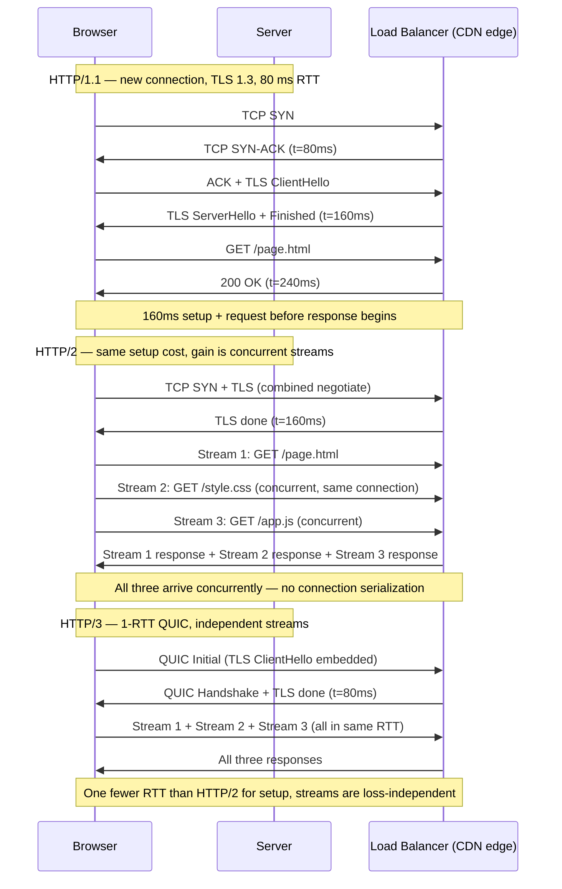
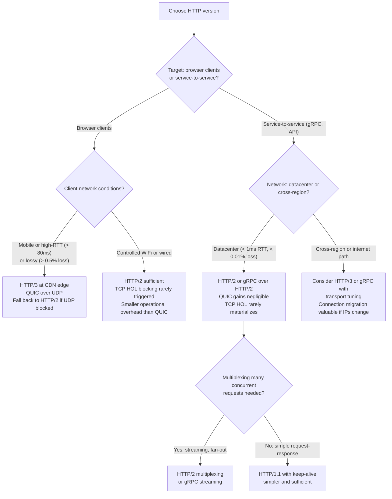

# Chapter 08 — HTTP/1.1, HTTP/2, HTTP/3, and QUIC

TL;DR — HTTP semantics — methods, status codes, headers, request-response pairs — are stable across versions; only the transport changes. HTTP/1.1 opens multiple connections to work around per-connection head-of-line blocking. HTTP/2 multiplexes requests over one TCP connection, eliminating application-layer HOL blocking but not TCP-layer HOL blocking — a single lost packet stalls all streams. HTTP/3 moves to QUIC over UDP, giving truly independent streams: a lost packet stalls only the stream it belongs to. The gains from each version are largest on high-latency, lossy, or multiplexed paths; in a controlled datacenter they are smaller. Connection setup costs (RTTs before data flows) differ by version and matter most on high-RTT or short-lived connections.

## Mental model

Each HTTP version addresses the bandwidth and latency problems left unsolved by the previous one:

HTTP/1.1 solved persistent connections (keep-alive), allowing multiple requests over one TCP connection, but still allows only one request at a time per connection. Browsers work around this with up to six parallel connections per origin.

HTTP/2 solved application-layer HOL blocking by multiplexing many requests over a single TCP connection. One slow response no longer blocks others at the HTTP layer. But one lost TCP segment blocks all multiplexed streams at the TCP layer.

HTTP/3 solved TCP-layer HOL blocking by replacing TCP with QUIC (over UDP), where each stream is independently deliverable. A lost UDP datagram stalls only the stream it was carrying, not the others.

## How it works

### HTTP semantics: stable across versions

HTTP methods (GET, POST, PUT, DELETE, PATCH, HEAD, OPTIONS), status codes (200, 301, 400, 404, 500), and header semantics are identical across HTTP/1.1, HTTP/2, and HTTP/3. An application that uses HTTP correctly at the semantic layer should need no application-level changes to benefit from a transport upgrade. The version determines how requests and responses are serialized and transported, not what they mean.

### HTTP/1.1: persistent connections and their limits

HTTP/1.1 (RFC 9112) introduced persistent connections (keep-alive) as a default, allowing multiple request-response pairs over one TCP connection sequentially. A connection can be reused once the previous response is complete, avoiding repeated handshake RTTs.

The remaining problem: only one request can be in flight per connection at a time. A slow server processing a large response (or a lost TCP segment delaying a small one) blocks all subsequent requests on that connection. This is application-layer HOL blocking.

Browsers respond by opening 6 connections per origin (a practical limit that emerged from industry practice, not a specification requirement). This allows 6 concurrent requests but multiplies handshake overhead and congestion-window ramp-up — each connection starts its own slow start.

HTTP/1.1 also sends headers in plain text for every request, even when they repeat (cookies, user-agent, authorization) — adding bytes per request. HTTP/2 and HTTP/3 address this with header compression.

### HTTP/2: multiplexing and its TCP-layer residue

HTTP/2 (RFC 9113) multiplexes streams over a single TCP connection using a binary framing layer. Each request-response pair is a stream with a numeric identifier. Frames from different streams are interleaved; the client can send request B before receiving the response to request A. This eliminates application-layer HOL blocking.

Header compression (HPACK in HTTP/2) reduces header overhead by maintaining a shared compression context between client and server, allowing repeated headers to be represented as references to a shared table rather than full strings.

Server push allows the server to proactively send resources the client will need, without waiting for a request. In practice, server push has seen limited adoption due to implementation complexity and the risk of pushing resources already cached by the client.

**The residual problem: TCP-layer HOL blocking.**

All HTTP/2 streams share one TCP connection. TCP delivers bytes in order. If a TCP segment carrying bytes of stream A is lost, TCP buffers all subsequent segments (including bytes of streams B and C that arrived intact) until the missing segment is retransmitted. The wait is one RTT at minimum. All streams stall for the duration, even those whose data arrived successfully.

On a lossy path with 1% packet loss and 100 ms RTT, a page load fetching 20 resources over HTTP/2 is statistically likely to hit at least one loss event per connection, adding at least 100 ms to the completion time — not because the application design is wrong, but because the transport protocol serializes recovery.

### HTTP/3: QUIC and independent streams

HTTP/3 (RFC 9114) replaces TCP with QUIC (RFC 9000) as the transport layer. QUIC runs over UDP, which provides no delivery guarantee, allowing QUIC to implement its own reliability — per-stream rather than per-connection.

**What QUIC adds on top of UDP:**
- Reliable, ordered delivery within each stream.
- Multiple independent streams over one connection — a lost datagram stalls only the stream that owns it.
- Integrated TLS 1.3 — the handshake and encryption are combined; a new QUIC connection requires only 1 RTT before data can flow.
- Connection migration — QUIC identifies connections by a connection ID rather than a 5-tuple (source IP, source port, destination IP, destination port, protocol). When a mobile device roams from WiFi to cellular and its IP address changes, the QUIC connection survives the address change; a TCP connection does not.
- 0-RTT resumption — for clients that have previously connected to the server and cached the session ticket, QUIC can send application data in the very first packet (0 RTTs before data), though this comes with replay-attack caveats.

**Header compression for HTTP/3:** QPACK replaces HPACK with a design that works with QUIC's independent streams. HPACK requires ordered delivery (a reference to a header table entry must be processed before the entry can be used in a later header); QPACK decouples encoding from decoding to work correctly when frames arrive out of order across streams.

### Connection setup RTT comparison

At 100 ms RTT (planning assumption; actual varies by path):

| Setup | RTTs | Time before first byte of response |
|---|---|---|
| HTTP/1.1, new TCP + TLS 1.2 | 1 + 2 = 3 RTTs | 300 ms |
| HTTP/1.1, new TCP + TLS 1.3 | 1 + 1 = 2 RTTs | 200 ms |
| HTTP/2, new TCP + TLS 1.3 | 1 + 1 = 2 RTTs | 200 ms (same as H1.1 with TLS 1.3) |
| HTTP/3, new QUIC + TLS 1.3 | 1 RTT (combined) | 100 ms |
| HTTP/3, 0-RTT QUIC resumption | 0 RTTs | 0 ms additional handshake |

HTTP/2 does not reduce the connection setup RTT over HTTP/1.1 with TLS 1.3 — the gain is in concurrent stream handling once the connection is established. HTTP/3's main RTT advantage is on the first connection or after a long idle; 0-RTT resumption eliminates setup latency for returning clients.

## Design Review Lens

- What problem is this actually solving? Each version reduces the overhead of multiple resources sharing a connection: HTTP/1.1 by persistence, HTTP/2 by multiplexing, HTTP/3 by loss-independent streams. The correct question when selecting a version is: what is the actual bottleneck on this path — connection count, HOL blocking, or handshake RTTs?
- What assumptions does it depend on (and when do they break)? HTTP/2's multiplexing gains assume that multiple requests are ready concurrently. On a page that loads sequentially (each resource triggers the next), multiplexing provides no benefit. HTTP/3's gains assume packet loss is present; on a low-loss in-datacenter path with fixed IPs, QUIC's advantages are negligible. 0-RTT resumption assumes the session ticket is valid and the server-side session state has not been rotated.
- What breaks FIRST at 10x scale? Header compression context management. HTTP/2's HPACK and HTTP/3's QPACK maintain per-connection state. At high connection counts with high request rates, the memory for these contexts per connection grows. Header compression tuning becomes relevant at scale.
- What breaks FIRST at 100x scale? Load balancer state. HTTP/2 and HTTP/3 multiplexed connections require the load balancer to be connection-aware — all requests in a multiplexed connection must be routed consistently if connection-level state is maintained on the backend. Naive L4 load balancing that routes per-connection rather than per-request works for HTTP/2 but can concentrate load unevenly.
- How would Netflix vs Amazon vs a 5-person startup each approach this differently? Netflix serving video uses HTTP/3 for client-facing delivery on mobile networks where packet loss and connection migration are real (devices switching networks mid-stream). Internal microservice calls use HTTP/2 over TCP within the data center where the network is controlled and loss-induced HOL blocking is rare. A 5-person startup should serve HTTP/2 (widely supported by CDNs and browsers, no operational QUIC overhead) and adopt HTTP/3 at the CDN edge layer when the CDN supports it by default — without any application code changes.

## Variants / approaches

| Version | Transport | HOL blocking | Setup RTTs (new) | Setup RTTs (resumed) | Best for |
|---|---|---|---|---|---|
| HTTP/1.1 | TCP | App-layer only (per connection) | 2–3 (TLS 1.3 / 1.2) | 1 (keepalive) | Legacy compatibility; simple non-multiplexed APIs |
| HTTP/2 | TCP | TCP-layer remains | 2 (TLS 1.3) | 1 (keepalive) | In-datacenter, gRPC, multiplexed browser traffic on reliable networks |
| HTTP/3 | QUIC (UDP) | None between streams | 1 (QUIC+TLS 1.3) | 0 (0-RTT) | Mobile, high-RTT, lossy paths; client-facing CDN delivery |
| gRPC (over HTTP/2) | TCP | TCP-layer | 2 | 1 | Typed service-to-service RPC with streaming and code generation |

## Worked example (with capacity model)

Scenario: a media-heavy web application that loads a news article page with 30 resources (HTML, CSS, JS, images). Client is on a mobile network with 120 ms RTT and 1% packet loss rate. This is a planning scenario; all timing values are derived from the protocol specifications and planning assumptions about the path.

**Assumptions**

| Input | Assumption | Basis |
|---|---:|---|
| Base RTT | 120 ms | Typical mobile network planning assumption |
| Packet loss rate | 1% | Typical poor mobile network heuristic |
| Resources on page | 30 (HTML + 4 CSS + 5 JS + 20 images) | Product design assumption |
| Average resource size | 40 KB | Planning assumption |
| Critical path depth | 3 sequential render-blocking resources | Product design assumption |
| Server processing time | 20 ms per resource | Application performance assumption |

**Step 1: HTTP/1.1 with 6 parallel connections**

Setup per connection: TCP (1 RTT = 120 ms) + TLS 1.3 (1 RTT = 120 ms) = 240 ms before first request.

With 6 connections established, 30 resources load in ceil(30/6) = 5 rounds.

Time for 5 rounds: each round = 120 ms RTT + 20 ms server processing = 140 ms.

Total estimated time = 240 ms (6 connection setups, amortized: the first 6 connections open in the same first RTTs) + 5 × 140 ms = 240 + 700 = **940 ms**.

At 1% packet loss, expected number of TCP retransmissions across 30 resources × ~10 segments each = 300 segments × 1% ≈ 3 retransmissions. Each adds one RTT (120 ms) to the affected connection. Expected loss overhead ≈ 3 × 120 ms = 360 ms amortized across 6 connections ≈ 60 ms expected added latency.

Total with loss: ~**1,000 ms** (planning estimate).

**Step 2: HTTP/2 with single connection**

Setup: TCP (1 RTT) + TLS 1.3 (1 RTT) = 240 ms.

All 30 resources multiplexed: ideally load in one server RTT (all requested simultaneously, assuming unconstrained server).

Round-trip for all resources: 240 ms setup + 120 ms RTT + 20 ms server = **380 ms** ideal.

However, the critical path depth of 3 means the page parser must discover resources before fetching them: 3 sequential resource fetches of 120 ms + 20 ms each = 3 × 140 ms = 420 ms for the critical chain.

At 1% loss over one TCP connection carrying all 30 resources: expected losses = 300 segments × 1% = 3 TCP losses. Each loss stalls ALL streams for one RTT. Expected loss overhead = 3 × 120 ms = **360 ms**.

Total with loss and critical path: ~240 + 420 + 360 = **1,020 ms** — not significantly better than HTTP/1.1 on a lossy path, because TCP-layer HOL blocking transfers the loss penalty to all streams.

**Step 3: HTTP/3 (QUIC) with 1-RTT setup**

Setup: 1 RTT (QUIC + TLS 1.3 combined) = 120 ms.

Critical path: same 3 sequential fetches at 120 ms RTT + 20 ms server = 420 ms.

At 1% loss: each lost datagram stalls only the stream that owns it. Expected loss events = 300 datagrams × 1% = 3 losses. Each loss stalls only 1 of the 30 streams for one RTT. Expected per-stream overhead = 3 losses × 120 ms / 30 streams = **12 ms** expected added latency.

Total: 120 ms setup + 420 ms critical path + 12 ms loss overhead = **~552 ms** — roughly half the HTTP/1.1 and HTTP/2 time on this lossy path.

**Comparison table**

| Version | Setup | Critical path | Loss overhead | Total estimate |
|---|---|---|---|---|
| HTTP/1.1 | 240 ms | 700 ms (5 rounds × 6 conn) | ~60 ms | ~1,000 ms |
| HTTP/2 | 240 ms | 420 ms | ~360 ms (TCP HOL) | ~1,020 ms |
| HTTP/3 | 120 ms | 420 ms | ~12 ms (stream-isolated) | ~552 ms |

The HOL blocking penalty makes HTTP/2 no better than HTTP/1.1 on a 1% loss mobile path. HTTP/3 wins primarily by eliminating TCP-layer HOL blocking and reducing setup by one RTT. On a 0% loss in-datacenter path, the numbers change: HTTP/2 and HTTP/3 perform similarly (no loss overhead) and both outperform HTTP/1.1's multi-connection overhead.

**QPS and bandwidth**

Following Chapter 01's capacity model: daily page views, QPS, and bandwidth are computed from product usage assumptions. The HTTP version affects the per-request latency distribution (p50, p95, p99), which affects user experience metrics, not the aggregate throughput or storage calculations.

## Failure Walkthrough

Single node failure: HTTP/2 and HTTP/3 connections to the failed node are reset. All multiplexed streams in-flight on that connection are aborted. The client must reconnect to a surviving node and retry. HTTP/1.1 clients lose only the connections to the failed node; other connections to other nodes continue. Detection: connection reset or TCP timeout. Recovery: client reconnect, load balancer stops routing to the failed node.

Network partition: connections crossing the partition are severed. HTTP/2 and HTTP/3 clients on the partitioned side lose all in-flight streams simultaneously. Detection: connection timeout, GOAWAY frame (HTTP/2), CONNECTION_CLOSE frame (QUIC). Recovery: DNS failover to a reachable endpoint; client reconnect.

Full regional failure: CDN or origin server unavailable. Browser clients experience DNS resolution failures or connection timeouts. Recovery: DNS TTL expiry and update to a surviving region's addresses; CDN edge nodes may serve stale cached content during origin outage.

Critical dependency outage: TLS certificate rotation causing handshake failure for new connections. All versions of HTTP are equally affected — TLS errors prevent connection establishment. Recovery: certificate rollback or redeployment. HTTP/3's 0-RTT resumption may continue serving cached session tickets for a short time before clients exhaust their tickets and must perform a full handshake.

Data corruption / poison data: HTTP responses with corrupted bodies are detected by the application's content checksum (if implemented) or by TLS's MAC (which detects in-transit corruption). At the HTTP layer, a server that serves a corrupt HTML page to HTTP/2 clients may do so concurrently to more clients than HTTP/1.1 (due to connection multiplexing), increasing the blast radius before detection. Detection requires content integrity checks (Subresource Integrity for browser assets, application-level checksums for API responses).

## Decision Framework

## Tradeoffs & alternatives

Main recommendation: serve HTTP/2 as the default for all web and API traffic; adopt HTTP/3 at CDN edge layers for client-facing traffic on mobile or high-RTT paths; use HTTP/2 (gRPC) for service-to-service communication that benefits from streaming or multiplexing.

WHY: HTTP/2's multiplexing eliminates the application-layer HOL blocking that HTTP/1.1's multi-connection workaround creates, without the operational complexity of QUIC. HTTP/3 addresses the residual TCP-layer HOL problem that is material only on lossy paths.

What it COSTS: HTTP/2 requires TLS (plaintext HTTP/2 exists in spec but browsers do not support it). HTTP/3 requires UDP support at load balancers and firewalls, TLS 1.3, and QUIC-aware infrastructure. QUIC is computationally more expensive than TCP per byte due to encryption of packet numbers and connection IDs.

ALTERNATIVES: gRPC over HTTP/2 is the standard for typed, multiplexed service-to-service RPC. WebSockets over HTTP/1.1 or HTTP/2 are used for full-duplex client-server communication where the server needs to push events without being polled.

WHEN NOT to upgrade: HTTP/3 is inappropriate for environments where UDP is firewalled or rate-limited (many corporate and enterprise networks). The operational investment in QUIC infrastructure is not justified for internal datacenter traffic on reliable, low-latency networks.

## Staff & Principal lens

HTTP version selection is an infrastructure decision that affects every user-facing feature's performance. A Principal engineer should ensure that HTTP/3 adoption at the CDN edge is on the roadmap for mobile-facing products, as the latency improvement on lossy paths is the largest user-experience gain available without any application code changes.

Operational burden: QUIC debugging requires different tools than TCP. Network packet analyzers (Wireshark with QUIC dissectors) can decode QUIC frames, but QUIC's encrypted packet numbers prevent some network-level inspection that TCP allows. Security teams that rely on DPI (deep packet inspection) for threat detection must update their tooling when QUIC is deployed.

Cost governance: HTTP/2 and HTTP/3 reduce the number of TCP connections required from client to CDN (one connection vs six per HTTP/1.1), which reduces TLS handshake CPU load on edge servers. For high-traffic CDN edges, this is a meaningful compute reduction. QUIC increases per-packet CPU on the server side due to per-packet encryption. The cost impact varies by traffic mix and hardware.

Migration complexity: moving from HTTP/1.1 to HTTP/2 is transparent to application code but requires infrastructure changes (TLS certificate, HTTP/2-capable load balancer). Moving to HTTP/3 requires UDP port 443 availability, QUIC infrastructure, and Alt-Svc headers to advertise HTTP/3 to clients so they can upgrade on the next connection. All changes should be rolled out at the CDN or load balancer layer, not per-service.

## Interview answer vs production reality

What interviewers expect to hear: HTTP/1.1 uses one request per connection (keep-alive allows reuse but serializes requests); HTTP/2 multiplexes streams over TCP but suffers TCP-layer HOL blocking; HTTP/3 uses QUIC over UDP for loss-independent streams and combined TLS handshake; the gains are largest on lossy or high-RTT paths.

What actually happens in production: HTTP/2 and HTTP/3 adoption at the server layer is often straightforward (CDN handles it), but backend service-to-service communication frequently remains at HTTP/1.1 with connection pools, where the multiplexing benefits of HTTP/2 would reduce connection count significantly. QUIC adoption is bottlenecked by UDP firewall rules, not by engineering effort. 0-RTT QUIC resumption is often disabled in practice due to replay attack concerns for non-idempotent requests.

Simplifications that are fine in an interview but wrong in prod: saying HTTP/2 "solves" HOL blocking — it solves application-layer HOL blocking but not TCP-layer. Saying QUIC is always faster — on a 0% loss in-datacenter path, QUIC and HTTP/2 perform similarly; QUIC's advantage is specifically on lossy or high-RTT paths. Treating 0-RTT as universally applicable — it has replay-attack implications for state-changing requests.

## Common pitfalls & misconceptions

- Believing HTTP/2 eliminates all HOL blocking. HTTP/2 eliminates application-layer HOL blocking. TCP-layer HOL blocking remains and dominates on lossy networks.
- Treating HTTP/3 as always better than HTTP/2. On a 0% loss, 1 ms RTT path, the difference is negligible. HTTP/3 wins on mobile, lossy, or high-RTT paths.
- Assuming UDP means no reliability. QUIC provides per-stream reliability and ordering over UDP. UDP itself is unreliable; QUIC adds the reliability layer.
- Overlooking the 0-RTT replay risk. Data sent in a QUIC 0-RTT packet can be replayed by an attacker. Only idempotent requests (GET, HEAD) should use 0-RTT; POST and other state-changing requests should require 1-RTT.
- Forgetting that HTTP semantics do not change. An application that works correctly with HTTP/2 does not need changes to work with HTTP/3 — the transport change is below the application protocol.
- Assuming all load balancers support HTTP/2 or HTTP/3 transparently. Some L4 load balancers pass TCP connections through without terminating HTTP/2 multiplexing, which can cause incorrect routing when downstream servers do not handle multiplexed HTTP/2 natively.

## Interview questions

Mid: What is head-of-line blocking in HTTP, and how does HTTP/2 address it? What does HTTP/2 not fix?

MODEL answer: In HTTP/1.1, a connection can have only one request in flight. A slow or stalled response blocks all subsequent requests on that connection. HTTP/2 fixes this by multiplexing many request-response streams over a single TCP connection — stream B does not wait for stream A to finish. What HTTP/2 does not fix is TCP-layer HOL blocking: all streams share one TCP connection, and a single lost TCP segment blocks all streams until it is retransmitted. HTTP/3 addresses this by using QUIC over UDP, where each stream is independently deliverable — a lost datagram stalls only its own stream.

Senior: A web application is slow for mobile users with 150 ms RTT and 2% packet loss but fast for office users on a 5 ms RTT wired connection. The stack uses HTTP/2. What is likely happening?

MODEL answer: TCP-layer HOL blocking. On a 2% loss path with 150 ms RTT, HTTP/2's single TCP connection experiences approximately one loss per 50 segments. Each loss stalls all multiplexed streams for one RTT (150 ms). Office users on 5 ms RTT with much lower loss (enterprise wired networks typically under 0.01%) rarely trigger the HOL blocking penalty. The fix is HTTP/3 at the CDN edge for mobile users: QUIC's per-stream loss isolation means a loss on one stream does not block others. A practical first step is to enable HTTP/3 via Alt-Svc headers and verify that the CDN and client browsers support it. A second optimization is server push or preload hints to reduce critical-path sequential fetches.

Staff: Your platform serves 50 million daily active users globally. Engineering proposes migrating from HTTP/2 to HTTP/3 for the main web front-end. What is the rollout plan?

MODEL answer: The rollout has three phases. Phase 1: validate that HTTP/3 is deliverable to the target client population. The CDN must support QUIC, UDP port 443 must be open (or the system must fall back gracefully to HTTP/2), and browser support must cover the target user base. Measure what fraction of users can reach the CDN via QUIC vs requiring TCP fallback. Phase 2: enable HTTP/3 with Alt-Svc advertisement on 5% of traffic, measure p50/p95/p99 page load time by network type (WiFi vs cellular vs wired), and compare to the HTTP/2 baseline. The gain should be largest for mobile/cellular users with high RTT and loss. Phase 3: gradually expand to 100% with a fast kill switch at the CDN layer if metrics regress. Monitor server-side CPU for the QUIC encryption overhead, which may require additional edge capacity. Keep the HTTP/2 fallback permanently for clients where UDP is blocked.

Principal: You are evaluating service-to-service communication between 60 microservices currently using HTTP/1.1 with connection pools. The team proposes gRPC (HTTP/2) for all calls. What is the benefit-cost analysis?

MODEL answer: The primary benefit of gRPC (HTTP/2) for service-to-service calls is connection count reduction and stream multiplexing. With HTTP/1.1 connection pools sized at 10–20 connections per service pair, 60 services with full mesh communication would require O(60²) = 3,600 connection pairs × 10–20 connections = 36,000–72,000 TCP connections. HTTP/2 reduces this by multiplexing many concurrent RPC streams over a smaller number of connections — potentially one per service pair — reducing OS resource consumption and TLS handshake overhead. The secondary benefit is strong typing with Protocol Buffers, bidirectional streaming for push use cases, and built-in load balancing aware of streams rather than connections. The costs: gRPC requires code generation and protobuf schema management; HTTP/2 in-process requires a compatible framework and library versions; debugging gRPC traffic requires tools that can decode protobuf. I would prioritize gRPC for service boundaries with high concurrent call rates (where multiplexing reduces connection overhead), streaming use cases, and cross-language boundaries where schema enforcement prevents drift. I would defer gRPC for low-frequency, internal-only calls where the schema overhead is not justified.

## Connections

Prerequisites: [Chapter 07 — TCP, UDP, and Connection Semantics](../chapter-07-tcp-udp-and-connection-semantics/) for TCP HOL blocking, the handshake RTT cost, and why QUIC uses UDP as its substrate.

Related chapters: [Chapter 10 — Load Balancing (L4/L7)](../chapter-10-load-balancing-l4-l7/) (HTTP version affects whether the load balancer must be L7-aware for multiplexed connections). [Chapter 11 — Reverse Proxies and API Gateways](../chapter-11-reverse-proxies-and-api-gateways/) (proxies terminate and re-establish HTTP connections, affecting which version the client sees vs which version the backend uses). [Chapter 12 — CDN and Edge Delivery](../chapter-12-cdn-and-edge-delivery/) (CDNs are the primary deployment site for HTTP/3 today).

Builds toward: [Chapter 13 — REST vs RPC vs gRPC](../chapter-13-rest-vs-rpc-vs-grpc/) (gRPC runs over HTTP/2), [Chapter 12 — CDN and Edge Delivery](../chapter-12-cdn-and-edge-delivery/).

## Further reading

- RFC 9000, [QUIC: A UDP-Based Multiplexed and Secure Transport](https://www.rfc-editor.org/rfc/rfc9000), IETF, 2021. The authoritative QUIC specification.
- RFC 9114, [HTTP/3](https://www.rfc-editor.org/rfc/rfc9114), IETF, 2022. HTTP semantics over QUIC.
- RFC 9113, [HTTP/2](https://www.rfc-editor.org/rfc/rfc9113), IETF, 2022. The current HTTP/2 specification.
- Cloudflare Blog, ["The Road to QUIC"](https://blog.cloudflare.com/the-road-to-quic/) and ["HTTP/3: From Root to Tip"](https://blog.cloudflare.com/http-3-from-root-to-tip/). First-party engineering posts describing Cloudflare's production QUIC and HTTP/3 deployment, including measured performance data.
