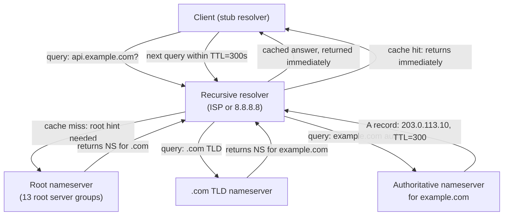
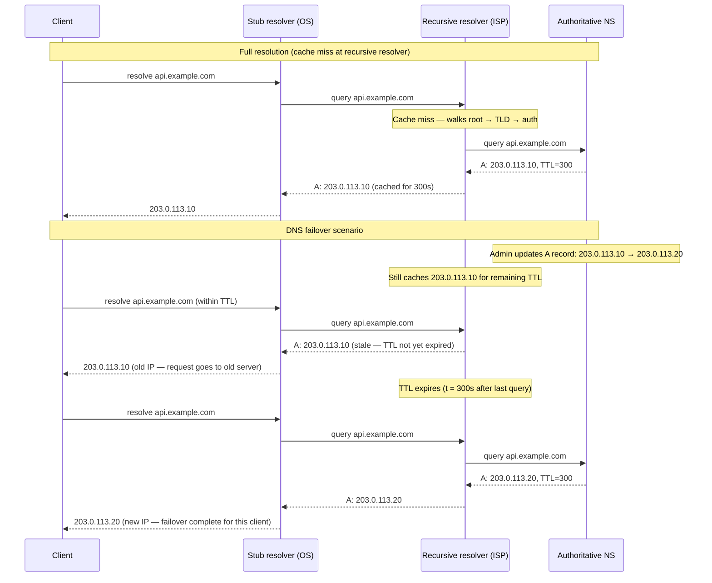
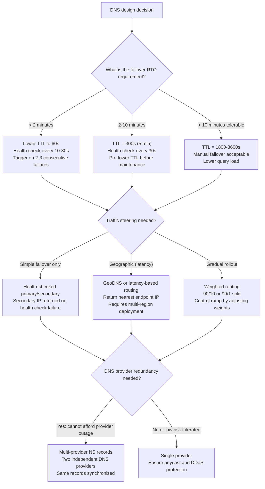

# Chapter 09 — DNS

TL;DR — DNS is the distributed, cached, hierarchical naming system that maps domain names to IP addresses. It is not a live routing protocol; it is a cache with a configurable expiry (TTL). "DNS propagation" is not an active push — it is waiting for cached entries to expire across recursive resolvers worldwide. TTL is the primary lever: a low TTL enables fast failover but multiplies resolver query load; a high TTL reduces query cost but bounds the achievable RTO for a DNS-based failover to the TTL value. DNS itself is a critical availability dependency — the 2016 Dyn outage demonstrated that taking out a major DNS provider takes out every service that depends on it, regardless of how redundant those services' own infrastructure is.

## Mental model

DNS resolves names through a hierarchy of authoritative servers, with caching at every layer. A stub resolver on the client delegates to a recursive resolver, which walks the tree — from root servers to top-level domain servers to authoritative servers — caching each answer for its TTL. Once an answer is cached, no further queries are made until the TTL expires. This is why a record change at an authoritative server does not instantly reach all clients: existing cached entries must expire first.

The key properties: DNS is pull-based (resolvers query when their cache expires, not when the authoritative server updates), hierarchical (each level caches and delegates downward), and eventually consistent (all resolvers converge on the new record after their TTL expires, but not simultaneously).

## How it works

### The resolution hierarchy

**Root nameservers**: 13 logical root server addresses (operated by 12 organizations, with hundreds of physical servers globally via anycast). They do not know the IP of every domain; they know which nameservers are authoritative for each top-level domain (.com, .org, .io, etc.). Root servers are the starting point for any recursive resolver that has a cache miss all the way to the top.

**TLD nameservers**: authoritative for top-level domains. The .com TLD nameservers know which nameservers are authoritative for each .com domain. They do not know the IP of individual hosts.

**Authoritative nameservers**: hold the actual DNS records (A, AAAA, CNAME, MX, TXT, NS) for a specific domain. When a zone administrator updates a record, the authoritative server reflects the change immediately for new queries. Cached copies elsewhere reflect the change only after their TTL expires.

**Recursive resolvers**: do the work of walking the hierarchy on behalf of clients. A recursive resolver (typically operated by an ISP, a public resolver like 8.8.8.8, or an organization's internal DNS) caches responses and returns them from cache for subsequent queries until the TTL expires. Most client DNS queries never touch the root or TLD servers — the recursive resolver's cache handles them.

**Stub resolvers**: the DNS client on the end-user machine or container. It forwards all queries to a configured recursive resolver and caches responses locally for the duration of the TTL (or a minimum configured TTL).

### Record types

| Record | Purpose |
|---|---|
| A | Maps hostname to IPv4 address |
| AAAA | Maps hostname to IPv6 address |
| CNAME | Alias from one name to another; the resolver continues resolving the target |
| MX | Mail exchange; routes email to the correct server |
| TXT | Arbitrary text; used for SPF, DKIM, DMARC, domain verification |
| NS | Nameserver; delegates a zone to specific authoritative servers |
| SOA | Start of Authority; zone metadata including serial number and default TTL |
| SRV | Service locator; hostname and port for a service |
| PTR | Reverse DNS; maps IP to hostname |

### TTL: the primary operational lever

TTL (Time To Live) is the number of seconds a resolver should cache a DNS record. The zone administrator sets TTL on each record. The trade-off:

**Low TTL** (30–300 seconds): resolvers refresh frequently. A record update propagates to all resolvers within TTL seconds. Fast failover, fast traffic steering. Cost: higher query load on authoritative servers (every TTL expiry triggers a new query from every resolver holding the record), and recursive resolvers that enforce a minimum TTL may not honor very low values.

**High TTL** (3,600–86,400 seconds): resolvers cache for hours or days. Query load is low. Cost: a record change takes up to TTL seconds to reach all clients. A DNS-based failover has an RTO bounded by the TTL of the old record. During an incident, the effective RTO is TTL minus the time already elapsed since the last cache refresh — which can be anywhere from 0 to the full TTL.

The pre-failure TTL reduction pattern: lower the TTL of critical records from 1 hour to 60 seconds well before any planned maintenance or expected failover. After TTL seconds, all resolvers have refreshed and hold the short-TTL record. Then perform the failover and update the record; all resolvers refresh within 60 seconds. After the failover is stable, restore the TTL to a higher value.

### DNS as traffic management

Modern authoritative DNS services offer routing policies that select which IP address(es) to return based on context:

**GeoDNS / latency-based routing**: return the IP of the nearest or lowest-latency endpoint based on the client's location (inferred from the resolver's IP via the EDNS Client Subnet extension, or from the resolver's own geographic location).

**Weighted routing**: return different IPs with specified probability, enabling gradual traffic shifts (10% to a new endpoint, 90% to the old).

**Health-checked failover**: the DNS provider continuously probes endpoints; if a health check fails, the failed IP is removed from DNS responses and traffic shifts to healthy endpoints. The RTO is the combination of health check interval (typically 10–30 seconds), the number of failures required to trigger removal (to filter false positives), and the TTL of the DNS record.

**Anycast**: multiple physical servers share the same IP address. Routing infrastructure directs each client to the topologically nearest server. DNS root servers and many CDN PoPs use anycast. Not a DNS feature per se, but DNS returns the anycast IP and routing does the rest.

### DNS as a critical availability dependency

DNS is an availability dependency for every service that is reached by name rather than by IP address. If the authoritative nameserver is unreachable, new DNS queries fail. If the recursive resolver is unreachable, clients cannot resolve any new names (cached records continue working until they expire).

The 2016 Dyn DDoS attack is the canonical example. Dyn, a major DNS provider, was hit by a massive distributed denial-of-service attack using the Mirai botnet on October 21, 2016. Dyn's recursive and authoritative resolver infrastructure was overwhelmed. Major websites including Twitter, Netflix, Reddit, GitHub, and Airbnb became unreachable for users whose DNS queries went to Dyn's resolvers — even though those services' own servers were running normally. The attack demonstrated that DNS providers are shared critical infrastructure, and that a single DNS provider for a service is a single point of failure regardless of the redundancy of the service itself.

Mitigations:
- Use at least two DNS providers (multi-provider DNS) so that the failure or attack of one does not take down resolution.
- Set appropriate TTLs so cached entries survive brief resolver outages.
- Use anycast for authoritative nameservers to spread attack traffic.

## Design Review Lens

- What problem is this actually solving? It decouples service identity (the name) from service location (the IP address), enabling operators to change infrastructure without updating every client. It also provides the first layer of traffic management — directing clients to specific endpoints based on geography, health, or weight.
- What assumptions does it depend on (and when do they break)? DNS assumes that clients respect TTLs. Some HTTP clients, mobile operating systems, and jvm-based applications aggressively cache DNS results and do not re-query when TTLs expire — a phenomenon sometimes called "DNS pinning." These clients will continue sending traffic to old IPs after a DNS update for minutes or hours. DNS also assumes the resolver infrastructure is reachable; DNS itself has no built-in redundancy at the client level (though multiple nameservers in the NS record help with authoritative redundancy).
- What breaks FIRST at 10x scale? Query volume to the authoritative nameserver if TTLs are low. At 10× user base with 60-second TTLs, query rate to the authoritative NS grows 10×. Authoritative nameservers must be provisioned for peak query rates.
- What breaks FIRST at 100x scale? DNS cache stampedes. When a record's TTL expires simultaneously across many resolvers (which happens if they all last queried the record at roughly the same time), all resolvers query the authoritative server simultaneously. At 100×, this can overload even a well-provisioned authoritative service.
- How would Netflix vs Amazon vs a 5-person startup each approach this differently? Netflix uses multi-CDN with GeoDNS to direct users to the nearest CDN edge, weighted routing for canary CDN deployments, and health-checked failover for origin protection. They use at least two DNS providers to avoid a single DNS dependency. Amazon operates Route 53 as infrastructure for its own services, using latency-based routing, weighted routing, and health checks extensively; the infrastructure is designed to survive DNS-layer attacks. A 5-person startup should use a managed DNS provider with health-checked failover, set a 5-minute TTL on critical records, and consider a second DNS provider for the domains they cannot afford to lose.

## Variants / approaches

| Approach | Strengths | Costs |
|---|---|---|
| Simple A record | Minimal; predictable | No traffic steering; single IP is a single point of failure |
| Round-robin DNS | Simple load distribution | No health checks; unhealthy IPs remain in rotation; no geographic awareness |
| GeoDNS / latency routing | Directs clients to nearest endpoint; reduces latency | Requires multiple endpoints; resolver IP may not reflect client location (CGNAT, proxies) |
| Weighted routing | Gradual traffic shifting for canary deploys | Weights are not per-client; a client gets one IP and stays there for the TTL duration |
| Health-checked failover | Automatically removes failed endpoints | Health check interval + TTL determines RTO; false positives cause unnecessary failover |
| Anycast (at nameserver) | DDoS resilience; automatically routes to nearest NS | Requires BGP and network infrastructure; not a DNS-layer feature |
| Multi-provider DNS | No single DNS provider is a point of failure | Requires synchronizing records across providers; operational overhead |

## Worked example (with capacity model)

Scenario: a SaaS platform with two data centers (DC-West and DC-East) serving traffic via DNS-based failover. The platform needs to survive the failure of one data center with minimal user impact. This is a hypothetical scenario; all timing values are planning assumptions.

**Assumptions**

| Input | Assumption | Basis |
|---|---:|---|
| DNS provider | Managed with health checks | Architecture decision |
| Health check interval | 30 seconds | DNS provider configuration |
| Failures-required-to-trigger | 3 consecutive failures | Configuration to reduce false positives |
| Record TTL during normal operation | 300 seconds | Balance between failover speed and query load |
| Record TTL pre-lowered before maintenance | 60 seconds | Pre-maintenance procedure |
| Daily active users | 500,000 | Product scale |
| Queries per user per day | 5 DNS resolutions | Planning assumption (most cached, few are new) |
| DNS cache hit rate | 90% | Planning assumption |

**Step 1: DNS query volume**

Total raw DNS lookups per day = 500,000 × 5 = 2,500,000/day.

With 90% cache hit rate: queries reaching authoritative NS = 2,500,000 × 10% = 250,000/day.

Average query rate to authoritative NS = 250,000 / 86,400 = 2.9 queries/second.

Peak query rate (5× planning assumption): 14.5 queries/second.

This is well within the capacity of any modern authoritative DNS service. DNS query load rarely limits service design at this scale.

**Step 2: RTO analysis for DNS-based failover**

When DC-West fails:

Phase 1 — Detection: health checker polls DC-West every 30 seconds. With 3 consecutive failures required: detection time = 3 × 30 s = **90 seconds**.

Phase 2 — DNS update: DNS provider removes DC-West's IP from responses. New queries return only DC-East's IP. Time: near-instantaneous after detection trigger.

Phase 3 — Cache drain: resolvers holding the old record (DC-West's IP) continue returning it until their TTL copy expires. With TTL = 300 s, a resolver that queried 1 second before the failover will still hold the record for 299 more seconds.

Maximum RTO (worst case): detection (90 s) + remaining TTL (up to 300 s) = **up to 390 seconds** (6.5 minutes).

For a user whose resolver last queried 290 seconds ago: remaining TTL = 10 s → RTO ≈ 90 + 10 = **100 seconds**.

Expected RTO across users: assuming resolvers last queried uniformly within the 300-second TTL window, average remaining TTL = 150 s. Average RTO = 90 + 150 = **240 seconds** (4 minutes).

**Step 3: RTO improvement with pre-lowered TTL**

If TTL is lowered to 60 seconds before a known maintenance window:

Maximum RTO = 90 s (detection) + 60 s (remaining TTL) = **150 seconds** (2.5 minutes).

Expected RTO = 90 + 30 = **120 seconds**.

For unplanned failures, the TTL cannot be pre-lowered, so the standard TTL applies.

**Step 4: query load at low TTL**

At TTL = 60 s, query rate to authoritative NS: 2,500,000 / 86,400 × (60/300 cache-hit assumption corrected) ...

More precisely: with TTL=60, the resolver refreshes every 60 seconds. Queries to authoritative NS = 500,000 users × 5 sessions × (TTL=60 means fewer cache hits) ≈ 2.5 million uncached + cached from within-session reuse.

A simpler approximation: at TTL=60 vs TTL=300, authoritative query rate increases by roughly 300/60 = 5× (the cache holds for 1/5 the time). New authoritative rate ≈ 2.9 × 5 = **14.5 queries/second** average (same as the peak estimate at TTL=300). Still very low.

**Step 5: multi-provider redundancy**

With two DNS providers (Provider A and Provider B), both serving NS records for the domain:

Resolvers use one of the two providers per query (based on which NS record is returned first or round-robin).

If Provider A is DDoSed or fails, resolvers that used Provider A experience a cache miss and fall back to Provider B's servers on retry.

RTO for provider failure: resolver retry time (typically seconds to a few minutes depending on SERVFAIL retry behavior) × TTL drain. With two providers and 300 s TTL, clients cached on Provider A's results continue using the cached IP for up to 300 s without needing any DNS query — the DNS outage itself does not affect already-cached clients until their TTL expires.

**Decision from the model**

For DNS-based failover with a target RTO of under 5 minutes: use TTL = 60 s for critical records, health check interval of 30 s, 3 consecutive failures required, and pre-lower TTL to 30 s before planned maintenance. Use two DNS providers for the domain's NS records to eliminate the DNS provider as a single point of failure. The expected RTO under this configuration is 90–120 seconds for unplanned failures.

## Failure Walkthrough

Single node failure: an authoritative nameserver for the domain fails. If multiple authoritative nameservers are listed in the NS record (standard practice), resolvers automatically query the surviving nameservers. Detection: resolver times out on the failed NS and retries another. Recovery: automatic — resolvers continue querying surviving NSes. RTO: near-zero for correctly configured multiple NSes.

Network partition: a subset of recursive resolvers cannot reach the authoritative nameservers. Those resolvers return SERVFAIL for new queries or continue serving cached records until TTL expires. Users on those resolvers experience resolution failures for names whose cached TTL has already expired. Detection: resolver-side SERVFAIL rates, client-side DNS error monitoring. Recovery: the partition heals, or clients use an alternative resolver. Systems that hardcode backup DNS servers (8.8.8.8, 1.1.1.1) can route around resolver-level failures.

Full regional failure: a region hosting both the origin servers and the authoritative DNS for the domain fails. If the authoritative DNS is hosted in the same region as the origin, both fail simultaneously — a design flaw. Authoritative DNS should always be hosted independently from the services it resolves. With a separate, geo-redundant authoritative DNS, the DNS layer survives regional failures and can redirect traffic; the health check detects the failed origin and removes it from responses.

Critical dependency outage: the DNS provider's infrastructure is attacked or fails (Dyn 2016 pattern). New DNS queries fail for all domains on that provider. Cached records continue working for their remaining TTL. After TTL expiry, clients cannot resolve new IPs. Mitigation: multi-provider DNS, where the domain's NS records point to two independent providers. If Provider A fails, resolvers retry and find Provider B's nameservers in the NS record set.

Data corruption / poison data: DNS cache poisoning — an attacker injects a false DNS record into a recursive resolver's cache, redirecting traffic for a domain to a malicious IP. DNSSEC (DNS Security Extensions) prevents this by signing records cryptographically; resolvers that validate DNSSEC signatures reject unsigned or incorrectly signed responses. Without DNSSEC, cache poisoning is a real attack vector. Detection: anomalous traffic to unexpected IPs, certificate mismatch errors (if TLS is used end-to-end — the correct TLS certificate will not match the attacker's server). Recovery: flush the poisoned resolver cache, enable DNSSEC.

## Decision Framework

## Tradeoffs & alternatives

Main recommendation: use a managed DNS provider with health-checked failover, set TTL to 60–300 seconds for critical records, and use at least two independent DNS providers for the NS records of any domain whose unavailability would be a major incident.

WHY: DNS-based failover is the most widely supported, infrastructure-agnostic traffic steering mechanism. It requires no changes to the origin servers and works for any TCP or UDP protocol. Health-checked failover automates the RTO that would otherwise require manual operator intervention.

What it COSTS: DNS-based failover has an inherent RTO floor bounded by the TTL of the record. For RTO targets under 60 seconds, DNS is insufficient and must be supplemented by load balancer-level failover (Chapter 10) or anycast routing.

ALTERNATIVES: Anycast routing provides sub-second failover by routing at the network layer rather than the DNS layer, but requires BGP infrastructure. Load balancer-level failover (L4/L7) provides faster RTO within a region. Service mesh-based routing (Chapter 54) provides failover within a cluster without DNS involvement.

WHEN NOT to use DNS for traffic steering: when RTO < 60 seconds is required; when the DNS provider cannot be trusted to maintain health check accuracy; when routing decisions must be made on request content (path, headers, cookies) rather than client location — this is L7 load balancing, not DNS.

## Staff & Principal lens

DNS is shared infrastructure between every team that uses the same domain. An RTO commitment for a service that relies on DNS-based failover must account for the DNS TTL — a promise of 60-second RTO cannot be delivered if the DNS record has a 5-minute TTL. Staff engineers must validate that the DNS configuration matches the SLA, not just the application.

The organizational risk is DNS misconfiguration during incidents. Under pressure, an operator may change a DNS record without lowering the TTL first, committing to a 1-hour wait for the change to propagate. DNS runbooks must include the TTL pre-lowering step and the associated wait time as explicit, mandatory steps before any maintenance that requires DNS changes.

DNS security is often neglected. DNSSEC prevents cache poisoning but adds operational complexity (key rotation, signing infrastructure). Domain registrar account security — preventing unauthorized zone record changes — is equally important. A stolen registrar credential allows an attacker to redirect a domain to any IP without touching the application at all.

Cost governance: low TTLs increase authoritative DNS query rates. At massive scale, this can affect pricing for DNS providers that charge per query. TTL should be sized to the actual failover requirement, not set arbitrarily low.

## Interview answer vs production reality

What interviewers expect to hear: explain the resolution hierarchy (stub → recursive → root → TLD → auth), explain TTL as the cache expiry mechanism, describe DNS-based failover and its RTO bound, and name GeoDNS as a traffic steering mechanism.

What actually happens in production: DNS pinning by Java applications (particularly the JVM's default DNS caching behavior) causes traffic to continue flowing to old IPs for minutes after a DNS update, even after the TTL has expired. Some mobile operating systems aggressively cache DNS results. In complex multi-CDN setups, GeoDNS may return the wrong CDN for clients behind CGNAT or enterprise proxies, because the resolver's IP is not the client's IP. DNS health checks have false positive rates that must be tuned — too sensitive and you get unnecessary failovers; too conservative and a real failure takes too long to detect. DNS registrar account compromise (not a network attack) is the primary real-world DNS hijacking vector.

Simplifications that are fine in an interview but wrong in prod: saying "DNS propagation takes 24 hours" — this refers to the TTL of records that were set to 24 hours; it is not an inherent property of DNS. Saying that DNS change is instant after TTL expiry — the expiry happens at different times at different resolvers, so there is a window during which some clients get the old answer and some get the new one. Treating DNS failure as recoverable by application retry — if the resolver is not reachable, the application cannot resolve any new name, not just the failed one.

## Common pitfalls & misconceptions

- Treating TTL as the propagation delay. TTL is the time until a cached record expires. After expiry, the resolver fetches the new record. Propagation is not active — it is passive cache expiry.
- Setting TTL too low permanently. Low TTL adds resolver query load and is unnecessary outside of maintenance windows. Pre-lower TTL, then restore it after the event.
- Single DNS provider. A single DNS provider is a single point of failure for all domains it serves, as the 2016 Dyn outage showed.
- Treating DNS failover as a real-time mechanism. DNS-based failover has a minimum RTO of detection time + TTL remaining. For sub-minute RTO, use load balancer failover, not DNS.
- Assuming GeoDNS resolves based on client IP. GeoDNS resolves based on the recursive resolver's IP (or EDNS Client Subnet hint if available). Clients behind shared corporate proxies or CGNAT all appear to come from the same resolver IP, defeating geographic routing.
- Forgetting negative caching. NXDOMAIN (name does not exist) responses are also cached for the SOA's negative TTL. A misconfigured zone that temporarily returns NXDOMAIN can cause clients to cache that negative answer and continue failing to resolve the name for the negative TTL period.

## Interview questions

Mid: What is DNS TTL, and how does it affect a DNS-based failover?

MODEL answer: TTL (Time to Live) is the number of seconds a resolver caches a DNS record before re-querying the authoritative nameserver. When an operator updates a DNS record to point to a new IP for a failover, resolvers that have cached the old record continue returning the old IP until their TTL copy expires. The minimum achievable RTO for DNS-based failover is the time to detect the failure plus the remaining TTL on the record. To reduce this, lower the TTL well before a planned failover (from, say, 3600 to 60 seconds), wait for that reduced TTL to propagate to all resolver caches, then perform the failover.

Senior: Your service is in US-West but 30% of users are in Europe. They experience 200 ms higher latency than US users. How do you use DNS to fix this?

MODEL answer: Use GeoDNS or latency-based routing to return a European endpoint IP to European resolvers. I would deploy the service in a European region (or use a CDN with European PoPs), then configure the DNS provider to return the European IP for queries coming from European resolvers and the US IP for US resolver queries. The caveats: GeoDNS resolves by resolver IP, not client IP. Clients behind CGNAT or proxies may have their resolver in the wrong geography. For users behind US corporate proxies who are physically in Europe, the fix is EDNS Client Subnet (ECS) — European resolvers that forward the client's subnet IP to the authoritative server allow geographic resolution based on the actual client location. I would also validate the geographic resolution by querying from both regions using dig or similar tooling and confirm the correct IPs are returned.

Staff: The 2016 Dyn outage took down major services that had nothing wrong with their own infrastructure. How should those services have been architected to survive it?

MODEL answer: Multi-provider DNS. The Dyn outage affected services that used Dyn as their sole authoritative DNS provider. Services with NS records pointing to two independent DNS providers — for example, NS1 and Cloudflare — would have survived because resolvers querying Dyn's nameservers and receiving SERVFAIL would retry on the alternative NS records and find Cloudflare's servers reachable. The key architectural requirements: (1) the domain's NS record set must include nameservers from at least two independent organizations with distinct infrastructure and AS numbers; (2) records must be synchronized across both providers so a query to either returns the same answer; (3) the domain registrar account must be secured against compromise. For services with very low acceptable RTO, anycast at the DNS provider level further reduces the attack surface by distributing query handling across many PoPs so no single PoP failure or DDoS concentration can take out the provider.

Principal: You are reviewing a major product launch that will DNS-failover traffic from a deprecated data center to a new one next month. What is the DNS runbook?

MODEL answer: The runbook has five phases. Phase 1 (one week before): verify that both endpoints (old and new DC) are in the DNS record and both pass health checks. Confirm health check interval and thresholds. Phase 2 (48 hours before): lower TTL of the affected records from the current value (say, 3,600 s) to 60 s. Wait 3,600 s (the old TTL) for all resolver caches to expire and refresh with the new 60-second TTL. Verify via external DNS monitoring that the short TTL is now propagated. Phase 3 (at failover time): update the A record to remove the old DC's IP and add only the new DC's IP (or reweight to 0/100 if using weighted routing). Monitor health checks, traffic volume, error rates, and application logs for 10 minutes before confirming. Phase 4 (confirmation): confirm the new DC is handling the expected traffic volume and error rates are nominal. Verify from multiple geographic vantage points that DNS returns only the new IP. Phase 5 (post-failover): restore TTL to a higher value (300–3,600 s) now that the failover is stable, to reduce authoritative query load. Document the actual RTO observed. The runbook must also include a rollback procedure: if the new DC shows problems within the first 30 minutes, revert the A record to the old IP and the short TTL allows recovery within 60 seconds.

## Connections

Prerequisites: [Chapter 03 — Availability and the Nines](../chapter-03-availability-and-the-nines/) for dependency chain reasoning — DNS is a dependency for every service reachable by name, and its availability multiplies into the series availability calculation.

Related chapters: [Chapter 10 — Load Balancing (L4/L7)](../chapter-10-load-balancing-l4-l7/) (DNS returns the IP of a load balancer, not usually of individual servers; DNS and LB failover are complementary layers). [Chapter 12 — CDN and Edge Delivery](../chapter-12-cdn-and-edge-delivery/) (CDNs use GeoDNS to direct users to the nearest PoP). [Chapter 47 — Multi-Region Architectures](../chapter-47-multi-region-architectures/) (DNS-based failover is the primary traffic steering mechanism for multi-region deployments — see Chapter 50 in the syllabus).

Builds toward: [Chapter 10 — Load Balancing (L4/L7)](../chapter-10-load-balancing-l4-l7/), [Chapter 12 — CDN and Edge Delivery](../chapter-12-cdn-and-edge-delivery/), [Chapter 50 — Multi-Region Architectures](../chapter-50-multi-region-architectures/), [Chapter 51 — Disaster Recovery (RPO/RTO)](../chapter-51-disaster-recovery-rpo-rto/).

## Further reading

- RFC 1034, [Domain Names — Concepts and Facilities](https://www.rfc-editor.org/rfc/rfc1034), P. Mockapetris, 1987. The foundational specification for the DNS architecture and concepts.
- RFC 1035, [Domain Names — Implementation and Specification](https://www.rfc-editor.org/rfc/rfc1035), P. Mockapetris, 1987. The companion specification covering DNS message format and resource record types.
- Amazon Web Services, [Amazon Route 53 Routing Policies](https://docs.aws.amazon.com/Route53/latest/DeveloperGuide/routing-policy.html). First-party documentation of weighted, latency-based, geolocation, and failover routing policies as implemented in a major production DNS service.
- Dyn Research and multiple post-incident analyses, [October 2016 Dyn DDoS Incident](https://dyn.com/blog/dyn-analysis-summary-of-friday-october-21-2016-attack/). First-party Dyn post-incident report covering the Mirai botnet DDoS and its impact on DNS resolution for major internet services.
