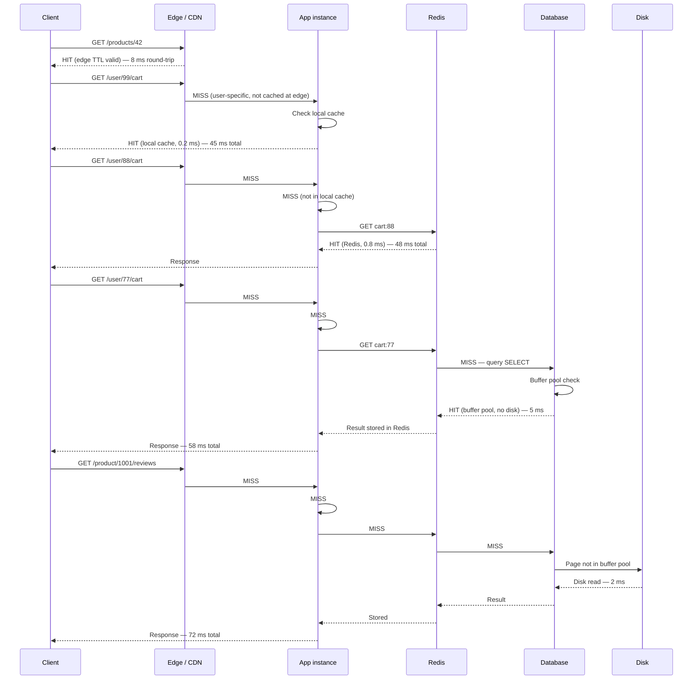
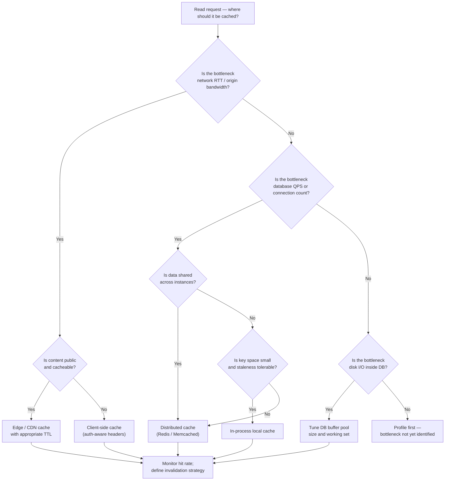

# Chapter 15 — Caching: Where to Cache

TL;DR — A cache is a copy of data placed closer to the consumer to reduce the cost of fetching the original. "Closer" means different things at each layer: an edge cache is geographically closer, an application cache is architecturally closer, a database buffer cache is physically closer to storage. Every caching layer relieves a different bottleneck — reduced round-trip time at the edge, reduced database load in the application tier, reduced disk I/O inside the database — and every layer introduces a different staleness risk and cold-start failure mode. Deciding where to cache starts with locating the bottleneck, not with reaching for the most familiar cache technology.

## Mental model

Each layer in the request path has a cost: network round-trips add latency, the database adds query processing and disk I/O, and disk adds seek and read time. A cache at any layer intercepts the request before the expensive operation downstream. The hit rate — the fraction of requests served from the cache rather than falling through — determines how much of that cost is avoided. Hit rate is not a constant; it depends on the working set, the TTL policy, the key distribution, and the failure state of the system (a point introduced in Chapter 01 for capacity modeling and developed further in Chapter 16).

```mermaid
flowchart LR
    Client["Client / browser"] -->|"1. local cache?"| LocalCache["Client-side cache\n(memory / disk)"]
    LocalCache -->|miss| Edge["CDN / edge cache\n(geographically near)"]
    Edge -->|miss| AppLocal["App-tier local cache\n(in-process, per instance)"]
    AppLocal -->|miss| Distributed["Distributed cache\n(Redis / Memcached)"]
    Distributed -->|miss| DB["Database\n(buffer cache + disk)"]
    DB -->|page miss| Disk["Persistent storage"]

    style LocalCache fill:#e8f4f8
    style Edge fill:#d4edda
    style AppLocal fill:#fff3cd
    style Distributed fill:#fde8d8
    style DB fill:#f8d7da
    style Disk fill:#e2e3e5
```

The decision tree is simple at the top level: find the bottleneck, place the cache just upstream of it. The complexity is in understanding what each layer actually costs, what it can safely serve stale, and what happens when the cache is empty or wrong.

## How it works

Tracing a single read end-to-end reveals what each layer does and what it cannot do.

**Request enters from the client.** The browser or mobile client may hold a cached response in memory or on disk. If the response headers allow it (Cache-Control, ETag, Last-Modified) the client serves it without any network call. This eliminates round-trip latency and origin load entirely for eligible content, but requires correct cache-control headers and still requires a conditional request on expiry.

**CDN / edge cache.** If the client cache misses, the request travels to the nearest CDN point-of-presence. Edge nodes are geographically distributed — often within tens of milliseconds of the user — and cache responses by URL or cache key. A cache hit at the edge eliminates the full round trip to the origin and removes that request from origin load. Edge caches are most effective for static or slowly-changing content (assets, public API responses, rendered pages). They are less effective for user-specific, session-bound, or high-churn content. The bottleneck relieved is round-trip latency and origin bandwidth. Staleness is controlled by TTL and explicit invalidation; both are explored in Chapter 16.

**App-tier local (in-process) cache.** If the edge misses or the request is not cacheable at the edge, it reaches an application server. An in-process cache stores recently computed or recently fetched data in the application's own heap. Access is sub-microsecond because there is no network or serialization cost. The tradeoff is that local caches are per-instance: in a fleet of ten application servers, the same object may be cached ten times independently, and a write on one instance does not invalidate the others. Local caches are most effective for small, frequently accessed, and read-heavy data whose staleness is tolerable for a short window (e.g., configuration values, user permission sets, product metadata). The bottleneck relieved is repeated database or distributed-cache round-trips for hot-path data.

**Distributed cache (Redis, Memcached).** For data that must be shared across application instances or whose working set is too large for each instance to hold independently, a distributed cache sits between the application tier and the database. All instances share the same cache namespace; a write that invalidates or updates a key is immediately visible to all consumers. The cost versus local cache is a network hop (typically sub-millisecond within a datacenter) and serialization overhead. Redis adds persistence, Lua scripting, sorted sets, pub/sub, and other data structures; Memcached is simpler and optimized for pure key-value throughput. The bottleneck relieved is database query load and connection pressure. Distributed caches also protect the database during read storms because a single warm cache key absorbs requests from the entire application fleet.

**Database buffer cache.** Inside the database process, recently used data pages are held in a memory pool (PostgreSQL shared_buffers, MySQL InnoDB buffer pool, Oracle SGA). Queries against hot data that fits in the buffer pool avoid disk reads entirely. This cache is managed automatically by the database engine; application engineers influence it by controlling the working set size (via sharding, archiving, indexing, and query patterns) and by sizing the buffer pool relative to the hot data set. The bottleneck relieved is disk I/O. Unlike application-tier caches, the buffer cache is transparent — it does not affect correctness, only performance.

Each missed layer adds latency and downstream load. The full miss path from client to disk is the worst case; the goal of caching strategy is to make the common case hit an early layer while keeping the miss path tolerable.

## Design Review Lens

**What problem is this actually solving?**
Caching solves the mismatch between demand and service capacity. The database can handle N queries per second; the application receives 10N. Without caching, the database becomes the bottleneck and latency degrades for all users. At the edge, caching solves geographic round-trip latency and origin bandwidth cost. In-process caching solves repeated cross-network fetches for hot data that doesn't need to be current to the millisecond. The distributed cache solves fan-out amplification: one popular record accessed by thousands of concurrent users can be served from a single warm key rather than triggering thousands of database reads.

**What assumptions does it depend on (and when do they break)?**
Every caching layer assumes a useful hit rate, which requires the working set to fit in cache and the access pattern to exhibit temporal or spatial locality. These break when:
- Keys are too numerous or access patterns are too uniform to concentrate in a smaller working set.
- Data changes so frequently that TTLs must be very short, reducing hit rate to negligible.
- A cache cold-start occurs after a restart, deploy, or failover — all requests fall through to the origin simultaneously.
- The workload is write-heavy; caches primarily help read-heavy workloads.
- An adversarial or unusual access pattern queries many distinct keys (cache busting, scraping).

The in-process cache assumes per-instance isolation is acceptable and that staleness within a short window is safe. The distributed cache assumes the cache tier is available; if it fails, the application must decide between serving stale, degraded, or uncached traffic. Both assume cache invalidation logic is correct; an invalidation bug silently serves wrong data.

**What breaks FIRST at 10x scale?**
The distributed cache's memory. A 10x increase in active keys or values can exhaust cache RAM, forcing evictions that reduce hit rate. Lower hit rate sends more traffic to the database, which then saturates on connection count or query throughput. The symptom is a slow cascade: cache miss rate rises, database CPU climbs, query latency increases, application timeouts spike. The mitigation involves larger cache instances, additional partitioning, or reducing TTL to free memory — each with its own tradeoff.

**What breaks FIRST at 100x scale?**
At 100x, the thundering herd and hot-key problems become structural. A single popular key (e.g., a trending product page) receives so many simultaneous requests that a single Redis node's network bandwidth or CPU becomes the bottleneck, even for cache hits. Cache invalidation events for popular keys trigger coordinated cache misses across the fleet, generating database request spikes that exceed its capacity. Solutions include read replication of the cache layer, key sharding, probabilistic early expiration, and request coalescing (covered in Chapter 16). At 100x, the edge cache's origin-shield configuration also becomes critical: without it, a CDN cache miss from every PoP simultaneously can saturate the origin.

**How would Netflix vs Amazon vs a 5-person startup each approach this differently, and why?**

Netflix-scale video streaming relies heavily on the edge and a proprietary CDN (Open Connect) because video bytes far outnumber any other data type. The bottleneck is origin bandwidth and regional latency, not database QPS. Application-tier caches focus on metadata (titles, recommendations, user state) where staleness of a few seconds is acceptable. Netflix invests in fine-grained cache control headers and proactive cache warming before major release events.

Amazon-scale e-commerce faces high write rates (inventory, orders, pricing), high read rates, and strict per-tenant isolation. Distributed caches like ElastiCache are used extensively, but key design is careful: product pages, pricing, and availability data have different TTL and invalidation requirements. Amazon also uses local in-process caches for configuration and permission data where latency budgets are tight. Thundering herd on popular products during sales events is a known hard problem requiring probabilistic TTL jitter and request coalescing.

A 5-person startup should start with a single distributed cache (Redis) for session state and frequently read records, rely on the hosting platform's CDN for static assets, and avoid over-engineering local caches until profiling shows them necessary. The operational cost of running and monitoring a multi-layer cache hierarchy is real; premature complexity creates bugs and pages.

## Variants / approaches

| Cache location | Bottleneck relieved | Strengths | Costs |
|---|---|---|---|
| Client-side (browser / app memory) | Full network round-trip | Zero-latency hits; zero origin load for fully cached responses | Requires correct cache-control headers; no server-side invalidation without ETag round-trips |
| CDN / edge | Geographic RTT; origin bandwidth | Scales to millions of users per origin; absorbs traffic spikes before origin | Only effective for cacheable (usually public) content; invalidation lag on short TTLs; edge config complexity |
| App-tier in-process | Cross-tier network + serialization | Sub-microsecond access; no extra infrastructure | Per-instance incoherence; memory pressure; not shared across fleet; harder to invalidate correctly |
| Distributed cache (Redis / Memcached) | Database query load; connection count | Shared across fleet; flexible data structures (Redis); explicit invalidation possible | Network hop; serialization; operational complexity; single tier failure if not replicated |
| Database buffer pool | Disk I/O | Transparent; automatic; covers all queries | Managed by DB engine; size constrained by instance RAM; cold after restart |
| Read replica | Primary write throughput; query fan-out | Distributes read load without application-tier changes | Replication lag; read-your-write consistency requires routing logic |

## Worked example (with capacity model)

Scenario: a product catalog service for an e-commerce platform. Users browse product pages. Catalog data changes infrequently (price updates a few times per day, inventory status every few minutes). This is a planning scenario; numbers are assumptions unless labeled otherwise.

**Assumptions:**

| Input | Assumption | Basis |
|---|---:|---|
| Peak product page reads | 12,000 requests/second | Business peak estimate |
| Unique active product keys in working set | 200,000 | Product catalog size assumption |
| Average product page response | 12 KB | Payload assumption |
| Database query time (uncached) | 8 ms | Heuristic for indexed lookup on warm DB |
| Redis round-trip (same datacenter) | 0.8 ms | Heuristic; verify with your environment |
| In-process cache access | 0.05 ms | Heuristic for HashMap lookup |
| Edge cache hit | 8 ms end-to-end from user | Heuristic for nearby CDN PoP |
| Uncached full-stack latency | 70 ms | Sum of network + app + DB + serialization |
| Target p95 read latency | 50 ms | SLO assumption |
| Database max comfortable read QPS | 2,000 reads/second | Heuristic for a moderately sized RDBMS; benchmark your instance |

**QPS and hit-rate model:**

Peak load = 12,000 reads/second.

Assume 60% of requests are for the top 5% of products (power-law access pattern, heuristic). These are good candidates for edge caching with a 60-second TTL.

Edge cache hit rate assumption = 55% of total requests (products that are public, cacheable, within TTL). This is a planning assumption; actual hit rate depends on TTL length, key diversity, and CDN configuration.

Requests reaching origin after edge = 12,000 * (1 - 0.55) = 5,400 requests/second.

Of those, assume local in-process cache (per app instance, 30-second TTL) absorbs 30% of origin-bound requests for the hottest keys, distributed unevenly across a fleet of 20 instances.

Requests reaching distributed cache after in-process = 5,400 * (1 - 0.30) = 3,780 requests/second.

Assume distributed cache (Redis) hit rate = 85% for these keys (working set fits in cache; TTL is 120 seconds for most products).

Requests reaching database after Redis = 3,780 * (1 - 0.85) = 567 requests/second.

567 database reads/second is well within the 2,000 reads/second capacity assumption, leaving 72% headroom for writes, joins, non-catalog queries, and peak spikes. Without any caching, the 12,000 reads/second would exceed the database capacity by 6x.

**Storage (cache memory) estimate:**

200,000 active product keys * 12 KB per response = 2,400,000 KB = 2.4 GB of logical cached data.

With Redis key overhead (roughly 60–100 bytes per key for metadata, heuristic) and assuming some value compression, total Redis memory for this working set is approximately 2.4 GB to 3.5 GB. A single Redis instance with 8 GB RAM covers this working set comfortably with room for TTL-expired keys pending eviction.

**Bandwidth estimate:**

Edge cache serves 12,000 * 0.55 = 6,600 responses/second at the edge without touching origin.

Edge egress bandwidth = 6,600 * 12 KB = 79,200 KB/second = 79.2 MB/second. CDN pricing typically counts this as edge-to-user egress; origin-to-CDN fill (cache misses at edge) is a fraction of this.

Origin egress = 5,400 responses/second * 12 KB = 64,800 KB/second = 64.8 MB/second.

**Peak vs average:**

Average daytime traffic = 40% of peak = 0.40 * 12,000 = 4,800 requests/second. Database reads at average = 4,800 * 0.45 (edge miss) * 0.70 (Redis miss) * 0.15 = approximately 226 reads/second, well within capacity.

Night-time trough = 10% of peak = 1,200 requests/second. At this level, caches begin to get cold as TTLs expire without being refreshed, so the first burst back to full traffic after a quiet period will have lower hit rates than steady state. This is the cold-cache risk (see Failure Walkthrough below).

**Growth projection:**

Assume 20% quarter-over-quarter traffic growth. After one year (4 quarters): 12,000 * 1.20^4 = 12,000 * 2.0736 = 24,883 requests/second at peak.

At that volume, the database headroom at 567 reads/second would scale to approximately 567 * 2.07 = 1,174 reads/second — still under the 2,000 read/second threshold assuming hit rates hold. If a product launch or viral event causes hit rate to drop (new products not yet in cache, unusual key spread), database QPS could spike beyond capacity. The model says: protect the database path with rate limiting or request coalescing by the time traffic exceeds 8,000 peak requests/second to the origin, as a planning trigger.

## Failure Walkthrough

**Single node failure (one Redis replica or one app instance):**
Users see no impact if Redis is replicated with a replica ready to take over primary duties. Sentinel or cluster failover typically completes in under 30 seconds. During failover, cache reads may return errors or stale data depending on client configuration. The application should be coded to treat cache failure as a miss (fetch from database) rather than a hard error. If an app instance fails, in-process cache state on that instance is lost; the remaining instances absorb the traffic with no user impact beyond the latency of redistributed load. RTO for a single replica failure with automatic failover: under 60 seconds for Redis Sentinel; under 15 seconds for Redis Cluster. RPO is not applicable to a cache (it holds a copy, not the source of truth).

**Network partition:**
If the application tier is partitioned from Redis, all cache reads return errors or timeout. Depending on the client's error handling, the application either falls back to the database (correct but slow and potentially overloaded), returns stale data from the local in-process cache if available, or returns an error. The database will see a sudden jump in read QPS equal to the fraction of requests that were Redis-served. If the database cannot absorb that load, it becomes the new bottleneck and latency spikes for all users. Detection: Redis client error rates, database connection pool exhaustion, application p95 latency. Recovery: restore network path; caches warm automatically as misses repopulate them. The slow-recovery pattern — cache stays cold until traffic warms it, during which time database stays hot — is the classic thundering herd scenario. Chapter 16 covers request coalescing and probabilistic TTL as mitigations.

**Full regional failure:**
If the primary datacenter fails and traffic fails over to a secondary region, the secondary region's caches are cold. All requests miss every layer and hit the database, generating a traffic spike equal to the full peak load with no cache buffering. The database in the secondary region must be provisioned to handle this cold-start peak, not just steady-state database QPS after caches warm. Detection: regional health checks, DNS failover triggers. Recovery: traffic routes to the secondary; caches warm gradually over several minutes. For a product catalog, a proactive cache warm (pre-populate key objects before cutting traffic) can reduce the cold-start spike. RPO for the cache tier: not applicable (cache is ephemeral). RPO for the database: depends on replication lag at time of failure. RTO: time-to-failover plus cache-warmup time.

**Critical dependency outage (database unavailable):**
If the database is unavailable, cache misses have nowhere to fall back. The application must decide whether to serve stale cached data (if the cache still holds valid entries), reject the request with an error, or serve a degraded response. Serving stale data from the cache can maintain partial availability (users can read data last written before the outage) at the cost of potentially incorrect information. This is a product decision, not a technology decision. An in-process cache with a longer grace period TTL (serving data past its normal expiry during dependency failure) is one pattern. Detection: database health checks, connection pool errors, rising error rates. Recovery: once the database recovers, caches repopulate on the next miss. If writes were accepted during the outage and queued, cache invalidation must be replayed after recovery to avoid serving stale data. RPO: data that was written to the queue but not yet committed to the database is at risk. RTO: database recovery time plus cache warming time.

**Data corruption / poison data:**
A bad write stores an incorrect value in the cache. All reads until TTL expiry (or explicit invalidation) return the wrong result. Detection is difficult without a read-path validation layer: the data looks present and returns successfully. Symptoms appear downstream — wrong prices displayed, incorrect permissions granted, corrupted rendered HTML. Detection paths include application-level validation of deserialized values, anomaly alerts on specific fields (e.g., price = 0), canary reads comparing cache and database, and user reports. Recovery: flush the specific key or key range from all cache layers (edge, distributed, in-process). In-process caches require a deploy or cache-clear signal; they cannot be invalidated remotely by key without a purpose-built mechanism. The full flush approach (flushing all cache contents) avoids selective key management but causes a cold-cache thundering herd. This is why cache invalidation correctness is considered one of the hard problems in distributed systems.

## Decision Framework

## Tradeoffs & alternatives

**Main recommendation: distributed cache (Redis) as the primary application-tier cache, with CDN at the edge for public content.**

WHY use it: A distributed cache absorbs the majority of read load before it reaches the database, is shared across all application instances (avoiding per-instance incoherence), and supports explicit invalidation. Redis adds useful primitives (sorted sets, pub/sub, Lua scripts) that go beyond simple key-value caching. CDN edge caching eliminates the majority of origin requests for public content, reducing latency and bandwidth cost simultaneously.

What it COSTS: Redis adds operational complexity: replication topology, failover configuration, memory sizing, eviction policy selection, client library configuration, and monitoring. Every cache layer adds a staleness risk; stale data requires careful TTL design and invalidation logic. A cache is not a durable store — it holds copies. If application code does not handle cache misses and errors gracefully, Redis availability becomes a hard dependency on system availability.

ALTERNATIVES: Read replicas on the database can distribute read load without a separate cache tier; they are simpler to operate but do not reduce query computation cost for complex queries and add replication lag risk. Materialized views precompute results inside the database, reducing query complexity; they are effective for aggregation-heavy workloads but add write-path complexity. For static content, object storage with CDN front-end is often simpler and cheaper than application-tier caching.

WHEN NOT to use it: Do not add a distributed cache when the database is not the bottleneck. If the bottleneck is application CPU, network bandwidth between services, or a dependency other than the database, adding Redis provides no relief and adds operational risk. Do not use a cache as a primary store for data whose loss matters; caches are ephemeral by design. Do not add caching when write rates are high enough that cache hit rates will be negligible — a record updated every second with a 1-second TTL has near-zero expected hit rate and adds complexity for no gain. Do not cache sensitive data (PII, credentials, payment information) without verifying that the cache's encryption, access controls, and eviction behavior meet your compliance requirements.

## Staff & Principal lens

**Organizational impact:** Introducing a distributed cache creates a new operational dependency. Someone must own Redis: version upgrades, capacity planning (memory is the binding resource, not CPU), failover testing, eviction policy decisions, and on-call runbooks. In many organizations, this lands on a platform or SRE team. The risk is that application teams treat the cache as a black box and design around it without understanding eviction or failure behavior. A Staff engineer should define the contract: what the application guarantees when the cache is unavailable, what TTL policies are acceptable for each data class, and who reviews cache key design for hot-key risk.

**Operational burden:** The pager for a distributed cache is subtle. Cache memory saturation causes evictions, which reduce hit rate, which increase database load, which can cascade into a database outage. The alert that fires is often "database CPU high" or "application p95 latency spike," not "cache memory high" — the cache failure is several steps removed from the visible symptom. Runbooks must trace this chain explicitly. Cache cold-start after a deployment, failover, or large-scale cache flush requires a planned warm-up strategy or a circuit breaker on the database path during recovery.

**Cost governance:** Cache memory is relatively cheap per GB compared to database instance costs, but it scales with the hot working set. The hot working set can grow unexpectedly when new features add new cache key namespaces, when tenant growth increases key space, or when TTLs are set too long and prevent memory from being reclaimed. A Principal engineer should ask for unit economics: cache memory cost per active user, cache hit rate as a function of memory allocation, and the cost differential between serving from cache versus from database (which includes not just instance cost but read replica cost, connection overhead, and latency SLO risk).

**Migration complexity:** Adding a cache tier to an existing system requires careful rollout. The application must be changed to read-through and populate the cache, with a fallback path to the database for misses. Key design decisions made at rollout are hard to change later: key naming conventions, TTL policies, and eviction policy affect downstream behavior. Switching from one cache technology to another (e.g., Memcached to Redis) while keeping the system live requires a migration strategy — dual writes, shadow reads, or traffic shifting — that must be tested under realistic load. The local in-process cache is the easiest to introduce and remove; the distributed cache is harder; the CDN cache configuration touches infrastructure and deployment tooling that may be owned by a separate team.

**Long-term maintainability:** Cache invalidation logic embedded in application code accumulates debt over time. When new writers are added (new services, background jobs, migrations) they must correctly invalidate or update cache keys. A write that bypasses cache invalidation silently introduces stale data. This argues for centralizing cache invalidation logic — either in a dedicated write path, a change-data-capture pattern, or an explicit cache-management service — rather than scattering invalidation calls across all writers. Chapter 16 covers the full landscape of invalidation patterns.

## Interview answer vs production reality

**What interviewers expect to hear:** Add a cache (usually Redis) between the application and the database to reduce database load. Use TTL to expire stale entries. Place a CDN in front for static content. Mention hit rate, eviction policies (LRU/LFU), and cache-aside versus write-through.

**What actually happens in production:** Cache hit rate is not a constant — it degrades after deploys, during traffic shifts, after a regional failover, or when a new feature touches a new key space. Cold-start behavior is often untested and becomes a production incident. Cache invalidation bugs are among the most common and hardest-to-detect correctness bugs in production systems. The distributed cache itself becomes a scaling bottleneck at high write rates (invalidation floods) or at high per-key request rates (hot keys). In-process caches are often added for performance without a disciplined invalidation strategy, creating subtle incoherence across fleet instances.

**Simplifications fine in an interview but wrong in prod:** Stating a fixed hit rate (e.g., "80% of requests hit the cache") is acceptable in an interview to drive a capacity estimate. In production, hit rate must be instrumented and alerted on; a drop in hit rate is often the first signal of a misconfiguration, a data shape change, or an upstream problem. Saying "add a cache and the database sees 80% less load" is fine for interview math but wrong in production if cache failures, cold starts, and TTL expiry are not handled. In an interview, a single Redis node is typically sufficient to illustrate the pattern; in production, replication, cluster mode, and connection pooling are baseline requirements for any traffic-bearing cache.

## Common pitfalls & misconceptions

- **Treating hit rate as a fixed parameter.** Hit rate is a property of the workload, the key distribution, the TTL, and the failure state of the system. It must be measured, not assumed. A cache designed around a 90% hit rate assumption with no instrumentation will fail silently when the hit rate drops.

- **Forgetting cold-start behavior.** A new deployment, a cache restart, or a regional failover starts with an empty cache. The resulting miss flood can overload the database before the cache warms. This risk is predictable and must be part of the design (warm-up scripts, request coalescing, database rate limiting).

- **Using the cache as a primary store.** Caches are designed to be ephemeral — they may evict data under memory pressure. Storing state in a cache without a durable backing store means that data can disappear silently. Redis with persistence (AOF or RDB) can act as a durable store for some use cases, but this is a distinct configuration with different operational requirements.

- **Ignoring per-instance incoherence for local caches.** In a fleet of application instances, each local cache is independent. A write on one instance does not propagate to others. For data whose staleness must be bounded fleet-wide (e.g., permission changes, configuration updates), local caches require either short TTLs or a pub/sub invalidation mechanism.

- **Hot-key blindness.** A single Redis key receiving thousands of requests per second can saturate the network bandwidth or CPU of the shard holding that key, even though total cache hit rate looks healthy. Hot-key problems require monitoring at the key level, not just the cluster level.

- **Cache as availability hack.** Some designs use cache reads as a fallback when the database is down, without deciding in advance whether that is acceptable product behavior. The decision to serve stale data during a database outage is a product and business decision, not a default; it must be made explicitly and tested.

- **Ignoring eviction under pressure.** When cache memory is full, the eviction policy (LRU, LFU, TTL-based) determines which keys are dropped. If important keys are evicted in favor of less-valuable ones, hit rate for critical paths drops. Key namespacing and memory limits per namespace help, but require deliberate configuration.

- **Not accounting for serialization cost.** Distributed caches store bytes, not objects. Serializing and deserializing large complex objects on every cache hit adds CPU cost and latency that can partially negate the benefit of avoiding a database query. This is especially relevant for large JSON payloads or protobuf objects.

## Interview questions

**Mid:** A product page takes 200 ms to load and the database is clearly the bottleneck. Where would you add a cache, and what would you cache?

MODEL answer: I would add a distributed cache (Redis) between the application tier and the database. I would cache the fully assembled product response — including name, price, description, image URLs, and availability — keyed by product ID. TTL depends on how frequently product data changes: if prices update a few times per day, a 60-second TTL is a reasonable starting point. I would also instrument cache hit rate from day one. If the product page includes user-specific data (personalization, cart state), that data should not be cached in the shared layer; it belongs in a user-session cache with a different TTL and key structure.

**Senior:** Your Redis cache is returning a 95% hit rate in dashboards, but database CPU is still spiking. What might be happening?

MODEL answer: Several things could cause this. First, the 5% miss rate might be concentrated on expensive queries — hot new products, complex joins, or uncacheable paths — that are disproportionately costly. Second, there may be a hot key driving many simultaneous requests to a single Redis shard, causing Redis to be the bottleneck, not the database — but the spike on the database is from something else (writes, background jobs, index maintenance). Third, a subset of traffic may be bypassing the cache entirely (a different code path, a migration job, an admin tool). Fourth, cache-aside misses might be causing stampedes: multiple concurrent requests for the same missing key all hit the database before any of them populates the cache. I would instrument per-key miss rate, database slow-query logs, and connection pool utilization to isolate the cause.

**Staff:** Your team is adding a distributed cache to a service that previously had none. What organizational and operational concerns do you raise before the rollout?

MODEL answer: Before rollout I would want answers on four fronts. First, ownership: which team is on-call for Redis? Who handles capacity planning (memory is the binding resource), version upgrades, and client library updates? If it is the application team, they need Redis runbooks; if it is a platform team, there needs to be a clear interface contract. Second, fallback behavior: what does the application do when the cache is unavailable — fall through to the database, serve stale, or error? This is a product decision that the team lead and product manager must make explicitly, not a default. Third, cold-start plan: what is the warm-up strategy for a new deployment or a post-incident cache flush? The database must be provisioned to absorb peak traffic without cache buffering, or the warm-up must be controlled (phased traffic shift, pre-population script). Fourth, key governance: who reviews cache key naming, TTL choices, and invalidation logic? A poorly designed key namespace or a missing invalidation call is a silent correctness bug that can go undetected for weeks.

**Principal:** An acquisition doubles the product catalog overnight and you expect cache hit rate to drop from 85% to 40%. Walk through the impact and your response.

MODEL answer: A hit rate drop from 85% to 40% means the database receives roughly 60% of requests instead of 15% — a 4x increase in database read QPS almost overnight. If current peak database QPS is near capacity, this will cause saturation, elevated latency, and likely connection pool exhaustion. My response has three phases. Immediate: provision additional database read replicas to absorb the larger miss volume, and add a database-side rate limit or circuit breaker so a cache miss storm cannot knock out the database for write traffic. Medium-term: analyze the new catalog's access pattern — if the new products have a power-law access distribution (which product catalogs typically do), the working set that fits in cache may be larger in absolute terms but similar in fraction of total catalog. Increasing cache memory to accommodate the combined working set may restore hit rate close to the original. I would also review TTL policies: longer TTLs improve hit rate at the cost of staleness, which may be acceptable for product descriptions but not for inventory status. Long-term: if the combined catalog's hot working set genuinely does not fit in a single cache tier, I would consider tiering: edge caching for the highest-traffic products (which can be identified from access logs), distributed cache for the next tier, and direct database for the long tail. The organizational question is whether the new catalog has different SLO requirements — if the acquired catalog's data changes more frequently, its TTL and invalidation logic may differ from the existing catalog, requiring namespace separation and potentially different cache instances.

## Connections

Prerequisites: [Chapter 01 - Estimation and Capacity Modeling](../chapter-01-estimation-and-capacity-modeling/) (hit rate is a measured property, not a constant; cold-cache behavior affects capacity estimates), [Chapter 02 - Performance vs Scalability, Latency vs Throughput](../chapter-02-performance-vs-scalability-latency-vs-throughput/) (caching improves latency and throughput, but their different failure modes require separate analysis), [Chapter 05 - Consistency Models](../chapter-05-consistency-models/) (caching introduces eventual consistency between cache and source of truth), [Chapter 12 - CDN and Edge Delivery](../chapter-12-cdn-and-edge-delivery/) (edge cache mechanics, TTL, and invalidation at the CDN layer).

Related chapters: [Chapter 09 - DNS](../chapter-09-dns/) (DNS TTL is itself a caching mechanism for name resolution), [Chapter 14 - Service Discovery](../chapter-14-service-discovery/) (service registries use TTL-based caching of endpoint state), [Chapter 27 - Rate Limiting](../chapter-27-rate-limiting/) (rate limiting often uses a distributed cache to track counters).

Builds toward: [Chapter 16 - Caching Patterns and Invalidation](../chapter-16-caching-patterns-and-invalidation/) (cache-aside, write-through, write-behind, thundering herd mitigations, and invalidation strategies depend on the layer map developed here), [Chapter 26 - Design Walkthrough: URL Shortener](../chapter-26-design-walkthrough-url-shortener/) (URL redirect lookup is a canonical in-process and distributed cache use case), [Chapter 66 - Design Walkthrough: Twitter-Style Feed](../chapter-66-design-walkthrough-twitter-style-feed/) (timeline caching is a high-stakes application of distributed cache design).

## Further reading

- Rajesh Nishtala et al., ["Scaling Memcache at Facebook"](https://www.usenix.org/conference/nsdi13/technical-sessions/presentation/nishtala), USENIX NSDI 2013. Describes how Facebook used Memcached at massive scale, including lease mechanisms to address thundering herds, regional replication, and operational lessons.
- Redis official documentation, ["Redis data types"](https://redis.io/docs/latest/develop/data-types/) and ["Redis persistence"](https://redis.io/docs/latest/operate/oss_and_stack/management/persistence/). Primary source for Redis data structures, persistence modes, and replication configuration.
- Memcached official documentation, ["Memcached wiki"](https://github.com/memcached/memcached/wiki). Primary reference for Memcached architecture, protocol, and operational behavior.
- PostgreSQL documentation, ["Resource Consumption: shared_buffers"](https://www.postgresql.org/docs/current/runtime-config-resource.html). Authoritative reference for PostgreSQL buffer pool sizing.
- MySQL documentation, ["InnoDB Buffer Pool Configuration"](https://dev.mysql.com/doc/refman/8.0/en/innodb-buffer-pool.html). Authoritative reference for MySQL InnoDB buffer pool behavior and tuning.
