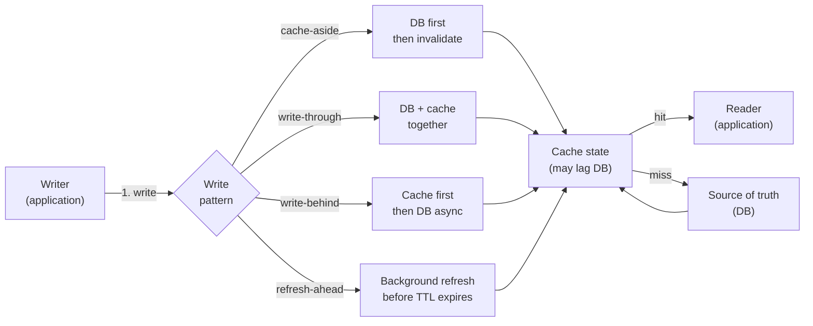
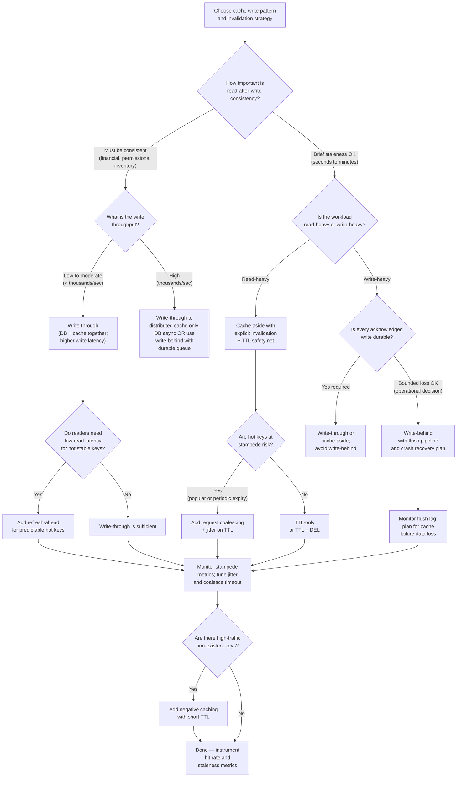

# Chapter 16 — Caching Patterns and Invalidation

TL;DR — Knowing where to place a cache (Chapter 15) is only half the problem. The other half is deciding how writes flow through the cache and how the cache stays coherent with the source of truth. Cache-aside, write-through, write-behind, and refresh-ahead represent the four principal patterns, each trading off write latency, read consistency, durability, and operational complexity in different ways. On top of the write pattern, invalidation strategy — time-to-live versus explicit invalidation — determines how long stale data can persist after a change. The two hardest problems are invalidation correctness (ensuring a stale copy is never silently trusted) and the cache stampede (ensuring a mass expiry does not collapse the origin). Neither problem has a cost-free solution: every mitigation displaces the risk rather than eliminating it.

## Mental model

A cache is a second source of truth. Unlike a read replica that applies the same writes as the primary and converges automatically, a cache is filled and invalidated by application logic. That means the cache and the database can disagree at any moment, and the duration and consequences of disagreement depend entirely on how the write pattern and invalidation strategy were designed. The fundamental tension is this: the faster the cache absorbs writes, the more consistent it stays, but the higher the write latency or the greater the durability risk.



The key insight is that the cache state is a derived view of the database. Any write pattern that delays or skips updating the cache creates a consistency window — a period when reads from the cache return data that does not match the database. The length and consequences of that window are the primary design variable.

## How it works

### Cache-aside (lazy loading)

In cache-aside, the application owns all cache interactions. On a read, the application checks the cache; on a miss, it reads from the database and then populates the cache. On a write, the application writes directly to the database and then invalidates (or updates) the cache entry.

The consistency window is the time between the database write completing and the cache entry being invalidated. If invalidation is synchronous and in the same transaction context, the window is short but not zero. If invalidation is asynchronous, the window widens to the invalidation lag. If the writer crashes after writing to the database but before invalidating the cache, the stale entry persists until TTL expiry.

Cache-aside is the most common pattern because it is simple to implement, keeps the cache lean (only data that has been read gets cached), and degrades gracefully when the cache is unavailable (reads fall through to the database).

### Write-through

In write-through, the application writes to both the cache and the database on every write, treating the cache as a write path rather than a read-path optimization. The write is not acknowledged to the caller until both the cache and the database confirm it.

The consistency window is essentially zero for reads that go to the cache after a write, because the cache is updated atomically with (or immediately after) the database. The cost is higher write latency — every write pays for two round-trips — and unnecessary cache population for data that may never be read again.

Write-through is appropriate when read-after-write consistency is a hard requirement and cache hit rate is high enough that populating on every write is not wasteful. It is less appropriate when write throughput is high, because the cache write becomes a bottleneck in the write path.

### Write-behind (write-back)

In write-behind, the application writes to the cache immediately and acknowledges success to the caller. The cache tier (or a background process) flushes writes to the database asynchronously, typically in batches.

The write path latency is low — the caller waits only for the cache write. However, any data that has been written to the cache but not yet flushed to the database is at risk if the cache fails before the flush completes. Write-behind trades durability for lower write latency. It is appropriate when writes are frequent and the database is the bottleneck, when writes can be safely batched, and when the business can tolerate a bounded data loss window. It is dangerous when durability of every acknowledged write is required, because the cache failure model includes data loss rather than just serving stale reads.

Write-behind also complicates reads: a reader might read from the database and miss data that the cache holds but has not yet flushed. This requires either routing reads through the cache or accepting that reads from the database may lag the cache's view.

### Refresh-ahead

In refresh-ahead, the system proactively refreshes cache entries before they expire, based on predicted access patterns or on detecting that a TTL is approaching its deadline. Rather than waiting for a miss to trigger a database read, a background process reads from the database and repopulates the cache.

Refresh-ahead reduces latency for frequently accessed keys by eliminating cache misses for those keys entirely. The cost is unnecessary origin load for keys that were about to expire but would never have been accessed again. It also requires predicting which keys will be accessed, which is straightforward for globally popular keys but complex for user-specific or query-derived keys.

Refresh-ahead is commonly paired with TTL-based expiry: when a key's TTL falls below a threshold (say, 10% of its original TTL), a background job schedules a refresh. This is the pattern used by content delivery networks for popular assets and by session management systems for long-lived sessions.

```mermaid
sequenceDiagram
    participant App as Application
    participant Cache as Cache (Redis)
    participant DB as Database

    Note over App,DB: Cache-aside write
    App->>DB: UPDATE products SET price=29 WHERE id=42
    DB-->>App: OK
    App->>Cache: DEL product:42
    Cache-->>App: OK (or error — stale survives until TTL)

    Note over App,DB: Write-through write
    App->>DB: UPDATE products SET price=29 WHERE id=42
    DB-->>App: OK
    App->>Cache: SET product:42 {price:29} EX 120
    Cache-->>App: OK
    Note right of App: Both succeed; write latency = DB time + cache time

    Note over App,DB: Write-behind write
    App->>Cache: SET product:42 {price:29} EX 120
    Cache-->>App: OK (acknowledged — DB not yet updated)
    Cache-->>DB: ASYNC batch flush (product:42 price=29)
    DB-->>Cache: OK

    Note over App,DB: Cache-aside read (miss then populate)
    App->>Cache: GET product:42
    Cache-->>App: MISS
    App->>DB: SELECT * FROM products WHERE id=42
    DB-->>App: {price:29}
    App->>Cache: SET product:42 {price:29} EX 120
    Cache-->>App: OK
    App-->>App: Serve result to caller

    Note over App,DB: Cache stampede on expiry
    App->>Cache: GET product:42 (expired, 1000 concurrent requests)
    Cache-->>App: MISS (x1000)
    App->>DB: SELECT * FROM products WHERE id=42 (x1000 simultaneously)
    Note right of DB: DB overload
```

### TTL versus explicit invalidation

Time-to-live (TTL) expiry is the simplest consistency mechanism. Every cached entry carries a deadline; after that deadline, the entry is treated as absent and the next read triggers a refresh from the source. TTL requires no coordination between writers and the cache tier. Its cost is the staleness window equal to the remaining TTL at the time of a write. Short TTLs reduce the window but increase origin load; long TTLs reduce origin load but widen the window.

Explicit invalidation — the writer sends a DELETE or UPDATE to the cache when the underlying data changes — can reduce the staleness window to near zero. Its cost is coordination complexity: every writer must know which cache keys to invalidate, and those keys must be predictable from the write. This is straightforward for simple key-value data (product:42) but complex for query-derived or aggregated cache entries (top-10-products-by-category:electronics).

The two approaches are often combined: TTL as a safety net to bound the maximum staleness even if invalidation fails, and explicit invalidation for the common case when the writer can identify the affected key.

### Negative caching

Negative caching stores the fact that a key does not exist in the source, rather than its value. Without negative caching, every miss for a non-existent key results in a database query, which can be exploited by an adversary querying many non-existent keys (a cache miss attack) or simply by legitimate access to records that have been deleted. A negative cache entry is typically stored with a short TTL (seconds to a few minutes), so that a record created after a negative entry was cached becomes visible after a bounded delay. Negative caching is particularly important for user lookup, permission checks, and any hot miss path where the cost of a database query for a non-existent row exceeds acceptable latency or throughput limits.

### Cache stampede (thundering herd)

A cache stampede occurs when a popular cache entry expires (or is invalidated) and many concurrent readers discover the miss simultaneously, each independently deciding to fetch from the origin. In a system with thousands of concurrent requests for a single key, a single expiry event triggers thousands of simultaneous database reads. Each reader finds the key missing, each issues a database query, and the database absorbs a traffic spike proportional to the concurrent request rate for that key.

Three principal mitigations exist:

**Request coalescing (probabilistic early expiration / mutex lock):** When the first request discovers a miss, it acquires a distributed lock on the key and performs the database read. Other requests that arrive during the read either wait for the lock to be released and serve the result, or — if the lock acquisition is non-blocking — serve the stale value under a grace-period TTL while the refresh runs in the background. The Facebook Memcached paper (Nishtala et al., 2013) describes a lease mechanism that solves both thundering herd and stale sets simultaneously: a lease token is issued to the first miss; subsequent misses receive a wait signal and retry after a brief delay.

**Jittered TTL:** Rather than setting every cache entry with the same TTL, the writer adds a random jitter (for example, base TTL plus a uniform random value between 0 and 10% of the base TTL). This spreads expiry events across time so that a batch of related entries — say, all products refreshed at the same time — does not expire simultaneously. Jitter is cheap to implement and effective for coordinated expiry problems; it does not help for a single hot key.

**Probabilistic early refresh:** Rather than waiting for full expiry, the reader computes a probability of triggering a background refresh based on how close the key is to its deadline (Vattani et al., 2015 describe this approach). As the TTL approaches zero, the probability of triggering a refresh increases. This staggers the refresh across multiple requests, ensuring the key is refreshed before expiry without requiring explicit coordination. The tradeoff is slightly increased origin load as keys near expiry, but far less than a full stampede.

## Design Review Lens

**What problem is this actually solving?**
The write pattern determines consistency and durability. Cache-aside accepts a staleness window in exchange for simplicity and lazy population. Write-through eliminates the staleness window at the cost of higher write latency. Write-behind lowers write latency at the cost of durability risk. The invalidation strategy determines how long incorrect data persists in the cache after a write — TTL bounds it loosely, explicit invalidation bounds it tightly, and the cache stampede problem arises when invalidation or expiry is handled naively under concurrent load. The chapter also addresses negative caching and the fact that the cache and database can silently disagree.

**What assumptions does it depend on (and when do they break)?**
Cache-aside assumes that writers can reliably identify and invalidate the affected cache keys. This breaks when data relationships are complex (a write to the products table affects multiple cached views), when writers are multiple independent services that do not all call the same invalidation path, or when the writer crashes after the database write but before the invalidation. Write-behind assumes the cache's persistence and flush pipeline are reliable enough that data loss is bounded and tolerable; this breaks when cache nodes fail without persisting their write queue. Jittered TTL assumes that key expiry is the dominant stampede cause; it does not help when an explicit invalidation (such as a product price change) affects a single high-traffic key. Request coalescing assumes a coordination mechanism (lock, lease) is available and that holding concurrent requests for a brief period does not violate latency SLOs.

**What breaks FIRST at 10x scale?**
At 10x the current load, the most common first failure is the stampede problem becoming severe. Under low traffic, a cache miss for a popular key might trigger ten simultaneous database reads. At 10x traffic, the same miss triggers a hundred simultaneous reads. The database absorbs this as a sudden spike, pushing it past its comfortable throughput ceiling and causing query latency to rise for all paths — including writes. If the system lacks request coalescing or lock-based miss handling, every expiry of a hot key is a mini-outage for the database write path. The second common failure is that explicit invalidation logic, written for a small number of writers, misses cases as new services are added without updating the invalidation contract.

**What breaks FIRST at 100x scale?**
At 100x, two structural limits emerge. First, a single cache key serving the most popular content reaches the per-node network bandwidth or CPU limit of the cache tier — even on a cache hit, the node cannot serve the throughput required. This is the hot-key problem: consistent hashing routes a key to one shard, and no amount of adding shards helps if the traffic concentrates on one key. Solutions include key replication (storing the same value under multiple keys and routing readers across them), local in-process caches as a second layer, or edge caching for public content. Second, write-through and write-behind patterns hit consistency or durability cliffs: write-through at 100x means the cache write path is absorbing the full write amplification, and write-behind at 100x means the flush queue backlog can grow to represent minutes of acknowledged-but-not-yet-durable data.

**How would Netflix vs Amazon vs a 5-person startup each approach this differently, and why?**

Netflix-scale streaming deals with a relatively small number of extremely hot keys: popular titles, recommendation lists, user profiles. The access pattern is highly skewed. Netflix uses local in-process caches as a first layer to absorb the hottest reads without any network hop, and relies on TTL plus a proactive refresh (refresh-ahead) for title metadata. Explicit invalidation is used for user-specific state (watch history, playback position) where staleness of a few seconds is noticeable. Cache stampede protection is architecturally baked in through request coalescing infrastructure because a single title expiry event under millions of concurrent viewers is a known failure mode.

Amazon-scale e-commerce has a more complex write pattern: pricing, inventory, and order state change frequently and must be reflected quickly for product and purchase correctness. Write-through is used for high-stakes data (cart state, order status) where read-after-write consistency is required. Cache-aside is used for lower-stakes product metadata with short TTLs and explicit invalidation on price changes. The stampede problem is managed through a combination of jitter, request coalescing, and hot-product detection that routes extremely high-traffic keys through a separate in-process cache layer with a short TTL before hitting Redis. Write-behind is avoided for anything touching financial or inventory state because the durability risk is unacceptable.

A 5-person startup should use cache-aside with explicit invalidation for the write path (delete the key after writing to the database) and TTL as a safety net. Start with a single TTL per data class, add jitter when coordinated expiry events appear in monitoring, and add request coalescing only after observing stampede symptoms. Write-behind is almost never the right choice for a small team because the operational complexity of managing a flush pipeline and handling crash recovery outweighs the write latency benefit.

## Variants / approaches

| Pattern | Consistency window | Write latency | Durability on cache failure | Operational complexity | Best fit |
|---|---|---|---|---|---|
| Cache-aside | TTL length or invalidation lag | Database write only (fast) | No data loss (cache holds copies, DB is authoritative) | Low — simple key-delete on write | Read-heavy; staleness tolerable for TTL duration |
| Write-through | Near-zero (for cache readers) | DB + cache (higher) | No data loss (DB written first or simultaneously) | Medium — write path touches two systems | Must-be-consistent reads; moderate write rate |
| Write-behind | Flush lag (minutes if batched) | Cache write only (lowest) | Acknowledged-but-unflushed data can be lost | High — flush pipeline, crash recovery, read routing | Write-heavy; durable backing store; loss window acceptable |
| Refresh-ahead | TTL of last refresh | No write path change | No data loss | Medium — background refresh job, predictability of hot keys | Hot stable keys; latency sensitivity; known access patterns |
| TTL-only invalidation | Full TTL duration | No invalidation overhead | No data loss | Very low | Slowly changing data; staleness bounded by TTL is acceptable |
| Explicit invalidation | Near-zero | Small overhead (DEL call) | No data loss | Medium — every writer must invalidate correctly | Frequently changing data; correctness-sensitive reads |
| Negative caching | Short TTL on negative entry | No extra write path cost | No data loss | Low | High miss rate for non-existent keys; abuse resistance |

## Worked example (with capacity model)

**Scenario:** A product catalog service for a retail platform. Assume 80,000 peak read requests per second against a catalog of 500,000 products. Prices are updated roughly 5,000 times per day across all products (concentrated in batch windows). This is a planning scenario; numbers are assumptions stated explicitly below.

**Assumptions:**

| Input | Assumption | Basis |
|---|---:|---|
| Peak read QPS | 80,000 requests/second | Business peak estimate |
| Average read QPS (daytime) | 32,000 requests/second | 40% of peak (heuristic for retail pattern) |
| Off-peak QPS (overnight) | 8,000 requests/second | 10% of peak |
| Active product keys in working set | 500,000 | Catalog size |
| Hot product keys (top 1% by access) | 5,000 | Power-law heuristic; top 1% receives 50% of reads |
| Average cached response size | 8 KB | Payload assumption (product JSON with images excluded) |
| Database read latency (single key, indexed) | 6 ms | Heuristic for indexed PK lookup on warm RDBMS |
| Redis round-trip latency | 0.8 ms | Heuristic for same-datacenter Redis |
| Target p99 read latency | 60 ms | SLO assumption |
| Database comfortable read capacity | 4,000 reads/second | Heuristic for well-tuned RDBMS on adequate hardware |
| Cache TTL for product data | 120 seconds | Planning assumption for catalog data |
| Price update rate | 5,000 updates/day | Product operations assumption |
| Peak factor for price updates (batched) | 20x average within 30-minute window | Batch window assumption |
| Write-behind flush interval (if used) | 10 seconds | Operational assumption |

**QPS and hit-rate model:**

The 500,000-key working set with 120-second TTL means approximately 500,000 / 120 = 4,167 cache entries expire per second on average. Under cache-aside with TTL, each expiry results in a miss on the next read for that key. Since read traffic follows a power-law distribution and the top 5,000 keys receive 50% of reads, those keys are most dangerous for stampede.

Target Redis hit rate = 90% at steady state (working set fits in cache; most keys accessed before TTL expiry). This is a planning assumption, not a guarantee.

Reads reaching DB after Redis at peak = 80,000 * (1 - 0.90) = 8,000 reads/second.

At 8,000 reads/second, the database is at 2x its comfortable capacity. This is the central design tension the example resolves below.

**Resolving the DB overload:**

Add an in-process local cache (per application instance, 30-second TTL, LRU eviction, 64 MB per instance) for the top 5,000 hot keys. With 20 application instances, each instance holds at most the top 5,000 keys independently.

Assume the in-process cache absorbs 35% of all reads (the hot keys concentrated in those 5,000 entries).

Reads reaching Redis after in-process cache = 80,000 * (1 - 0.35) = 52,000 reads/second.

Reads reaching DB after Redis at 90% Redis hit rate = 52,000 * 0.10 = 5,200 reads/second.

Still above the 4,000 read/second database capacity. Two options:

Option A — Raise Redis hit rate to 93.5% by increasing cache memory (see storage estimate below). Reads reaching DB = 52,000 * 0.065 = 3,380 reads/second. Within capacity with 15% headroom.

Option B — Add one database read replica and distribute miss reads across two nodes. Effective DB read capacity = 8,000 reads/second. 5,200 reads/second provides 35% headroom.

Both options are modeled; this example uses Option A (larger cache, no replica) as the base case.

**Cache stampede for hot product key:**

The top 5,000 keys receive 50% of reads at peak. Average reads per hot key = (80,000 * 0.50) / 5,000 = 8 reads/second per hot key (uniform across the 5,000 hot keys, which is a simplifying assumption; real distribution is more skewed).

For the single most popular key (assume it receives 3x the average of the hot set): 8 * 3 = 24 reads/second against that key.

At a 120-second TTL, that key expires 1/120 = 0.0083 times per second. When it expires, the next 24 requests within the same second all miss. Without coalescing, 24 simultaneous database reads are issued. At 6 ms each, they resolve quickly, but for a more popular key or under load spikes, this number scales to hundreds.

Mitigation applied: request coalescing via Redis SETNX lock (set-if-not-exists). When the first request finds the key missing, it acquires a lock key (product:42:lock) with a 2-second TTL and performs the database read. Subsequent requestors that find the main key missing check for the lock; if the lock exists, they wait up to 50 ms and retry, serving the stale value from the in-process cache under a grace-period extension if available. With coalescing, the stampede for a 24-req/second key is reduced to one database read per expiry event.

Additional mitigation: jitter applied to all TTLs. Base TTL of 120 seconds, with jitter of uniform random 0 to 12 seconds (10% of base). This prevents coordinated expiry of products loaded in the same batch. The effective per-second expiry rate is unchanged at 4,167 per second on average, but the burst is smoothed.

**Storage estimate (cache memory):**

Working set = 500,000 keys * 8 KB per value = 4,000,000 KB = 4 GB of logical cached data.

Redis key overhead: approximately 70 bytes per key (metadata, hash table entry, expiry record). This is a heuristic.

Key overhead for 500,000 keys = 500,000 * 70 bytes = 35,000,000 bytes = 35 MB.

Total Redis memory for working set = 4,000 MB + 35 MB = approximately 4.04 GB logical.

Redis allocator overhead and fragmentation add approximately 30% (heuristic). Total Redis allocation = 4.04 GB * 1.30 = approximately 5.25 GB.

A Redis instance with 8 GB RAM covers the full working set with approximately 2.75 GB headroom for lock keys, negative cache entries, and growth buffer.

For Option A to reach 93.5% hit rate, the full working set must remain in cache with low eviction pressure. At 8 GB, this is achievable with the above estimate.

**Bandwidth estimate:**

At peak, reads reaching Redis = 52,000 reads/second. At 90% hit rate, Redis serves 52,000 * 0.90 = 46,800 responses/second.

Redis bandwidth = 46,800 responses/second * 8 KB = 374,400 KB/second = 374.4 MB/second egress from Redis to application tier.

This is per-second sustained egress from Redis. A modern 10 GbE NIC supports approximately 1,000 MB/second, so a single Redis node has bandwidth headroom. At 100x scale this would not hold (see Design Review Lens).

Write-path bandwidth for price updates:

Average price update rate = 5,000 updates/day / 86,400 seconds = 0.058 writes/second average.

During batch window (30 minutes), peak = 5,000 * (20x factor / 48 half-hours) = 5,000 * 0.42 per minute peak window — this is small. Even at 20x average, peak = 0.058 * 20 = 1.16 writes/second. Cache invalidation (DEL command) is negligible bandwidth.

**Peak vs average:**

Average daytime QPS = 32,000. Database reads at average = 32,000 * 0.65 (after in-process) * 0.065 (after Redis) = approximately 1,352 reads/second. Well within 4,000-read capacity.

Peak QPS = 80,000. Database reads at peak = 3,380 reads/second as modeled. Within capacity with 15% headroom.

During off-peak (8,000 QPS), caches partially cool: hot key in-process cache loses less popular entries on LRU eviction, but top keys remain warm. Redis entries expire and are not re-populated until requested again. On transition from off-peak to morning traffic ramp, a brief cold period increases DB load for approximately one to two TTL durations (120 to 240 seconds) before caches warm. During that window, database reads could approach 8,000 * 0.65 * 0.40 (lower hit rate in cold cache) = 2,080 reads/second — still within capacity.

**Write pattern trade-off for price updates:**

Using cache-aside: a price update writes to the DB, then DELetes the cache key. Next read triggers a miss-and-populate. Consistency window = time between DEL and next read, which is effectively the next request's round-trip through the DB. No durability risk. Chosen pattern for this example given the low write rate and correctness requirement for pricing.

If the write rate were 10x higher (50,000 updates/day during a flash sale), write-through would be considered: after updating the database, immediately update the cache key with the new value and a fresh TTL, eliminating the miss-and-populate step and preventing a transient miss spike during the sale event.

**Growth projection:**

Assume 25% quarter-over-quarter traffic growth. After one year (4 quarters): 80,000 * 1.25^4 = 80,000 * 2.44 = 195,200 peak reads/second.

With the same hit-rate model, reads to DB after caches = 195,200 * 0.65 * 0.065 = approximately 8,255 reads/second — exceeding the single-database capacity of 4,000 reads/second. One year from now, the architecture requires either a read replica (doubling effective DB read capacity) or a higher Redis hit rate (requiring cache memory to scale with the working set growth, if the catalog expands). The model says: plan the read replica addition at 50% traffic growth from today, which at 25% QQoQ growth occurs in approximately two quarters.

## Failure Walkthrough

**Single node failure (one Redis node or one application instance):**
If Redis is in cluster mode, a primary node failure triggers failover to a replica. During the failover window (typically 10 to 30 seconds with Redis Cluster's CLUSTER_NODE_TIMEOUT), reads to shards on the affected node return errors or stale data depending on client configuration. Applications should treat cache errors as misses (fall through to the database) rather than hard errors. If the database absorbs the miss load during the 30-second failover window, it will see approximately 52,000 reads/second instead of 3,380 reads/second — a 15x spike. This exceeds the 4,000 reads/second capacity significantly. Mitigations: the in-process cache absorbs the hottest 35% of reads for up to 30 seconds (the in-process TTL), reducing the DB spike to approximately 33,800 reads/second during failover — still too high. This failure scenario requires either provisioned headroom in the database for the failover window or a circuit breaker that sheds low-priority reads during cache failures, accepting degraded responses for non-critical paths. RPO for the cache: not applicable (cache holds copies). RTO: 10 to 30 seconds for Redis Cluster failover, plus cache warm-up time (one to two TTL cycles, approximately 2 to 4 minutes until hit rate recovers).

**Network partition (application tier partitioned from Redis):**
All cache reads return timeouts or connection errors. The application falls back to the database. The database sees the full miss load (approximately 52,000 reads/second in the worst case where in-process caches have also expired). This is the thundering herd at the database tier. Detection: Redis client error rate, database connection pool exhaustion, application p99 latency breach. Recovery: network path restored, cache warms over the next 1 to 2 TTL cycles. Mitigation during partition: circuit-breaker on the DB path to shed the lowest-priority requests; priority given to writes and user-facing reads over background jobs. The in-process cache provides partial relief for the hottest keys for up to 30 seconds (its TTL), giving a brief window to either restore the network path or shed load before DB saturation.

**Full regional failure:**
Traffic fails over to the secondary region. The secondary region's Redis cache is cold. All reads miss every cache layer and reach the secondary database, which also starts cold (or with replication lag). Peak load of 80,000 reads/second against a cold database with 4,000 reads/second capacity is a severe overload. Recovery strategy: (1) proactive warm-up script that pre-populates the top 5,000 hot keys in the secondary Redis before cutting traffic; (2) traffic ramping that shifts traffic gradually from primary to secondary over 5 to 10 minutes, allowing the cache to warm before full traffic arrives; (3) database rate limiting during the warm-up window, accepting degraded latency for the first TTL cycle. RPO for the database: depends on replication lag at time of failure. RPO for the cache: zero (cache is ephemeral; loss is expected). RTO: DNS/load balancer failover time plus cache warm-up time. With pre-warming, RTO target is under 5 minutes for the cache path.

**Critical dependency outage (database unavailable):**
On a cache miss, the application has no fallback for a fresh read. Options: serve stale data from cache under an extended grace-period TTL (requires the cache client to distinguish "absent" from "TTL-expired-but-still-held"); return an error or degraded response to the caller; or queue the read and retry. For a product catalog, serving stale data (last cached price/availability) is usually acceptable for seconds to minutes. For a financial transaction, it is not. The choice is a product decision, not a default. For write-behind pattern specifically: during database unavailability, acknowledged writes are held in the cache flush queue. If the database recovers before the flush queue overflows or the cache node fails, no data is lost. If the cache node fails before flushing, acknowledged writes are permanently lost — the customer sees a write acknowledged that was never persisted. This is the durability risk of write-behind, and it is why write-behind is inappropriate for financial or order data. Detection: database health check failures, cache miss error rates, application error budget burn. Recovery: database restores, cache-aside misses repopulate, write-behind flush queue drains.

**Data corruption / poison data:**
A bad write stores an incorrect value in the cache (wrong price, wrong permissions, corrupted JSON). All reads for that key return the incorrect value until TTL expiry or explicit invalidation. In write-through, the bad value is stored in both the database and the cache simultaneously, so invalidating the cache is insufficient — the database must also be repaired. In cache-aside, the database is the authoritative source; deleting the cache key causes the next read to fetch the correct database value, assuming the database write was correct. Detection: read-path validation of deserialized values (price range checks, schema validation), anomaly detection on specific fields, canary reads that compare cache and database for a sampled fraction of hot keys. Recovery: delete the specific cache key (propagate DEL to all cache layers including in-process cache via pub/sub or restart signal); in write-through, also correct the database record; verify the fix by forcing a read from the database after DEL. A full cache flush resolves the poison entry but triggers a cold-cache thundering herd — prefer surgical key deletion where possible. In-process caches cannot be remotely invalidated by key without a purpose-built invalidation signal (pub/sub, deployment flag, or short TTL). This is why in-process cache TTLs should be short (seconds to tens of seconds) for data with correctness requirements.

## Decision Framework



## Tradeoffs & alternatives

**Main recommendation for most services: cache-aside with explicit invalidation on write, TTL as safety net, jitter on all TTLs, and request coalescing for the hottest keys.**

WHY use it: Cache-aside is the simplest correct pattern for a service where the database is the authoritative source of truth. Writes touch only the database; cache entries are invalidated immediately after a write, then lazily re-populated on the next read. The cache holds only data that has actually been requested, so memory is used efficiently. Degradation is graceful: if the cache tier fails, the system falls back to the database without requiring a separate code path or data recovery process. Jittered TTLs and request coalescing address the two most common failure modes (coordinated expiry, stampede) at low implementation cost.

What it COSTS: There is a consistency window between the database write and the cache invalidation. If invalidation is synchronous in the write path, the window is small (a network hop to Redis); if it is asynchronous or fails, stale data persists until TTL expiry. Every writer must know which cache keys to invalidate; this is straightforward for simple keyed entities but hard for query-derived or aggregated cache entries. The in-process cache layer adds per-instance incoherence that requires either short TTLs or a propagation mechanism.

ALTERNATIVES: Write-through eliminates the consistency window at the cost of higher write latency and the risk of unnecessary cache population. It is appropriate when reads must always see the latest write and write throughput is moderate. Write-behind reduces write latency at the cost of durability risk; use it only with a durable write queue (not just in-process buffer) and explicit crash recovery semantics. Refresh-ahead reduces read latency for predictable hot keys but adds background origin load and requires predicting which keys to refresh. Change-data-capture (CDC) as an invalidation source — reading the database's replication log and issuing cache DEL or SET operations from a CDC consumer — is a robust alternative for multi-writer environments where coordinating invalidation at the application layer is impractical; it trades application simplicity for infrastructure complexity.

WHEN NOT to use it: Do not use cache-aside when the write pattern is multi-writer and writers cannot be modified to issue invalidations (use CDC or TTL-only instead). Do not use write-behind when durability of every acknowledged write is a business or regulatory requirement. Do not add any caching pattern when the cache hit rate will be negligible: a record updated every few seconds with a TTL shorter than the update interval provides near-zero benefit. Do not use an in-process cache for data with hard correctness requirements unless TTLs are short enough that the staleness window is acceptable; in-process caches cannot be invalidated remotely per-key without a dedicated signaling mechanism.

## Staff & Principal lens

**Organizational impact:** Caching patterns encode correctness assumptions that cross team boundaries. If Service A writes to the database and Service B owns the cache invalidation logic, a new write from Service A that Service B does not know about silently leaves a stale cache entry. This is not a technology problem; it is a team boundary problem. A Staff engineer should define the invalidation contract as explicitly as the API contract: which writers are responsible for which cache keys, how new writers discover the invalidation obligation, and how the invalidation coverage is tested. The contract should be part of the service's runbook, not embedded only in application code.

**Operational burden:** The pager impact of caching bugs is disproportionate to their apparent simplicity. A missing DEL call after a write produces stale data that looks correct. A stampede on a popular key produces a brief database spike that may not correlate obviously with a specific deployment. Write-behind flush failures appear as data inconsistencies hours or days later. The on-call engineer needs runbooks that cover: how to inspect current cache key values and their TTLs, how to force a cache flush for a specific key or namespace, how to identify stampede patterns in cache-miss logs and database slow-query logs, and what the expected recovery time is after a cache restart.

**Cost governance:** Cache memory is cheap per GB, but the total cost grows with the working set, and the working set grows with the product catalog, tenant count, and number of distinct cache key patterns. A Principal engineer should ask for the cache key taxonomy: how many distinct key patterns exist, what is the expected key count and value size for each, and which patterns are growing fastest. Unbounded key patterns — keys derived from user-generated content, unbounded query parameters, or feature flags — can exhaust cache memory silently. An eviction policy (LRU or LFU) will handle overflow, but if the wrong keys are evicted, critical hit rates drop unexpectedly. Namespacing cache keys by data class and setting per-namespace memory limits (available in Redis 7 via keyspace policies) is a cost governance practice, not just an operational one.

**Migration complexity:** Migrating from TTL-only invalidation to explicit invalidation requires auditing every write path to add the DEL call. Missed writers mean silent stale data after migration. Migrating from cache-aside to write-through requires changing the write path to accept the higher latency and to handle the case where the cache write fails after the database write succeeds (partial success). Migrating from one cache technology to another (Memcached to Redis, or Redis standalone to Redis Cluster) while the system is live requires a dual-read phase, a key migration strategy, and validation that eviction and TTL behaviors are equivalent. The migration risk is not the data movement (caches are ephemeral) but the behavioral difference: Redis key eviction under memory pressure differs from Memcached's slab-based eviction, and a system tuned for Memcached's eviction behavior may behave differently under Redis with the same memory limit.

**Long-term maintainability:** Invalidation logic embedded in application code accumulates debt. Every new writer added to a system that uses explicit invalidation must be reviewed for invalidation coverage. A CDC-based invalidation approach separates the invalidation concern from the write concern: the database's replication stream drives cache updates, and new writers do not need to be aware of the cache. The operational cost is a CDC consumer to operate and monitor. For systems with many independent writers (microservices, migration jobs, admin tools), CDC-based invalidation often becomes the more maintainable choice at scale, even though it is more complex to introduce.

## Interview answer vs production reality

**What interviewers expect to hear:** Describe cache-aside as the default pattern (check cache, miss, read from DB, populate cache). Mention write-through for consistency, write-behind for throughput. Describe TTL and explicit invalidation. Mention the thundering herd problem and request coalescing or jitter as mitigations. Confirm that the cache is a derived copy of the database, not a primary store.

**What actually happens in production:** Invalidation logic drifts. A new service or migration job writes to the database without calling the cache invalidation path, silently producing stale reads. This is discovered weeks later when a user reports seeing outdated data or when a data-quality monitor fires. The fix is a cache DEL for the affected key, but the root cause is an invalidation contract that was not enforced — no test covers "does every writer correctly invalidate this key?" The stampede problem is discovered the first time a popular key expires under high concurrent load: the database spikes, the on-call engineer sees a sudden load increase with no obvious deployment trigger, and the connection between the cache expiry and the database spike is identified only by correlating timestamps. Jitter and coalescing are then added reactively. Write-behind is sometimes introduced to solve a write throughput problem, with the durability risk not fully appreciated until a cache node fails during a high-write period and the data loss window is discovered in production.

**Simplifications fine in an interview but wrong in prod:** In an interview, it is sufficient to say "invalidate the cache key after every write." In production, you must ask: what happens if the database write succeeds but the invalidation fails (network error, Redis node failover)? The answer is that stale data persists until TTL expiry, which may be acceptable or not depending on the data class. This must be explicitly decided, not left as a default. In an interview, describing a single Redis node is fine for illustrating patterns. In production, the cluster topology, eviction policy, and failover behavior all affect which pattern is safe to use. A write-behind pattern on a non-persistent Redis instance (no AOF, no RDB) is data loss waiting to happen; this detail does not matter in an interview but is a production incident waiting to happen.

## Common pitfalls & misconceptions

- **Assuming invalidation is atomic with the write.** Cache-aside sends a DEL to Redis after writing to the database. If the DEL fails (network error, Redis unavailability), the stale entry remains until TTL expiry. This is not a theoretical edge case; Redis failover windows and transient network errors make it a regular operational event. The correct posture is: invalidation is best-effort; TTL is the guaranteed bound on staleness.

- **Forgetting that write-through populates the cache for every write.** A product updated once is cached after the write. A product updated every few seconds has a very high ratio of cache writes to cache reads, with a near-zero hit rate. Write-through on high-churn data wastes write latency and cache memory for no consistency benefit.

- **Treating write-behind as equivalent to write-through.** Write-behind lowers write latency at the cost of durability. If the cache node fails before flushing, acknowledged writes are lost. This is not the same risk profile as write-through, which is loss-free. The two patterns are not interchangeable; they serve different businesses constraints.

- **Using jitter to solve single hot-key stampedes.** Jitter spreads coordinated expiry across time, which helps when many keys in a batch expire together. It does not help when a single high-traffic key expires: that key's expiry is a single event regardless of TTL jitter. Single hot-key stampedes require request coalescing or a lock-based mechanism.

- **Cache invalidation scope too narrow or too broad.** Invalidating too narrow a set of keys leaves related views stale (a product price change that does not invalidate the category page cache). Invalidating too broad a set (flushing all product keys on any update) causes unnecessary cold-cache spikes. The right scope requires modeling which keys are derived from which data, which is an ongoing maintenance task as features are added.

- **Not accounting for in-process cache TTL when diagnosing staleness.** When a stale value is reported, engineers often check Redis and find the correct value. The stale value may be held in the in-process cache on the specific application instance that served the request. In-process caches are invisible in standard cache monitoring and are often overlooked in incident diagnosis.

- **Negative caching omission.** Without negative caching, every request for a deleted or non-existent entity results in a database miss. Under adversarial conditions (scanning unknown IDs) or after a bulk delete, this can cause a cache miss flood. Negative cache entries with short TTLs protect the database from miss floods on absent keys.

- **Assuming cache invalidation is the right solution for all staleness.** For some use cases, TTL-only invalidation is simpler, more robust, and operationally cheaper than explicit invalidation. If the business can tolerate 60 seconds of staleness, a 60-second TTL requires no coordination between writers and the cache tier. Explicit invalidation is only worth the complexity when the TTL window is too wide for the use case.

## Interview questions

**Mid:** You have a user profile cache with a 5-minute TTL. A user changes their name. When will the cache reflect the new name?

MODEL answer: Under TTL-only caching, the cache will reflect the new name after at most 5 minutes — when the existing entry expires and the next read fetches a fresh copy from the database. If the system uses cache-aside with explicit invalidation, the application deletes the cache key immediately after the database write, so the next read will see the new name. The difference is the staleness window: TTL-only guarantees at most 5 minutes of staleness, explicit invalidation reduces the window to the time between the DEL and the next read (typically milliseconds). The failure mode for explicit invalidation is that the DEL fails: in that case, the stale name persists for up to 5 minutes just as with TTL-only, so TTL is still a useful safety net even when explicit invalidation is in use.

**Senior:** Your team is debugging why users occasionally see stale prices on product pages. You have Redis with explicit invalidation on every write. Walk me through your investigation.

MODEL answer: I would start by checking whether the invalidation is actually being called on every write. I would look for write paths that bypass the cache invalidation: migration scripts, admin tools, direct database writes, or new services added after the invalidation contract was established. I would instrument the invalidation call with a counter and compare it to the database write counter to detect divergence. Next, I would check timing: is the invalidation happening before the write commits to the database (wrong order — read sees stale because the write has not landed), or is there a time window between the write committing and the DEL reaching Redis? I would also check whether the stale value is coming from Redis or from an in-process cache on one of the application instances — an in-process cache with a 30-second TTL would serve the old value for up to 30 seconds even after Redis was correctly invalidated. Finally, I would check for multi-writer scenarios: if the product price is written by multiple services, are all of them issuing the DEL, or only one? Any writer that skips the invalidation silently produces stale data for the duration of the next TTL cycle.

**Staff:** Your organization is moving from a monolith to microservices. The monolith currently handles all cache invalidation centrally. How do you maintain cache correctness as services split out?

MODEL answer: Central invalidation in the monolith means one place knows which cache keys are affected by a write. As services split, each service has its own write path, and no single place knows the full key impact of a write. I would evaluate two approaches. First, explicit contract enforcement: define the cache invalidation contract as a shared interface, document which service owns which key namespace, and require that any service writing to the database for a given entity must also invalidate the corresponding cache keys. This is maintained through code review, integration tests that write through a new service and assert the cache key is absent afterward, and runbook documentation. The risk is that new services added later miss the contract. Second, CDC-based invalidation: use the database's replication log (via Debezium, AWS DMS, or equivalent) to publish row-level change events to a cache invalidation consumer. The consumer knows which cache keys to invalidate based on the changed table and row key. New services writing to the database do not need to know about the cache; the CDC consumer handles invalidation automatically. The tradeoff is operational complexity: a CDC pipeline must be operated, monitored, and tested for lag. For a team with the infrastructure capability to operate CDC reliably, this is usually the more maintainable long-term approach because the invalidation concern is separated from the write concern.

**Principal:** You are reviewing a proposal to use write-behind caching for the order confirmation service to reduce p99 write latency. The SLA requires that every confirmed order appears in the customer's order history within 2 seconds. What questions do you ask, and what is your recommendation?

MODEL answer: My questions would cover durability, failure semantics, and the consistency window. First, what is the durability guarantee of the write queue? If the cache node fails before flushing the order to the database, is the acknowledged order lost? What is the expected frequency of cache node failures (planned restarts, hardware failures, failovers) and what is the flush interval? If the flush interval is 10 seconds and a cache node fails every 30 days, on average we lose approximately 5 seconds of acknowledged orders per month — possibly hundreds of orders. This may be unacceptable for an order service. Second, how do reads work during the flush lag? If a customer confirms an order and then navigates to order history within 2 seconds, the order may be in the cache write queue but not yet in the database. Does the order history service read from the cache or the database? If it reads from the database, it will not see the order for up to the flush interval. Does this violate the 2-second SLA? Third, what is the recovery path if the flush fails? Is there a durable message queue (Kafka, SQS) between the cache and the database, or is the write buffer in-process? An in-process buffer provides no durability guarantee. My recommendation: write-behind is inappropriate for confirmed order writes where loss of an acknowledged order is unacceptable. The correct approach for high write latency is to accept the database write synchronously but optimize the database path — add a write-optimized replica, use an insert-only append table for order events, or batch multiple writes to a queue that is durable (not just in-cache) before committing to the database. The 2-second SLA for order history visibility is a consistency requirement, not a latency requirement; it should drive the read architecture (write-through or CDC-based cache population), not the write acknowledgment path.

## Connections

Prerequisites: [Chapter 01 - Estimation and Capacity Modeling](../chapter-01-estimation-and-capacity-modeling/) (cache miss rates, working set sizing, and stampede math are capacity modeling inputs), [Chapter 05 - Consistency Models](../chapter-05-consistency-models/) (cache-aside and write-behind create eventual consistency; write-through creates stronger guarantees that must be named precisely), [Chapter 15 - Caching: Where to Cache](../chapter-15-caching-where-to-cache/) (the layer map and hit rate model developed there are the foundation for the write pattern and invalidation decisions in this chapter).

Related chapters: [Chapter 04 - Durability and Reliability](../chapter-04-durability-and-reliability/) (write-behind durability risk; grace-period TTL under dependency failure), [Chapter 12 - CDN and Edge Delivery](../chapter-12-cdn-and-edge-delivery/) (edge invalidation APIs and cache-control header semantics are the edge-layer specialization of explicit invalidation), [Chapter 22 - Replication and Quorums](../chapter-22-replication-and-quorums/) (write-through to both cache and database raises the question of atomicity under partial failure; replication quorum concepts apply), [Chapter 29 - Resilience Patterns: Timeouts, Retries, Circuit Breakers, Bulkheads](../chapter-29-resilience-patterns-timeouts-retries-circuit-breakers-bulkheads/) (request coalescing is a resilience pattern; circuit breakers on the database read path protect against miss floods).

Builds toward: [Chapter 26 - Design Walkthrough: URL Shortener](../chapter-26-design-walkthrough-url-shortener/) (URL redirect cache uses cache-aside with explicit invalidation on URL deletion), [Chapter 66 - Design Walkthrough: Twitter-Style Feed](../chapter-66-design-walkthrough-twitter-style-feed/) (timeline caching requires careful write-pattern choice under high fanout and eventual consistency), [Chapter 68 - Design Walkthrough: Scaling to Millions of Users](../chapter-68-design-walkthrough-scaling-to-millions-of-users/) (cache write patterns, stampede mitigations, and invalidation architecture are central to scaling from thousands to millions of users).

## Further reading

- Rajesh Nishtala et al., ["Scaling Memcache at Facebook"](https://www.usenix.org/conference/nsdi13/technical-sessions/presentation/nishtala), USENIX NSDI 2013. Covers lease-based thundering herd prevention, regional replication, and operational lessons from a large-scale cache deployment.
- Alberto Vattani, Flavio Chierichetti, and Keegan Lowenstein, ["Clocks Are Bad, Or, Welcome to the Pleasures of Non-Blocking Cache Stampede Prevention"](https://cseweb.ucsd.edu/~avattani/papers/cache_stampede.pdf), 2015. Formal treatment of probabilistic early expiration as a stampede mitigation.
- Redis official documentation, ["Cache expiration and eviction"](https://redis.io/docs/latest/develop/reference/eviction/) and ["Redis persistence"](https://redis.io/docs/latest/operate/oss_and_stack/management/persistence/). Authoritative reference for TTL behavior, eviction policies, and persistence modes.
- Redis official documentation, ["Distributed Locks with Redis"](https://redis.io/docs/latest/develop/use/patterns/distributed-locks/). Primary source for the Redlock algorithm and lock-based request coalescing patterns.
- Pat Helland, ["Memories, Guesses, and Apologies"](https://queue.acm.org/detail.cfm?id=2984631), ACM Queue, 2016. Frames the relationship between cached state and authoritative state in terms of memory, guesses, and communication.
