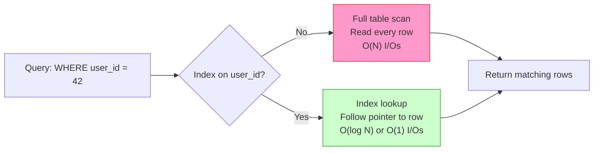
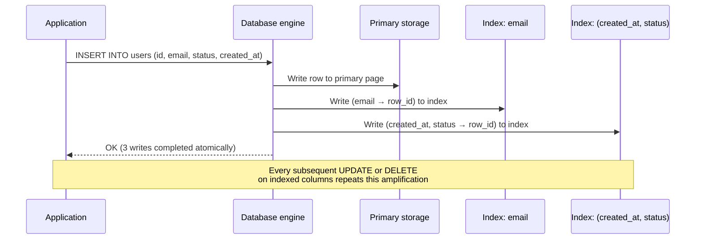
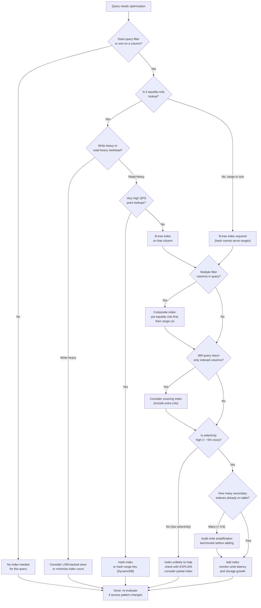

# Chapter 17 — Indexing

TL;DR — An index is a separate data structure maintained alongside primary data that allows the database engine to locate matching rows without scanning every row in the table. Every index is a deliberate tradeoff: read latency drops because the engine follows a much shorter lookup path, but write latency and storage grow because every insert, update, and delete must also update the index. The right set of indexes comes from analyzing actual access patterns, estimating selectivity, and accepting the write amplification that secondary indexes impose on high-write workloads. Adding indexes blindly costs more than it earns.

## Mental model

Think of a book's index at the back: it maps topics to page numbers so you jump straight to the right page instead of flipping through every page in order. A database index does the same work: it maps column values to row locations so the engine can skip most of the table. The engine maintains that mapping automatically as rows are inserted, updated, and deleted, which is why every write must also update every index on that table.

The key intuition is that a full table scan reads O(N) rows while a B-tree index lookup reads O(log N) pages and a hash index lookup reads O(1) pages. At modest table sizes the difference is small; at hundreds of millions of rows the difference is the gap between a 5 ms query and a 30-second query.

## How it works

### B-tree indexes

B-trees are the default index structure in PostgreSQL, MySQL/InnoDB, Oracle, and SQL Server. A B-tree is a self-balancing tree where every leaf page holds a sorted sequence of key-pointer pairs. The engine starts at the root, follows the correct child pointer at each level based on key comparisons, and arrives at the leaf that contains the matching key and the row identifier (a page number and slot number, or a primary key value). Because the tree is always balanced, the path from root to leaf is O(log N) in the number of rows.

B-trees are efficient for:
- Point lookups: `WHERE id = 42`
- Range queries: `WHERE created_at BETWEEN t1 AND t2`
- Prefix scans: `WHERE name LIKE 'Joh%'`
- Sorted output: `ORDER BY price` (the leaf level is already ordered)

### Hash indexes

Hash indexes map each key through a hash function to a bucket that holds one or more row pointers. The lookup is O(1) on average. PostgreSQL supports explicit hash indexes; MySQL Memory tables use hash indexes; many in-memory stores (Redis hash fields, Memcached) implement hash-based lookup.

Hash indexes work only for equality predicates (`WHERE id = 42`). They cannot serve range queries or sorted output because the hash function deliberately scatters keys across buckets, destroying their natural order. Hash indexes are also generally larger than B-trees when the key space is dense, and they require rehashing when the bucket count is resized.

### LSM-tree (Log-Structured Merge-Tree)

LSM-trees convert random writes into sequential writes by first appending new entries to an in-memory buffer called a memtable, then flushing sorted runs (SSTables) to disk when the memtable is full. Background compaction threads periodically merge and garbage-collect SSTables, removing deleted and superseded entries.

LSM-trees appear in LevelDB, RocksDB, Apache Cassandra, Apache HBase, and ScyllaDB. The write path is extremely fast because every write lands in memory and is flushed sequentially. The read path is more expensive because a key might appear in the memtable, in any recently flushed SSTable, or buried in deeper levels; the engine must check each level until it finds the most recent version, using bloom filters to skip most levels cheaply.

**Write amplification in LSM trees** is the ratio of bytes written to disk to bytes written by the application. Each byte written by the application may be rewritten multiple times during compaction. RocksDB documentation describes write amplification factors commonly in the range of 10x to 30x for leveled compaction, meaning 1 GB of application writes causes 10-30 GB of disk writes across the compaction lifecycle. This is intentional: it amortizes the I/O cost of maintaining sorted order across time, keeping the write path fast.

**Read amplification** in LSM trees is the number of I/Os required to serve one read. In the worst case, the engine checks the memtable, then checks each SSTable at each level. Bloom filters (probabilistic data structures that quickly rule out keys not in a given SSTable) reduce the expected number of I/Os substantially, but they are not free: each bloom filter check costs memory and CPU, and a false positive costs one unnecessary disk read.

### Composite indexes and column order

A composite index covers multiple columns: `CREATE INDEX idx ON orders (customer_id, created_at)`. The sort order in the index follows the column list: rows are first sorted by `customer_id`, then by `created_at` within each `customer_id` group.

The left-prefix rule governs which queries the index can serve. An index on `(customer_id, created_at)` can serve:
- `WHERE customer_id = 42` (prefix)
- `WHERE customer_id = 42 AND created_at > t1` (prefix plus range on trailing column)
- `ORDER BY customer_id, created_at` (fully ordered)

The same index cannot serve a query that filters only on `created_at` without also filtering on `customer_id`, because the index is not sorted by `created_at` globally. The engine would need to scan the entire index to find matching `created_at` values.

**Column ordering rule (heuristic):** Put equality-filtered columns before range-filtered columns, and put higher-selectivity columns earlier within the equality set. This is a planning heuristic; the correct ordering depends on the actual access patterns, data distribution, and query mix.

### Covering indexes

A covering index contains every column needed to satisfy a query, allowing the engine to answer the query entirely from the index without reading the primary table ("heap fetch" in PostgreSQL terminology, "bookmark lookup" in SQL Server). For high-throughput read paths, covering indexes can reduce query cost dramatically. The cost is a larger index that occupies more storage and requires more maintenance on every write.

### Secondary indexes and write amplification

A secondary index is any index other than the primary key. Every secondary index is a separate data structure that the engine must update atomically with the primary row. If a table has five secondary indexes, each insert causes six writes: one to the primary row and one to each index. At write-heavy workloads, this amplification is the dominant cost.

This amplification matters for capacity planning: a table with N secondary indexes multiplies write I/O by approximately N+1. For LSM-backed stores like Cassandra, each secondary index is itself an LSM structure with its own write path, compaction, and read amplification.

### Selectivity and cardinality

Selectivity is the fraction of rows returned by a predicate. A high-selectivity predicate (for example, `WHERE user_id = 42` on a table of 100 million users) returns very few rows, making an index valuable. A low-selectivity predicate (for example, `WHERE status IN ('active', 'inactive')` where 60% of rows are 'active') returns many rows; the engine may spend more time following index pointers than it would save by skipping the scan.

A rule of thumb (heuristic, not a measured threshold): a query optimizer typically abandons an index when the estimated selectivity exceeds roughly 5-20% of the table, because at that point the sequential scan with prefetching is cheaper than random I/O through the index. The exact cutoff depends on the storage medium (SSDs tolerate higher random I/O than spinning disk), the table-to-cache ratio, and the engine's cost model.

Cardinality is the number of distinct values in a column. A boolean column has cardinality 2; a UUID primary key column has cardinality equal to the row count. High-cardinality columns are generally good candidates for indexes. Low-cardinality columns (boolean flags, status enums with few values) rarely benefit from single-column indexes, though they can appear usefully as trailing columns in composite indexes when combined with a high-cardinality leading column.

## Design Review Lens

**What problem is this actually solving?**
Indexes solve the cost of full-table scans when a query filters, sorts, or joins on a subset of rows. Without indexes, every query that filters by a non-primary-key column must examine every row in the table. At table sizes above a few hundred thousand rows, this becomes prohibitively expensive for interactive latency targets. Indexes pay for themselves on read-heavy workloads or on write-heavy workloads where the specific queries they serve are in the critical path.

**What assumptions does it depend on (and when do they break)?**
Indexes assume that the access patterns they were designed for remain stable. They break down when: query patterns change (a column once queried by equality is now queried with LIKE wildcards); data distribution shifts (a column assumed to have high selectivity accumulates a dominant hot value); the write rate grows to the point where index maintenance dominates write latency; the table is rebuilt without the right index order hint; or the application starts performing bulk loads that the write amplification makes unacceptably slow. Statistics staleness also breaks indexes: if the query planner's row count estimate is many orders of magnitude off, it may choose a full scan even when an index would be faster.

**What breaks FIRST at 10x scale?**
At 10x scale, the first visible failure is usually write throughput saturation on a heavily indexed table. An OLTP table with six or seven secondary indexes can see write latency climb from 5 ms to 60 ms as the write amplification consumes I/O budget. Index bloat grows faster than the primary table because each update inserts a new key and marks the old key as a dead tuple (in MVCC engines like PostgreSQL), requiring more frequent vacuuming and more storage. Query plans that worked at baseline data volume may choose the wrong index once selectivity estimates drift.

**What breaks FIRST at 100x scale?**
At 100x scale, the problems compound. Index maintenance during schema migrations becomes a blocking operation: adding an index to a billion-row table takes hours and, depending on the database and migration approach, may lock writes during the build. Hot key problems emerge: a composite index on `(account_id, created_at)` serves read queries well until one account generates 40% of the writes, concentrating contention on adjacent B-tree leaf pages. LSM-tree compaction can fall behind ingestion, causing read amplification to climb until the system reduces write throughput or increases compaction parallelism. Storage costs for secondary indexes can exceed primary data storage on heavily indexed wide tables.

**How would Netflix vs Amazon vs a 5-person startup each approach this differently, and why?**
Netflix operates large-scale content and event data; they lean on Cassandra (LSM-based) for write-heavy event streams, accepting read amplification in exchange for write throughput. For their catalog and subscriber data they use relational stores where indexes on user and content IDs support the read-heavy recommendation and playback paths. They invest heavily in query pattern analysis and proactively drop unused indexes.

Amazon operates a massive mix of OLTP services across thousands of teams using DynamoDB (hash-plus-range-key model), Aurora, and specialized stores. DynamoDB's primary index is the hash key; global secondary indexes are explicit, provisioned resources with their own throughput limits. Teams must design access patterns before choosing keys, making index planning a first-class architectural step.

A 5-person startup should add indexes when a specific query starts showing latency in production, not upfront. The access patterns are not yet stable, schema evolves rapidly, and the table sizes are small enough that missing an index for a few weeks is not catastrophic. A single composite index on the most common filter-plus-sort path and a primary key index are usually sufficient to launch.

## Variants / approaches

| Index type | Data structure | Best for | Limitations |
|---|---|---|---|
| B-tree (default) | Balanced tree | Point lookups, range queries, sorted output, prefix scans | Higher write cost than heap; large random-I/O footprint on cold data |
| Hash | Hash table | Equality-only point lookups where range/sort is not needed | Cannot serve range or ORDER BY; may require rehashing on resize |
| LSM-tree (storage engine level) | Memtable + sorted runs | Write-heavy workloads; sequential append patterns | Read amplification; compaction I/O competes with foreground reads; bloom filter memory |
| Composite B-tree | Multi-column B-tree | Queries that filter on multiple columns; covering index use cases | Column order is critical; wrong order wastes the index entirely |
| Covering index | B-tree with extra columns | Queries that read only indexed columns; eliminates heap fetch | Larger index; every covered column's write updates the index |
| Partial index | B-tree on a filtered subset | Indexing only rows that satisfy a predicate (e.g., active records) | Only useful for queries with the same predicate; not all engines support them |
| Expression index | B-tree on a computed expression | Queries on `lower(email)`, `date_trunc('day', created_at)`, etc. | Expression must match exactly; adds expression evaluation cost on write |
| Full-text / inverted index | Posting lists | Text search, token-based retrieval | High storage cost; write amplification from tokenization; not a substitute for relational indexes |
| GIN / GiST (PostgreSQL) | Generalized index structures | JSONB, arrays, geometric data, full-text | Complex maintenance; can be expensive to build |
| Bitmap index | Bitfield per value | Low-cardinality columns in analytical/OLAP workloads | Poor for OLTP writes; useful in read-mostly warehouse settings |

## Worked example (with capacity model)

**Scenario:** An e-commerce order service stores 500 million orders in a PostgreSQL table. The team runs two queries in production: (A) look up all orders for a customer, sorted by `created_at` descending, and (B) find orders in a date range with a specific status for a fulfillment job.

This is a hypothetical planning scenario. Numbers are stated assumptions, not benchmark claims.

**Table assumptions:**

| Parameter | Value | Basis |
|---|---:|---|
| Total rows | 500,000,000 | Current production data |
| Average row size (primary data) | 512 bytes | Schema audit |
| Columns | id (PK), customer_id, status, created_at, total_cents, ... | Schema |
| Index on (customer_id, created_at) | Exists | Serves query A |
| Index on (created_at, status) | Proposed | To serve query B |
| Write rate (peak) | 2,000 inserts/second | Capacity model from Ch1 |
| Read rate (peak) | 8,000 reads/second | 4:1 read/write ratio, measured |
| Growth rate | 50 million rows per month | Current trend |

**Full-table-scan baseline (no index for query A):**

Without an index on `customer_id`, query A requires a sequential scan of all 500 million rows.

Pages to scan = (500,000,000 rows * 512 bytes/row) / 8,192 bytes/page = 31,250,000 pages.

At a sequential disk read throughput of 500 MB/s (NVMe SSD, conservative planning estimate labeled as heuristic), reading 31,250,000 * 8 KB = 250 GB takes 250,000 MB / 500 MB/s = 500 seconds. Even with OS caching and parallel workers, serving thousands of such queries per day is not viable at interactive latency targets. This is the motivating calculation for having an index.

**B-tree index lookup for query A:**

The B-tree index on `(customer_id, created_at)` has depth approximately log_branching_factor(N). A typical PostgreSQL B-tree page holds about 300 key-pointer pairs for a 8-byte integer key, giving a branching factor of roughly 300.

Tree depth = ceil(log_300(500,000,000)) = ceil(log(500,000,000) / log(300)) = ceil(8.7 / 2.477) = ceil(3.51) = 4 levels.

To serve query A for a specific customer, the engine reads 4 index pages (root to leaf) and then follows pointers to the matching row pages. If a customer has 50 orders (a planning assumption for the average active customer), the engine reads approximately 4 + ceil(50 / rows_per_page) pages. With 16 rows per 8 KB page (512 bytes/row), 50 orders fit in about 4 heap pages.

Total I/Os for query A with index = 4 (index path) + 4 (heap fetch) = 8 I/Os, versus 31,250,000 I/Os for the full scan. This is the lookup speedup an index provides on a large table.

Latency estimate: 8 random I/Os * 0.1 ms/I/O (NVMe, planning heuristic) = 0.8 ms. In practice, upper index levels are cached in the buffer pool and latency will be lower for hot customers. Cold heap pages for infrequent customers may see higher latency; this is acknowledged as variability the model does not fully resolve.

**Write amplification from adding the secondary index on (created_at, status):**

Before the new index: each insert writes 1 heap page and updates 1 existing index: `(customer_id, created_at)`.
After adding the new index: each insert writes 1 heap page and updates 2 indexes.

Old write cost per insert: 1 (heap) + 1 (existing index) = 2 writes.
New write cost per insert: 1 (heap) + 1 (existing index) + 1 (new index) = 3 writes.
Write amplification increase: 3/2 = 1.5x more write work per insert.

At peak insert rate of 2,000 inserts/second:

Old peak write I/O rate = 2,000 * 2 = 4,000 index/heap writes per second.
New peak write I/O rate = 2,000 * 3 = 6,000 index/heap writes per second.
Additional write I/O budget consumed = 6,000 - 4,000 = 2,000 additional writes per second.

If the storage tier is provisioned for 10,000 write IOPS (a declared planning assumption), the system was using 40% of that budget before the index and would use 60% after. The index is viable, but the team should confirm headroom for future index additions and for the growth rate of 50 million rows per month.

**Storage cost of the new index:**

Index row for `(created_at, status)` stores: 8-byte `created_at` + 1-byte `status` + 6-byte row identifier = approximately 15 bytes plus page overhead. With a B-tree fill factor of 90% and 8 KB pages, each page holds approximately floor(8,192 * 0.9 / 15) = 491 entries.

Index size = 500,000,000 rows / 491 entries per page * 8,192 bytes per page = 8,350,916 KB = approximately 8.35 GB today.

At 50 million new rows per month: additional index storage = 50,000,000 / 491 * 8,192 bytes = approximately 835 MB per month.

After 12 months: index size = 8.35 GB + 12 * 0.835 GB = 8.35 + 10.02 = 18.37 GB.

This is small compared to the primary table (500M rows * 512 bytes = 256 GB today), but the team should track all indexes combined. If the table has 5 secondary indexes of similar size, index storage reaches 5 * 18.37 GB = 91.85 GB after one year, representing 26% of the primary table size as a planning estimate.

**Composite column order decision:**

Query B is: `WHERE created_at BETWEEN t1 AND t2 AND status = 'PENDING'`.

Option 1: Index on `(created_at, status)`.
- Serves the range on `created_at` using B-tree range navigation.
- Within each leaf node, filters rows by `status`.
- Selectivity of `created_at` range depends on how narrow the range is. A 1-day range on a table growing at 50M rows/month = 50M/30 = 1.67M rows/day. Selectivity = 1.67M / 500M = 0.33%. An index serving 0.33% of rows is high-selectivity and valuable.

Option 2: Index on `(status, created_at)`.
- Serves equality on `status` first: `status = 'PENDING'` might match 10% of all orders (planning assumption).
- Then range-scans `created_at` within matching rows.
- 10% selectivity on `status` alone is borderline; the engine may prefer a scan depending on its cost model.

Column order verdict for query B: `(created_at, status)` is preferred because the `created_at` range has higher selectivity (0.33%) than `status` equality (10%). Putting the high-selectivity column first narrows the scan earlier. This analysis must be verified with EXPLAIN output and actual statistics in production; this is a planning heuristic, not a guarantee.

**Peak vs average write throughput:**

Average insert rate (from capacity model) = 2,000 / 5 peak factor = 400 inserts/second (this assumes the same 5x peak factor established in Chapter 1's example methodology).

Average write I/O with new index = 400 * 3 = 1,200 writes/second.
Peak write I/O with new index = 2,000 * 3 = 6,000 writes/second.

The storage provisioning target should be the peak number (6,000 IOPS for writes), not the average, with headroom for concurrent reads.

**Growth projection (12 months):**

Rows at month 12 = 500M + 12 * 50M = 1,100,000,000 rows.
Primary table size at month 12 = 1,100M * 512 bytes = 562,400 MB = 549 GB.
Index `(customer_id, created_at)` at month 12 (same estimation method): approximately 1,100M / 491 * 8,192 bytes = 18.35 GB.
Index `(created_at, status)` at month 12: 18.37 GB (computed above).
Total index storage = 36.72 GB after 12 months.
Total logical storage = 549 GB (primary) + 36.72 GB (two indexes) = 585.72 GB.
With 3-way replication: physical storage = 585.72 * 3 = 1.76 TB.
MVCC dead tuple accumulation and vacuum overhead are not included in this estimate; add 10-20% as a planning buffer (heuristic).

## Failure Walkthrough

**Single node failure (database replica):**

If a read replica fails, the application load balancer stops routing queries to it after the health check interval (typically 10-30 seconds). Users on connections routed to that replica see query errors or timeouts until failover completes. The index state on the failed replica is irrelevant to the primary: indexes are maintained independently per replica. Recovery is to restart the replica and replay replication lag, or to promote a new replica and rebuild from a snapshot. The index is fully rebuilt as part of the replica's data set. RTO: minutes to tens of minutes depending on replication lag. RPO: zero for reads (reads are non-mutating); no data is lost.

**Network partition (replica loses connectivity to primary):**

The partitioned replica may continue serving reads from its local copy, but its indexes become increasingly stale as replication lag grows. Users reading from that replica may receive data that does not reflect recent writes. Detection comes from replication lag metrics, diverging read-after-write behavior, and health check failures. Recovery: the application should have a maximum-lag threshold; if the replica exceeds it, the load balancer should stop routing reads to it. After the partition heals, the replica resumes replication and catches up. Indexes on the replica are updated as rows are applied from the replication stream.

**Full regional failure:**

A regional outage takes the primary and all replicas in that region offline. If a standby exists in a second region, failover promotes it to primary. Users see an outage duration equal to the detection time plus DNS propagation plus connection re-establishment. The standby's indexes are consistent with the data it received before the regional failure. Any writes acknowledged to the failed primary but not replicated to the standby are lost (this is the RPO). RTO is typically 1-10 minutes for well-automated failover. Index consistency on the promoted standby is guaranteed to match its data state; the concern is data loss, not index corruption.

**Critical dependency outage (storage subsystem):**

If the underlying storage system experiences I/O errors, B-tree index page writes may fail mid-operation. PostgreSQL, for example, uses write-ahead logging (WAL): index updates are written to WAL first, then applied to the index file. If the storage fails after the WAL record but before the index page write, recovery replays the WAL to bring the index back to a consistent state. Partial writes to a page can corrupt the page; PostgreSQL uses full-page writes on the first write to a page after a checkpoint, enabling detection and recovery. Users may see errors during the outage; after storage recovery, the database replays WAL and becomes consistent before accepting new writes. LSM-based systems (RocksDB, Cassandra) similarly replay the write-ahead log (commit log) to recover memtable state.

**Data corruption / poison data:**

A corrupted index page can cause queries to return wrong results, skip rows, or crash the query executor. PostgreSQL AMCHECK extension can verify B-tree index consistency. Detection also comes from: query results that do not match expected counts (e.g., a query that should return rows returns none), checksums on data pages (PostgreSQL `data_checksums` option), or unusual error rates on index scan query patterns. Recovery: `REINDEX` rebuilds the index from the primary data. During the rebuild, the index is unavailable (or unavailable for writes in PostgreSQL 12+ `REINDEX CONCURRENTLY`). Users may see query slowdowns as queries fall back to sequential scans. For LSM-based systems, a corrupted SSTable is detected via checksums embedded in the file; RocksDB will quarantine the file and alert the operator. RPO for a corrupt index is zero because the data itself is intact; the index is derived from the primary data and is fully rebuildable.

## Decision Framework

## Tradeoffs & alternatives

**WHY use indexes:** Without indexes, queries that filter, sort, or join on non-primary-key columns require full table scans. At table sizes above a few million rows, a full scan exceeds interactive latency targets (typically 10-200 ms for user-facing queries). Indexes reduce query I/O from O(N) to O(log N) or O(1) and unlock sort-without-scan behavior, making them the primary tool for satisfying latency targets on read paths.

**What indexes COST:** Every index imposes write amplification: each insert, update, and delete on an indexed column must also update the index. Storage grows: indexes for a heavily-indexed table can equal or exceed the size of the primary data. Vacuum and maintenance windows grow: B-tree indexes accumulate dead tuples as MVCC engines mark old versions invisible; regular vacuuming is required to reclaim space. Schema migrations that add indexes to large tables can take hours and, without online DDL support, may lock writes during the build. Planning and maintenance cost: unused indexes still consume write budget and storage; periodic audits are necessary.

**ALTERNATIVES:**
- Materialized views pre-aggregate or pre-join data for read-heavy analytical queries, trading storage for query latency without the write amplification of a raw secondary index.
- Denormalization stores derived values alongside the row, turning a join into a column read at the cost of update complexity.
- Read replicas allow heavy analytical queries to run against a replica without blocking OLTP writes on the primary; the replica still needs indexes.
- Search indexes (Elasticsearch, OpenSearch, Solr) serve full-text and complex filter queries outside the relational database, offloading specific query types entirely.
- LSM-based stores (Cassandra, RocksDB-backed databases) are an architectural alternative for write-dominant workloads where B-tree write amplification is prohibitive.
- Application-level pre-computed lookups (caches, materialized in Redis) can bypass the database index entirely for the hottest read paths.

**WHEN NOT to use indexes:**
- Do not add an index on a low-cardinality column (boolean, status with 3 values, region with 5 values) as a single-column index; the selectivity is too low for the optimizer to use it, but the write amplification is still paid.
- Do not add secondary indexes to a write-heavy table without benchmarking: if the insert rate is high, each additional index can push write latency past acceptable targets.
- Do not index columns that are rarely or never used in queries; audit with pg_stat_user_indexes (PostgreSQL) or equivalent before adding.
- Do not index columns in bulk-load tables where writes are done in batches; drop indexes before the load, rebuild after.
- Do not use a B-tree index expecting to serve a full-table-equivalent read (e.g., `WHERE status = 'active'` when 95% of rows are active); the sequential scan will be faster.

## Staff & Principal lens

**Organizational impact:** Index decisions made at table-creation time become long-lived constraints. An index added to support a query that runs daily at 3 AM OLAP style becomes a permanent write-path tax on the OLTP service that inserts 2,000 rows per second. This tension is common when analytics teams issue ad-hoc queries against production databases. The Staff engineer must establish a policy: analytics runs against a replica or a separate warehouse; production indexes are owned by the team responsible for the write path; and adding a secondary index to a high-write table requires a write-amplification review, not just a query latency review.

**Operational burden:** The on-call engineer inherits the cost of index maintenance. `REINDEX CONCURRENTLY` on a 500 GB table occupies disk I/O for hours. Vacuum workers that fall behind on a bloated table cause storage exhaustion and query planner staleness. Bloated B-tree indexes (from high update rates on indexed columns) can grow several times larger than necessary and require explicit rebuilds. The team that adds the index owns the storage monitoring, autovacuum tuning, and migration plan for future schema changes. This burden must be made explicit when index proposals are reviewed.

**Cost governance:** Index storage is not free. On managed cloud databases (Amazon RDS, Cloud SQL, Aurora), storage is billed per GB-month. A table with 10 secondary indexes can cost 3-5x the storage of the table alone, including MVCC dead tuples, index overhead, and replication of the index data to replicas. Periodic index audits (using `pg_stat_user_indexes.idx_scan` to identify unused indexes, or equivalent tools) should be part of quarterly cost reviews. Principal engineers should ask for the index-to-data storage ratio and its trend line, not just the primary table size.

**Long-term maintainability:** The most expensive index operation is not adding one; it is removing or changing one safely. Dropping an index that was added years ago requires verifying that no query depends on it, which may require weeks of query log analysis. Changing column order in a composite index requires creating the new index concurrently, verifying it is used, and then dropping the old one. The migration complexity grows with table size and with the number of services that query the table. Schema changes on billion-row tables in 24x7 services require careful planning, feature flags, dual reads/writes during transition, and rehearsed rollback.

**Migration complexity:** Adding an index to a live large table with `CREATE INDEX CONCURRENTLY` (PostgreSQL) or online DDL (MySQL, Vitess) avoids write locks but consumes significant I/O bandwidth for the duration of the build. The build time is O(N log N) in the number of rows; on a 500 million row table, this can be 4-12 hours depending on I/O bandwidth. During the build, write amplification is elevated because new writes must update both the in-progress index and existing indexes. The migration plan should include: monitoring index build progress, setting I/O throttling if available, having a rollback procedure (drop the partial index), and validating the index is used by the target queries after completion.

## Interview answer vs production reality

**What interviewers expect to hear:** "Add an index on the column you filter by. B-trees work for ranges, hash indexes for equality. Composite indexes follow the left-prefix rule. Indexes speed up reads but slow down writes."

**What actually happens in production:** The index landscape evolves organically over years. Tables acquire indexes from different teams for different access patterns, and nobody audits them. An `EXPLAIN` on a slow query reveals the optimizer chose a full scan because the statistics were stale and it estimated 1,000,000 rows when the predicate actually matches 200. A covering index added to eliminate a heap fetch causes index bloat that pushes autovacuum workers to their limit. A new access pattern requires a composite index in a different column order than the existing one, requiring a parallel build and careful cutover. A Cassandra table designed with one partition key turns out to have a hot partition serving 40% of all reads because one tenant's `account_id` appears in millions of rows.

**Simplifications that are fine in an interview but wrong in production:**
- "Just add an index" is fine in an interview. In production, every index addition requires a write-amplification analysis, a storage budget review, and a plan for the index build on live traffic.
- Saying "B-trees are O(log N)" is correct in interview context. In production, the effective cost depends on buffer pool hit rates: upper B-tree levels are nearly always cached, so practical depth is often 1-2 uncached reads, not 4; but a cold table can see all 4 levels as disk I/Os.
- Treating selectivity as a simple threshold (5% or 10%) is a useful interview heuristic. In production, the correct threshold depends on the cost model, storage medium, table-to-buffer ratio, concurrent workload, and the query's access pattern. The only reliable answer is EXPLAIN ANALYZE on the real data.

## Common pitfalls & misconceptions

- **Adding indexes upfront without known queries.** The right set of indexes is determined by the access patterns. Adding indexes before the application is built wastes write budget and storage, and they may not serve the queries that actually run.

- **Assuming low-cardinality indexes help.** An index on a boolean `is_deleted` column in a table where 95% of rows are `is_deleted = false` will not be used by queries selecting active rows; the optimizer will scan instead. The write amplification is still paid.

- **Forgetting that composite index order is critical.** An index on `(created_at, customer_id)` does not serve `WHERE customer_id = 42 ORDER BY created_at`. The leading column must be in the predicate for the index to help.

- **Confusing index cardinality with selectivity.** A `customer_id` column may have high cardinality (millions of unique values) but low selectivity for a specific query if a single customer accounts for 30% of rows (hot key). High cardinality does not guarantee high selectivity for a given predicate.

- **Treating EXPLAIN plan as a guarantee.** Query plans change as statistics are updated, data distribution shifts, or the planner's cost model is adjusted. An index used today may be bypassed after a statistics refresh tomorrow.

- **Ignoring write amplification on LSM stores.** RocksDB/Cassandra writes are fast per operation, but compaction is a background I/O cost. A table with five materialized secondary indexes in Cassandra has five separate LSM structures all compacting in parallel. The combined compaction I/O can saturate disk even when write throughput looks normal.

- **Building indexes without understanding vacuum or compaction.** In PostgreSQL, updating an indexed column creates a dead tuple in both the heap and the index. If autovacuum cannot keep up, the table and index grow without bound, query planner estimates become wrong, and storage fills. Monitor `pg_stat_user_tables.n_dead_tup` and `pg_stat_user_indexes.idx_blks_read`.

- **Assuming index is used after creation.** The optimizer may still choose a full scan if the cost model prefers it. Always run EXPLAIN (or EXPLAIN ANALYZE) after adding an index to confirm the plan changed.

- **Not planning for index build impact on live traffic.** `CREATE INDEX CONCURRENTLY` on a large table consumes I/O for hours, elevating write latency for the table during the build. Schedule index builds during low-traffic windows and monitor I/O utilization.

## Interview questions

**Mid:** You have a query `SELECT * FROM orders WHERE customer_id = 42 ORDER BY created_at DESC LIMIT 10` that is slow. The table has 200 million rows. What index would you add and why?

MODEL answer: I would add a composite B-tree index on `(customer_id, created_at)`. The query filters by `customer_id` (equality) and sorts by `created_at` (range/order). With a composite index in that column order, the engine can seek directly to the `customer_id = 42` leaf range and read rows in `created_at` order from the index without a separate sort step. It can then stop after 10 rows using the LIMIT. I would verify with EXPLAIN that the plan changed from a sequential scan or explicit sort to an index scan. I would also note that this index adds write cost: every insert into the orders table now updates this index too, which is acceptable if writes are not the bottleneck.

**Senior:** A team wants to add six secondary indexes to a table that currently receives 5,000 inserts per second. How do you evaluate this request?

MODEL answer: First I would establish the current write budget: how many IOPS the storage tier provides and what fraction is currently consumed. Each additional index multiplies per-insert write work. If the table already has two indexes (heap + primary), six new indexes brings the total to eight write targets per insert. I would measure or estimate the per-insert I/O cost now, multiply by the new factor, and compare to available IOPS with headroom. Second, I would ask about selectivity: for each proposed index, what query does it serve and what fraction of the table does that query touch? A low-selectivity index is useless but still costs write budget. Third, I would look at the index build plan: 5,000 inserts/second on a large table with 6 concurrent index builds means sustained elevated I/O. I would likely recommend adding 2-3 of the most critical indexes first, measuring write latency under load, and adding more only if headroom allows. I would also ask whether some of these indexes serve analytics queries that should move to a replica or a warehouse.

**Staff:** Your organization has accumulated 40+ tables each with 8-12 secondary indexes. Storage costs are high, write latency on the busiest tables is at the 95th-percentile SLO boundary, and three teams each own 10-15 of those tables. How do you drive a cross-team index audit and what does the outcome look like?

MODEL answer: The first step is making the cost visible. I would produce a dashboard showing per-table index count, estimated index storage, `idx_scan` counts (how often each index is actually used, from `pg_stat_user_indexes`), write IOPS consumed per table, and the approximate write amplification ratio. Most teams have never seen this view. The second step is establishing a shared policy with engineering leadership: unused indexes (idx_scan = 0 over 30 days) are dropped after a 2-week review window; new indexes require a write-amplification memo approved by the owning team's tech lead. The third step is execution team by team: for each table, identify indexes with zero scans, propose drops, coordinate with the application teams to confirm no code path bypasses monitoring (e.g., migration scripts), and drop after a dark period. For high-write tables near the SLO boundary, I would also benchmark whether an LSM-backed secondary store (Redis for hot lookups, Elasticsearch for search queries) can offload some access patterns entirely, removing the index from the relational table. The outcome is a measurable reduction in storage cost, write latency headroom restored, and a documented policy preventing accumulation from recurring.

**Principal:** A product team wants to migrate a 2 TB PostgreSQL table from the current schema to a new schema that changes two composite index column orders to better serve new access patterns. The table receives 3,000 writes per second and serves a financial application. What is your migration plan and what are the key risks?

MODEL answer: This is a multi-week coordinated migration, not a schema change. The financial context means I cannot accept data loss or a window where indexes diverge from the data. My plan in phases:

Phase 1 (preparation, 2 weeks): Build the new indexes concurrently alongside the old ones. `CREATE INDEX CONCURRENTLY` on a 2 TB table at 3,000 writes/second will take 8-24 hours per index depending on I/O and will elevate write latency during the build. I schedule this during the lowest-traffic window, monitor write latency p95 throughout, and have an abort procedure (DROP the partial index). I instrument query plans before and after to confirm new indexes are used. During this phase, both old and new indexes are maintained, doubling the write amplification. This is the highest-risk window for write latency.

Phase 2 (traffic shift, 1 week): Work with application teams to deploy query changes that prefer the new indexes. Verify with EXPLAIN ANALYZE in staging against a production-size copy first. Deploy gradually with feature flags, monitoring query plan changes and latency. The old indexes remain in place as a safety net; if the new queries perform worse, we roll back the query code, not the schema.

Phase 3 (cleanup, 1 week): After confirming the new indexes are serving the target queries for 7+ days and the old indexes show declining scan counts, drop the old indexes. Monitor write latency post-drop; it should improve as write amplification decreases. Confirm storage reclamation and autovacuum catch-up.

Key risks: (1) Write latency spike during index build — mitigate with I/O throttling and a low-traffic window. (2) Optimizer choosing wrong index during transition — mitigate with EXPLAIN validation in staging and phased query rollout. (3) An undiscovered application code path (migration scripts, reporting jobs) that depends on the old column order — mitigate with 7-day index scan monitoring before dropping. (4) Table lock during index creation — `CONCURRENTLY` avoids this but has its own constraints (cannot run inside a transaction block). (5) Financial audit requirement: keep records of the migration steps, timing, and validation results for compliance.

## Connections

Prerequisites: [Chapter 01 - Estimation and Capacity Modeling](../chapter-01-estimation-and-capacity-modeling/) (write amplification and storage cost model), [Chapter 02 - Performance vs Scalability, Latency vs Throughput](../chapter-02-performance-vs-scalability-latency-vs-throughput/) (latency and throughput tradeoffs), [Chapter 15 - Caching: Where to Cache](../chapter-15-caching-where-to-cache/) (when caching can substitute for an index lookup).

Related chapters: [Chapter 16 - Caching Patterns and Invalidation](../chapter-16-caching-patterns-and-invalidation/) (caching derived from indexed data), [Chapter 18 - Database Transactions and Isolation Levels](../chapter-18-database-transactions-and-isolation-levels/) (MVCC, dead tuples, and index maintenance interact with transaction isolation), [Chapter 19 - SQL vs NoSQL](../chapter-19-sql-vs-nosql/) (index model shapes the database choice), [Chapter 20 - The NoSQL Families](../chapter-20-the-nosql-families/) (LSM-tree engines appear in multiple NoSQL families), [Chapter 21 - Data Modeling at Scale](../chapter-21-data-modeling-at-scale/) (access-pattern-driven design determines index needs).

Builds toward: [Chapter 22 - Replication and Quorums](../chapter-22-replication-and-quorums/) (replicas carry full index state; replication lag includes index write lag), [Chapter 24 - Sharding and Partitioning](../chapter-24-sharding-and-partitioning/) (partition key selection is analogous to composite index leading-column selection), [Chapter 26 - Design Walkthrough: URL Shortener](../chapter-26-design-walkthrough-url-shortener/) (index on short code is the primary lookup), [Chapter 58 - Vector Databases](../chapter-58-vector-databases/) (vector indexes are a specialized extension of the indexing concepts covered here).

## Further reading

- Patrick E. O'Neil, Edward Cheng, Dieter Gawlick, Elizabeth J. O'Neil, ["The Log-Structured Merge-Tree (LSM-Tree)"](https://www.cs.umb.edu/~poneil/lsmtree.pdf), Acta Informatica, 1996. Primary source for LSM-tree design and write amplification analysis.
- Martin Kleppmann, _Designing Data-Intensive Applications_, O'Reilly, 2017, Chapter 3 ("Storage and Retrieval"). Covers B-trees, LSM-trees, SSTables, and index tradeoffs from first principles.
- PostgreSQL Documentation, ["Indexes"](https://www.postgresql.org/docs/current/indexes.html). Covers B-tree, hash, GIN, GiST, SP-GiST, and BRIN index types, including partial and expression indexes.
- PostgreSQL Documentation, ["Index Maintenance"](https://www.postgresql.org/docs/current/routine-vacuuming.html). Covers vacuum, dead tuple accumulation, and autovacuum tuning.
- RocksDB Documentation, ["RocksDB Tuning Guide"](https://github.com/facebook/rocksdb/wiki/RocksDB-Tuning-Guide). Covers LSM write amplification, read amplification, space amplification, and compaction strategies from the RocksDB engineering team.
- Goetz Graefe, ["Modern B-Tree Techniques"](https://dl.acm.org/doi/10.1561/1900000028), Foundations and Trends in Databases, 2011. Comprehensive treatment of B-tree variants, locking, concurrency, and maintenance.
