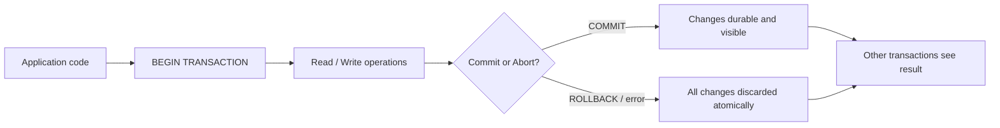
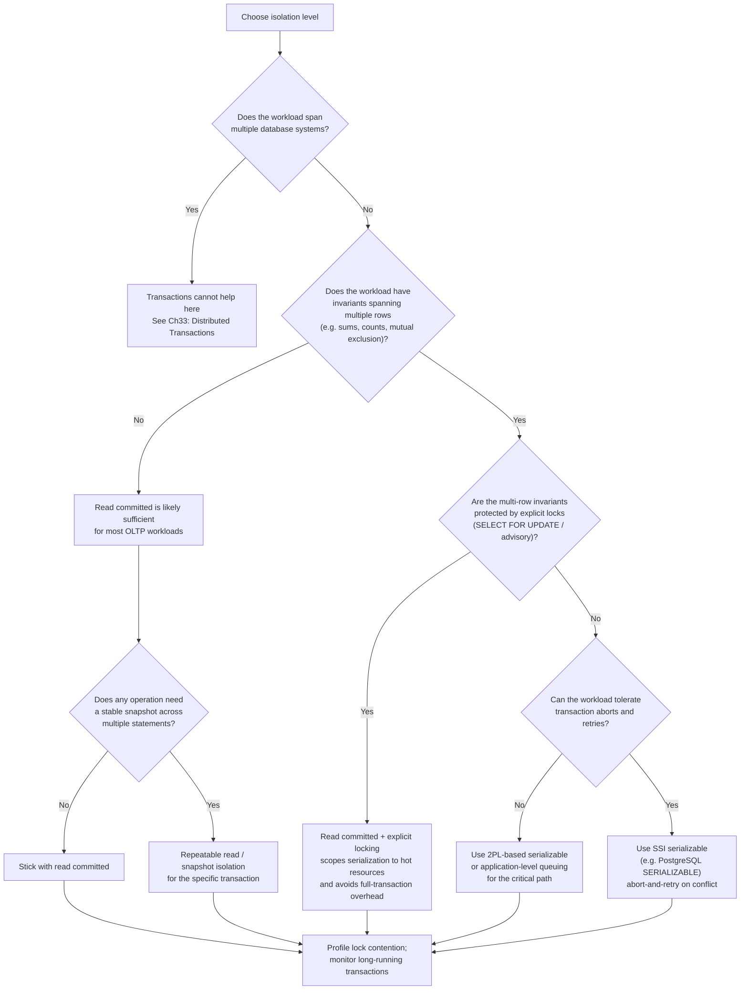

# Chapter 18 — Database Transactions and Isolation Levels

TL;DR — A transaction groups multiple reads and writes into a unit that the database treats as if it happened all at once and completely or not at all. Transactions reduce the number of things application code must get right about concurrency and failure, but they impose costs that depend on which correctness guarantees you ask for. The guarantee governing concurrent transactions is called isolation, and it has four standard levels — read uncommitted, read committed, repeatable read, and serializable — each permitting different anomalies. The key tension is that stronger isolation requires more coordination, which reduces throughput and raises latency. Snapshot isolation sits between repeatable read and serializable in practice: it eliminates most anomalies cheaply using multi-version concurrency control (MVCC), but it allows write skew and is not serializable. Choosing the right isolation level means identifying which anomalies your application cannot tolerate and picking the weakest level that prevents them, then reaching for serializable only when invariants or write-skew protection demand it. This chapter covers single-system transaction isolation; distributed transactions across multiple systems are a separate topic addressed in Chapter 33.

## Mental model

A transaction wraps a sequence of operations in a correctness envelope. The database maintains that envelope by buffering, versioning, or locking the data the transaction touches. When multiple transactions run concurrently, isolation policy determines how much of each transaction's work-in-progress is visible to the others. Stronger isolation narrows that visibility but requires the database to do more work to enforce it.



Think of isolation levels as a dial between two extremes. At one end, every transaction sees every other transaction's in-progress changes immediately (no isolation, highest throughput). At the other end, every transaction behaves as if it ran alone, one after another (full serializable isolation, correct but costly). Real workloads live somewhere in the middle, and the choice of where to sit on that dial must be grounded in which anomalies the application can tolerate and which it cannot.

## How it works

### ACID properties

ACID is the classical framing for what a transaction guarantees. Each property is precise and important to understand separately.

**Atomicity** means that all operations in a transaction either commit together or are rolled back together. Partial commits do not happen. If the process crashes after writing half the rows in a transaction, the database recovers to the state before the transaction began. Atomicity is enforced through write-ahead logging (WAL): before any page is modified on disk, the intended change is recorded in a durable log, and on recovery the log is replayed or rolled back as needed.

**Consistency** in the ACID sense is distinct from the consistency covered in Chapter 05 (Consistency Models). In ACID, consistency means that a transaction takes the database from one state satisfying its declared integrity constraints to another state that also satisfies them. This is primarily a property of the application's use of the database, not a property the database enforces on its own beyond constraints and foreign keys. The ACID C is largely a statement that atomicity and isolation preserve invariants; the application must define those invariants.

**Isolation** means that transactions running concurrently appear to each other as if they ran serially. How strictly that appearance is maintained depends on the isolation level. Weaker levels allow some forms of interference in exchange for lower coordination overhead.

**Durability** means that once a transaction commits, its effects are preserved even across crashes, power loss, or restarts. This is enforced by writing to persistent storage (typically with fsync or equivalent) before acknowledging the commit.

### Anomalies: what can go wrong without sufficient isolation

Understanding isolation levels requires understanding the anomalies they prevent. These are best shown as interleaved transaction histories. In each example below, T1 and T2 are two concurrent transactions. Each line is a step, and time flows downward.

**Dirty read**: T2 reads data written by T1 before T1 commits. If T1 later aborts, T2 has acted on data that never durably existed.

```
T1: BEGIN
T1: UPDATE account SET balance = balance - 100 WHERE id = 42
T2: BEGIN
T2: SELECT balance FROM account WHERE id = 42   -- reads T1's uncommitted -100
T1: ROLLBACK                                    -- T1's change is gone
T2: now holds a balance that never committed
```

**Non-repeatable read**: T2 reads the same row twice within one transaction and gets different values because T1 committed a change between the two reads.

```
T1: BEGIN
T2: BEGIN
T2: SELECT balance FROM account WHERE id = 42   -- reads 500
T1: UPDATE account SET balance = 300 WHERE id = 42
T1: COMMIT
T2: SELECT balance FROM account WHERE id = 42   -- reads 300, different result
```

**Phantom read**: T2 issues a range query twice and gets a different set of rows because T1 inserted or deleted rows in that range between the two queries.

```
T1: BEGIN
T2: BEGIN
T2: SELECT * FROM orders WHERE amount > 1000    -- returns 3 rows
T1: INSERT INTO orders (amount) VALUES (2000)
T1: COMMIT
T2: SELECT * FROM orders WHERE amount > 1000    -- returns 4 rows
```

**Write skew**: Each transaction reads a set of rows, makes a decision based on that read, and then writes to a row in that set. The writes do not directly conflict, but together they violate an invariant that would have prevented both if they had run serially. Write skew is not prevented by snapshot isolation.

```
Invariant: at least one doctor must be on call at all times.
Currently: Dr. Alice is on call, Dr. Bob is on call.

T1: BEGIN
T2: BEGIN
T1: SELECT COUNT(*) FROM oncall WHERE on_duty = true  -- sees 2, decides it can remove one
T2: SELECT COUNT(*) FROM oncall WHERE on_duty = true  -- sees 2, decides it can remove one
T1: UPDATE oncall SET on_duty = false WHERE id = 'alice'
T2: UPDATE oncall SET on_duty = false WHERE id = 'bob'
T1: COMMIT
T2: COMMIT
-- Result: zero doctors on call; invariant violated
```

### Standard isolation levels and which anomalies each prevents

The SQL standard defines four isolation levels. The table below uses the three classical anomalies from the standard plus write skew, which the Berenson et al. 1995 critique showed the standard missed.

| Isolation level | Dirty read | Non-repeatable read | Phantom read | Write skew |
|---|:---:|:---:|:---:|:---:|
| Read uncommitted | Permitted | Permitted | Permitted | Permitted |
| Read committed | Prevented | Permitted | Permitted | Permitted |
| Repeatable read | Prevented | Prevented | Permitted* | Permitted |
| Snapshot isolation | Prevented | Prevented | Prevented | Permitted |
| Serializable | Prevented | Prevented | Prevented | Prevented |

*MySQL InnoDB's "repeatable read" prevents phantoms via gap locks; the SQL standard's repeatable read does not require this. PostgreSQL uses snapshot isolation for its "repeatable read" level, making the behavior engine-specific rather than standard-defined.

### MVCC: the common implementation mechanism

Most modern databases implement read committed and snapshot isolation using multi-version concurrency control (MVCC). Instead of overwriting rows in place and locking them for readers, the database keeps multiple versions of each row, each tagged with the transaction ID that created it.

When a transaction begins, it receives a transaction ID (or snapshot timestamp). Reads see only versions committed before that snapshot was taken. Writers create new versions without disturbing the versions that running readers are using. This means readers never block writers and writers never block readers, which is the key throughput advantage of MVCC over lock-based approaches.

```mermaid
sequenceDiagram
    participant T1 as Transaction T1 (snapshot at ts=100)
    participant T2 as Transaction T2 (snapshot at ts=101)
    participant DB as Database (MVCC store)

    T1->>DB: BEGIN -- assigned snapshot ts=100
    T2->>DB: BEGIN -- assigned snapshot ts=101
    T1->>DB: SELECT balance WHERE id=42
    DB-->>T1: Returns version committed before ts=100 (e.g. balance=500)
    T2->>DB: UPDATE balance=300 WHERE id=42
    T2->>DB: COMMIT -- creates new version with ts=102
    T1->>DB: SELECT balance WHERE id=42 (again)
    DB-->>T1: Still returns ts=100 snapshot version (balance=500)
    Note over T1,DB: T1 sees a stable snapshot; T2's commit is invisible to T1
    T1->>DB: COMMIT
    DB->>DB: Vacuum/garbage-collect old versions no longer needed
```

MVCC enables snapshot isolation at lower cost than two-phase locking (2PL) for read-heavy workloads. The costs of MVCC are that old versions accumulate until a background process (VACUUM in PostgreSQL, purge in MySQL InnoDB) reclaims them, and that long-running transactions can hold back version cleanup, increasing storage pressure and query latency. This is why long idle transactions are a practical operational concern and not merely a theoretical one.

### Why snapshot isolation is not serializable

Snapshot isolation prevents dirty reads, non-repeatable reads, and phantom reads because each transaction sees a stable, consistent snapshot of committed data. However, it does not prevent write skew, because two transactions can each read an overlapping set of rows and write to different rows within that set without their writes conflicting at the storage level.

Formally, snapshot isolation allows execution histories that have no serial equivalent. The on-call doctor example above is the canonical illustration. Each transaction passed the database's conflict check (no two transactions wrote the same row), so both committed. But no serial ordering of those two transactions would have permitted both to succeed, because the invariant would have been checked against a count of one, not two.

This is the single most important misconception to correct: using snapshot isolation (or a database that calls its level "repeatable read" but implements snapshot isolation, as PostgreSQL does) does not give you serializability. If your application has invariants that span multiple rows and requires both transactions to respect those invariants, you need serializable isolation.

### Serializable isolation: 2PL vs SSI

There are two major approaches to enforcing serializable isolation.

**Two-phase locking (2PL)** is the classical approach. A transaction acquires shared (read) locks on rows it reads and exclusive (write) locks on rows it writes. It holds all locks until it commits or aborts. No other transaction can write a row while a shared lock is held, and no other transaction can read or write a row while an exclusive lock is held. This prevents all anomalies but creates significant lock contention and can lead to deadlocks, which the database detects and resolves by aborting one transaction.

**Serializable snapshot isolation (SSI)**, introduced by Cahill et al. (2008) and implemented in PostgreSQL 9.1+ and recent versions of other databases, takes a different approach. Transactions run with snapshot isolation and track read/write dependencies between concurrent transactions. When the database detects a dependency cycle that would make the execution history non-serializable, it aborts one of the involved transactions and asks the application to retry. SSI incurs much lower lock contention than 2PL because reads do not block writes and vice versa in the common case. The cost is that some transactions must be retried, and the overhead of tracking dependencies is non-zero. In read-heavy or low-conflict workloads, SSI performs close to snapshot isolation.

### SQL-standard levels vs real engine behavior

The SQL standard defines level names, but the behavior of those names varies significantly across engines:

- **PostgreSQL read committed**: Implemented with MVCC. Each statement within a transaction sees a fresh snapshot as of that statement's start. Writers do not block readers. This differs from a lock-based read committed, where a read might wait for a conflicting write lock to release.
- **PostgreSQL repeatable read**: Implemented as snapshot isolation. The snapshot is taken at the start of the first statement in the transaction and held for the transaction's duration. Prevents phantoms (unlike what the SQL standard's repeatable read requires). Does not prevent write skew.
- **PostgreSQL serializable**: Implemented as SSI. True serializability with automatic conflict detection and abort-on-cycle.
- **MySQL InnoDB repeatable read (default)**: Uses MVCC for reads and gap locks to prevent phantom inserts. Not the same as snapshot isolation and not serializable.
- **Oracle**: Does not offer read uncommitted. "Serializable" in Oracle is snapshot isolation, not true serializability. This is a known deviation and matters for applications relying on Oracle's "serializable" to prevent write skew.

Never assume that a level name means the same thing across engines. Consult the primary documentation for the specific version you are running.

## Design Review Lens

**What problem is this actually solving?**
Transactions solve the problem of correctness under concurrent access and partial failure. Without atomicity, a crash mid-write leaves data in a half-updated state that application code must clean up -- and often cannot. Without isolation, concurrent reads and writes can interleave in ways that violate invariants no single-threaded application ever anticipated. Transactions shift correctness responsibility from application code to the database for the operations within the transaction boundary, which reduces the surface area of concurrent-access bugs.

**What assumptions does it depend on, and when do they break?**
Single-system transactions assume all the data the transaction touches lives in one database instance or a compatible cluster under a single transaction manager. This breaks when data must span databases, services, or systems of record. It also assumes that transaction retries are safe -- serializable and SSI-based systems may abort transactions requiring the application to retry, and not all application code handles retries correctly without idempotency design. MVCC-based snapshot isolation assumes background cleanup keeps old version chains short; this breaks under long-running transactions or heavy write workloads with slow vacuuming.

**What breaks FIRST at 10x scale?**
Lock contention under 2PL-based serializable isolation becomes the first casualty of high concurrency. Hot rows and hot ranges experience queuing delays that grow nonlinearly with the number of concurrent transactions. Under MVCC-based isolation, the version accumulation rate grows with write throughput, and if vacuum cannot keep up, table bloat and query latency increase. Connection pool exhaustion is also common: each transaction holds a database connection for its duration, and connection counts are typically limited to a few hundred or low thousands on a single instance.

**What breaks FIRST at 100x scale?**
At 100x, the single database instance itself becomes the bottleneck. No isolation mechanism scales a single database instance beyond its hardware limits. Horizontal partitioning (sharding) introduces a regime where transactions that span shards cannot use single-system isolation at all; they require distributed transaction protocols (Chapter 33) or redesigned application logic that avoids cross-shard invariants. At this scale, the choice of isolation level also shapes the replication topology: read replicas running asynchronously behind the primary cannot offer the same isolation guarantees as the primary, which forces decisions about whether application reads can tolerate bounded staleness.

**How would Netflix vs Amazon vs a 5-person startup each approach this differently?**
A startup would typically use PostgreSQL with the default read committed level, upgrade to repeatable read or serializable for specific critical paths (payments, inventory, bookings), and treat transaction failures as bugs to fix before they matter. A mid-sized company like a growing e-commerce platform would model transaction hotspots (shopping carts, inventory rows, payment records), profile lock contention and vacuum behavior in production, and segment workloads so that analytical queries run on read replicas at weaker isolation without blocking OLTP transactions. Netflix-scale services largely abandon single-system transactions for data that must be distributed globally, instead relying on idempotency, event sourcing, compensation patterns, and eventual consistency for most writes, reserving serializable transactions for bounded domains (billing, entitlement) where a relational database is justified by the correctness requirement.

## Variants / approaches

| Approach | Strengths | Costs |
|---|---|---|
| Read committed (MVCC-based, e.g. PostgreSQL default) | Readers never block writers; good throughput for read-heavy OLTP; prevents dirty reads; low overhead | Non-repeatable reads and write skew are possible; requires application to handle anomalies in sensitive paths |
| Repeatable read (snapshot isolation) | Stable read snapshot for the transaction duration; prevents dirty reads, non-repeatable reads, and phantoms; still uses MVCC with no read blocking | Does not prevent write skew; long transactions delay version cleanup; retry logic needed if write-write conflicts abort the transaction |
| Serializable (2PL) | Prevents all anomalies including write skew; no application retry logic required if locks serialize access | High lock contention on hot rows; deadlocks require detection and abort; significant latency increase under contention; poor for mixed read/write |
| Serializable snapshot isolation (SSI) | Prevents all anomalies; much lower read-write contention than 2PL; PostgreSQL 9.1+ implementation is production-proven | Some transactions must be aborted and retried; dependency tracking adds CPU/memory overhead; false positives (spurious aborts) under high concurrency |
| Optimistic concurrency control (OCC) | Works well when conflicts are rare; low lock overhead in the common case | Under contention, abort rate rises steeply; retry amplification can increase total work significantly |
| Application-level locking (SELECT FOR UPDATE, advisory locks) | Explicit and predictable; works across any isolation level; compatible with sharded or partitioned data for narrow critical sections | Easy to misuse; holding advisory locks across round trips or across transactions causes contention; leaks if client disconnects |

## Worked example (with capacity model)

Scenario: a seat reservation system for an event ticketing platform. Users browse available seats, reserve a specific seat, and then check out. The critical correctness requirement is that no two users may hold a reservation for the same seat simultaneously. This is a hypothetical planning scenario; all numbers are assumptions used to illustrate capacity decisions.

### Assumptions

| Input | Assumption | Basis |
|---|---:|---|
| Concurrent events on sale at peak | 50 | Product planning target |
| Seats per event | 5,000 | Venue size assumption |
| Total reservable seats at peak | 250,000 | 50 events x 5,000 seats |
| Peak concurrent users attempting reservations | 20,000 | Product planning assumption for popular events |
| Reservation attempt QPS at peak | 4,000 | 20,000 users / 5-second average think time, planning assumption |
| Seat check (read before reservation) QPS | 20,000 | 5 reads per reservation attempt, planning assumption |
| Average transaction size (read + write path) | 3 rows read, 1 row written | Seat status read, user record read, reservation insert |
| Average transaction latency target | 50 ms | Product SLO assumption |
| Peak factor vs daily average | 20x | Ticket sales are highly bursty at on-sale time |
| Daily average reservation QPS | 200 | 4,000 peak / 20x peak factor |
| Reservation record size | 512 bytes | Seat ID, user ID, event ID, timestamp, status, version |
| Seat status record size | 256 bytes | Seat ID, event ID, reserved flag, version |
| Growth projection | 3x peak concurrent users in 12 months | Business growth target |

### QPS estimate

Daily average reservation attempts = 200 QPS x 86,400 seconds = 17,280,000/day.

Peak reservation write QPS = 4,000/second (at on-sale moment).

Peak seat-availability read QPS = 4,000 attempts/second x 5 reads/attempt = 20,000 reads/second.

Total peak database operations = 20,000 reads + 4,000 writes = 24,000 operations/second.

### Concurrency and latency check

At 50 ms target latency and 24,000 peak operations/second, average in-flight operations by Little's Law = 24,000 x 0.050 = 1,200 concurrent in-flight database operations. If each transaction uses one connection for 50 ms, the connection pool needs to sustain at least 1,200 connections at peak. Standard PostgreSQL connection limits are 100-500 on most configurations without a connection pooler such as PgBouncer. A connection pooler in transaction mode is required for this workload.

### Isolation level decision

The central invariant is "one seat may be reserved by at most one user." Without serializable isolation, two concurrent transactions can both read a seat as available and both write a reservation, producing a double booking. The specific anomaly is write skew: T1 and T2 both see the seat as unreserved and each inserts a reservation for the same seat.

Two implementation options at scale:

Option A: Use serializable isolation (SSI on PostgreSQL). The database detects the conflicting dependency and aborts one transaction. The application retries. At 4,000 reservation attempts/second during the on-sale rush, conflict rate for a popular seat may reach 50-80% in the first few seconds. Retry amplification means effective write load may be 2x-4x the attempt rate during contention. This is acceptable for correctness but the retry behavior must be explicitly designed and tested.

Option B: Use read committed + SELECT FOR UPDATE on the seat row. This takes an explicit row lock before checking availability, serializing access to each seat. Write throughput for popular seats is limited by lock hold time, but lock contention is bounded per seat rather than database-wide. For a 50 ms transaction, a single popular seat can service approximately 1,000/50 = 20 successful reservations per second (heuristic, not a measured figure), which is more than enough for a single seat.

Option B is preferred here because it limits serialization scope to the hot resource (the seat row) rather than the entire transaction, reducing abort-and-retry overhead.

### Storage estimate

Reservation records: 17,280,000/day x 512 bytes = 8,847,360,000 bytes = 8.85 GB/day of reservation data.

Seat status records: 250,000 seats x 256 bytes = 64 MB (static except for reservation flag updates; not a growth driver).

Index overhead (seat + user + event indexes on reservations table): assume 2x raw data = 8.85 GB x 2 = 17.7 GB/day.

Retention assumption: 90-day rolling retention for hot data, 3-year cold archive. 90-day primary storage = 17.7 GB/day x 90 = 1,593 GB = 1.6 TB logical. With 3 physical replicas = 4.8 TB physical.

WAL archive for PITR (point-in-time recovery): at 4,000 writes/second and average 512-byte records, WAL generation = 4,000 x 512 bytes = 2 MB/second = 172.8 GB/day during peak on-sale windows. Daily average WAL at 200 writes/second = 200 x 512 bytes = 102.4 KB/second = 8.85 GB/day.

### Network and bandwidth estimate

Reservation write requests (ingress): 4,000/second x 512 bytes = 2 MB/second peak ingress.

Seat read responses (egress): 20,000/second x 256 bytes = 5 MB/second peak egress.

Replication traffic to replicas (assume 3 replicas, synchronous for primary failover safety): 2 MB/second WAL x 3 replicas = 6 MB/second internal replication bandwidth at peak.

Total peak network = 2 + 5 + 6 = 13 MB/second peak. Daily average = 13 MB/second / 20 (peak factor) = 0.65 MB/second average. This is well within typical cloud instance network capacity.

### Growth projection

Business growth target: 3x peak concurrent users in 12 months.

After 12 months: peak reservation QPS = 4,000 x 3 = 12,000/second. Peak read QPS = 60,000/second.

Connection pool requirement at 3x: 1,200 x 3 = 3,600 concurrent in-flight operations. A single PostgreSQL instance on high-memory hardware with PgBouncer can likely sustain 3,600 concurrent active transactions, but this is at the edge of single-node capacity. At 3x scale the architecture review should evaluate read replica offloading for availability reads, vertical instance sizing, and whether hot-seat serialization via application-level queuing or distributed locking provides better throughput than database-level locking.

Storage at 3x: 17.7 GB/day x 3 = 53.1 GB/day. One-year cumulative (linear interpolation from today to 3x): average 35.4 GB/day x 365 = 12,921 GB = 12.9 TB logical. With three physical copies = 38.7 TB.

Decision from the model: the isolation approach (read committed + SELECT FOR UPDATE per seat) is valid at current scale. At 3x, connection pool sizing and read replica offloading become the primary architectural decisions. The isolation model itself does not need to change, but the connection pooling tier needs proactive capacity planning before on-sale peak at 3x scale.

## Failure Walkthrough

**Single node failure**: If the primary database node fails mid-transaction, any uncommitted transaction is lost. The WAL ensures no partial commit persists. Users whose requests were in flight see a connection error or timeout. The application should detect the error and either retry (for idempotent operations) or surface the failure to the user. Recovery is automatic failover to a synchronous replica (seconds to low tens of seconds depending on HA configuration). RPO is zero if a synchronous replica is used. RTO is detection time plus failover promotion plus connection pool reconnection, typically 5-30 seconds in a well-configured setup. Long-running transactions delay the failover because replicas must apply all WAL through the primary's checkpoint.

**Network partition**: A network partition between the application tier and the database primary causes in-flight transactions to time out and roll back. If the partition is between the primary and replicas, the primary may continue accepting writes but replicas fall behind. Applications reading from replicas will see increasing staleness. If the primary cannot confirm quorum with synchronous replicas, it may stop accepting writes to prevent split-brain. Detection comes from connection timeout alerts, replication lag metrics, and health-check failures. Recovery depends on whether the partition resolves or whether failover is triggered. RPO depends on replication mode: synchronous replication means zero acknowledged data loss; asynchronous replication means a lag-sized window of potential data loss. Applications must be written to handle partial transaction failure gracefully.

**Full regional failure**: All database nodes in the affected region become unavailable. Any committed data that was only in that region is potentially lost unless cross-region replication was in place. A hot standby in another region can be promoted, but the promotion process must verify that no transactions were acknowledged by the failed primary after the last replicated WAL record. Users see a service outage until failover completes. RTO is minutes to tens of minutes including promotion, connection pool drain, DNS update, and application warm-up. RPO depends on cross-region replication lag, which is typically seconds to low minutes for asynchronous replication. Synchronous cross-region replication eliminates RPO at the cost of write latency on every transaction.

**Critical dependency outage**: For the ticketing system, the critical dependency is the database itself. If the database is unavailable, reservation writes and seat checks fail completely. The appropriate response is to fail writes explicitly (return an error to the user), serve cached availability data for browsing (with a clear "may be stale" indication), and queue retry attempts with backoff. The application must not silently suppress errors in a way that makes users think a reservation succeeded when it did not. Connection pool exhaustion is a related failure: if the database is slow rather than completely down, connections back up, and the pool fills. This is detected via connection pool depth metrics and slow query logs. The mitigation is a circuit breaker that sheds reservation traffic before the pool fills completely.

**Data corruption / poison data**: Corruption in a transaction management context typically means a row that violates an expected invariant (two reservations for the same seat, a negative seat count, a reservation referencing a non-existent event). These can arise from a bug in application-level locking logic, a schema migration that bypassed constraint enforcement, or a direct database write that skipped the application layer. Detection comes from constraint violation errors in application logs, anomaly-detection queries run periodically (SELECT seat_id, COUNT(*) FROM reservations GROUP BY seat_id HAVING COUNT(*) > 1), and data-quality monitoring. Recovery involves identifying the scope of the corruption, quarantining affected bookings, issuing compensation (refunds, rebooking), and patching the logic that produced the corruption. A point-in-time restore from WAL is possible for systemic corruption but requires replaying subsequent legitimate transactions, which is operationally expensive. For a reservation system, preferring narrow re-writes to a full restore is usually correct.

## Decision Framework



Use the lowest isolation level that prevents the anomalies the workload cannot tolerate. Reaching for serializable everywhere imposes unnecessary coordination overhead. Confirm engine-specific behavior against primary documentation, not the SQL standard alone.

## Tradeoffs & alternatives

**WHY use explicit isolation levels rather than application-side locking or eventual consistency for everything?**
Database-managed isolation moves a class of concurrency bugs out of application code where they are hard to test and easy to miss, and into the database where they are enforced consistently on every operation. Application-side locking requires the application to hold the lock state and release it reliably even on failure, which is harder than it appears. Eventual consistency shifts anomaly handling into application logic (conflict detection, last-write-wins, convergent data types), which is appropriate for globally distributed systems but unnecessarily complex for single-system workloads where the database can enforce correctness cheaply.

**What it COSTS:**
Higher isolation levels reduce throughput and raise latency. Read committed with MVCC has very low overhead compared to lock-based approaches. Repeatable read adds snapshot retention overhead and delays vacuum. Serializable (2PL) adds lock contention and deadlock risk. SSI adds dependency-tracking memory and CPU overhead plus abort-and-retry cost. Long-running transactions impose costs at any isolation level because they hold back MVCC cleanup and can block DDL operations.

**ALTERNATIVES:**
- Optimistic concurrency control: the application writes with a version number and the database rejects writes where the version has changed. Effective when conflicts are rare, expensive under contention.
- Application-level queuing: serialize access to a hot resource by routing all writes through a single queue consumer. Eliminates database-level contention at the cost of latency and a new infrastructure component.
- Idempotent design + compensation: accept that some anomalies will occur and detect them after the fact, then compensate (refund, re-allocate). Appropriate when the cost of anomaly is low enough to handle reactively and the cost of preventing it upfront is high.
- Redesigning the data model: sometimes the invariant that requires serializable isolation can be eliminated by rethinking the model. For example, replacing a count-based invariant with a partition-per-resource model where each resource is owned by exactly one row eliminates the need for range locking.

**WHEN NOT to use serializable isolation:**
Do not use serializable isolation on a workload where high write concurrency is expected and the data model has not been reviewed for lock or dependency contention. Serializable on a table with a hot write key will serialize all transactions through that key, reducing effective throughput to approximately 1/latency transactions per second for that key. Do not use serializable isolation on analytical or reporting queries that run for seconds or minutes alongside OLTP transactions; run those on a read replica with snapshot isolation instead. Do not apply serializable globally as a defensive default without understanding the retry contract it imposes on application code.

## Staff & Principal lens

**Organizational impact**: Choosing an isolation level is not a purely technical decision once a system is in production. Changing from read committed to serializable in a running application can break code that was never written to handle transaction aborts and retries. Application code that assumes success on commit must be audited for abort handling before a level change. This is a cross-team migration, not a configuration knob. Similarly, the choice of isolation level affects which teams own which correctness properties: if the database enforces serializability, the database team and its operational practices carry some of that correctness burden; if the application uses application-level locking, the application team owns it entirely.

**Operational burden**: MVCC requires ongoing vacuum/autovacuum maintenance. Long-running transactions block vacuum and cause table bloat, which eventually degrades query performance. The team operating the database must monitor transaction age (pg_stat_activity in PostgreSQL), replication lag, and table bloat, and must have runbooks for forcibly terminating dangerously long transactions. This is a continuous operational discipline, not a one-time setup. The pager for "the database is slow" often traces back to a long-running transaction that was never terminated.

**Cost governance**: Higher isolation levels do not directly increase cloud infrastructure cost in most cases, but they can increase compute and I/O cost through increased contention and retry amplification. More significantly, the operational overhead of MVCC cleanup (autovacuum, index bloat rebuild, VACUUM FULL) consumes I/O at unpredictable intervals that can affect production latency and should be modeled in the maintenance window strategy. Cross-region synchronous replication, required for zero-RPO failover, adds write latency to every committed transaction that touches replicated data and can increase inter-region data transfer cost.

**Maintainability and migration complexity**: Schema migrations on tables with active transactions require careful isolation. DDL in PostgreSQL acquires an access exclusive lock, which blocks all reads and writes until the lock is granted. In a high-throughput system, a migration that waits behind a long-running transaction can hold the lock queue and cause cascading latency. Migration patterns like adding a column with a default, backfilling in batches, then making the column not-null in a separate step are standard practice precisely because they avoid holding the exclusive lock for the duration of a bulk operation. The isolation model directly shapes the migration playbook. A Principal engineer should ensure the team has documented migration patterns and has tested them under production-like traffic before a critical schema change.

**Upgrade and engine version risk**: Moving between PostgreSQL major versions or changing storage engines (e.g., MySQL's implicit InnoDB behavior changes across versions) can silently change isolation semantics for a given level name. Lock behavior, vacuum tuning defaults, SSI implementation, and constraint enforcement have all changed between versions in production-critical ways. Version upgrades should include explicit validation of isolation semantics for critical transaction paths, not just functional correctness of the application logic.

## Interview answer vs production reality

**What interviewers expect to hear**: Explain ACID. State the four isolation levels and the anomalies they prevent. Mention that serializable is the strongest and most expensive. Mention MVCC as the implementation mechanism. Acknowledge the tradeoff between correctness and throughput. Pick read committed or repeatable read for most workloads and serializable for critical sections.

**What actually happens in production**: Most engineers reach for the database default (read committed on PostgreSQL, repeatable read on MySQL InnoDB) and never change it. The result is that write skew bugs exist in many production systems, sometimes for years, before they are noticed. The on-call doctor example is not academic; similar bugs appear in inventory systems, seat reservation systems, slot allocation services, and account balance checks. Snapshot isolation (often called "repeatable read") is commonly believed to be stronger than it is. Production teams discover the gap when a correctness bug surfaces that only affects concurrent transactions, which is hard to reproduce in unit tests. The fix usually involves adding SELECT FOR UPDATE to the critical read path, which is the right and fast fix in most cases, but sometimes requires moving to SSI serializable if the affected data model cannot be narrowed to a single hot row.

**Common simplifications that are fine in an interview but wrong in prod**: Saying "use serializable for everything important" is acceptable shorthand in an interview but is wrong in production without understanding the abort-and-retry contract and the contention profile of the workload. Saying "read committed prevents dirty reads so it's safe for most things" is acceptable interview shorthand but misses write skew risks in systems with row-spanning invariants. Treating isolation level and consistency as interchangeable terms is acceptable in a casual interview conversation but is actively misleading in production: isolation governs concurrency within a single database; the STYLE_GUIDE definition of consistency as a guarantee about what a read observes relative to prior writes applies to replication topology and distributed systems, not to transaction isolation within a single node.

## Common pitfalls & misconceptions

- **Conflating ACID consistency with distributed consistency**: ACID's "C" is about integrity constraints within one database. Chapter 05 consistency models (linearizability, causal consistency, eventual consistency) are about replication and multi-node semantics. They are distinct concepts that share a word. Using the consistency definition from this handbook precisely: ACID consistency is a narrow constraint that the transaction leaves the database satisfying declared constraints; isolation is the ACID property that governs what concurrent transactions can observe relative to each other's writes.

- **Assuming snapshot isolation is serializable**: It is not. PostgreSQL's "repeatable read" and many "serializable" implementations in other databases (notably Oracle) are actually snapshot isolation. Write skew can occur. If your application has an invariant that spans multiple rows and depends on a count, sum, or exclusivity condition, snapshot isolation does not protect it.

- **Treating isolation level as a global constant**: Most databases allow setting isolation on a per-transaction or per-session basis. Sensitive critical paths (payments, inventory claims, seat reservations) should be escalated to a higher isolation level locally rather than elevating the entire application.

- **Forgetting that long transactions block MVCC cleanup**: A transaction open for hours can cause table bloat, slow vacuums, and degraded query performance that looks like a capacity problem. Always set statement_timeout and idle_in_transaction_session_timeout in PostgreSQL; these are safety valves that prevent runaway transactions from accumulating version chain debt.

- **Misusing SELECT FOR UPDATE**: Acquiring a row lock and then doing slow work (calling a payment API, sending an email, waiting for user confirmation) while holding the lock blocks all other transactions that need the same row. The lock should be held for the minimum duration: read, validate, write, commit.

- **Ignoring abort-and-retry in application code**: Applications using SSI serializable or optimistic concurrency control must handle SerializationFailure (SQLSTATE 40001 in PostgreSQL) by retrying the transaction from scratch, including re-reading all input data. Retrying only the write without re-reading can replay stale decisions.

- **Assuming the database enforces all invariants**: The database enforces constraints (UNIQUE, FOREIGN KEY, CHECK), but it cannot enforce invariants that span tables or require application-level knowledge unless explicit locking or serializable isolation is used. An unconstrained business rule such as "a user may not hold more than three active reservations" requires application-enforced serialization, not just a database-level constraint.

- **Not verifying engine-specific level semantics**: Oracle, MySQL, PostgreSQL, SQL Server, and CockroachDB all behave differently at the same isolation level name. Primary documentation for the specific engine and version is the only authoritative source.

## Interview questions

**Mid**: What does ACID mean, and which property protects against concurrent transactions seeing each other's partial writes?

MODEL answer: ACID stands for Atomicity, Consistency, Isolation, and Durability. Atomicity means all writes in a transaction commit or all are rolled back; no partial commits. Consistency means the transaction takes the database from one constraint-satisfying state to another. Isolation means concurrent transactions behave as if they ran serially; the degree of isolation depends on the isolation level. Durability means committed data survives crashes. Isolation is the property that protects against seeing partial writes. The specific mechanism depends on the isolation level: at read committed, you will never see an uncommitted row from another transaction; at higher levels, you also get protection against non-repeatable reads, phantom reads, and write skew.

**Senior**: Explain write skew and why snapshot isolation does not prevent it. Give a concrete example.

MODEL answer: Write skew occurs when two concurrent transactions each read an overlapping set of rows, make independent decisions based on that read, and write to different rows within the set. The writes do not directly conflict, so the database's write-write conflict check passes, and both commits succeed. But together the results violate an invariant that would have prevented both if the transactions had run serially.

Canonical example: two doctors can each take themselves off the on-call roster if at least one other doctor is on call. Both read the roster and see two doctors on call. Both conclude they can safely go off call. Both write. Now no one is on call. Snapshot isolation allows this because the two UPDATE statements modified different rows, so no write-write conflict was detected. The reads were not locked; each transaction saw a snapshot that was valid at read time but not at commit time.

To prevent write skew, you need either serializable isolation (SSI in PostgreSQL detects the read-write dependency cycle and aborts one transaction) or an explicit lock on the rows read before making the decision (SELECT FOR UPDATE on the roster rows within the same transaction).

**Staff**: Your team runs a ticket reservation service on PostgreSQL with the default read committed isolation. A business requirement says no seat may be double-booked. How do you close the write-skew gap, and what are the operational tradeoffs of your chosen approach?

MODEL answer: The first question is whether double-booking is actually happening or whether the concern is theoretical. I would audit the read-check-write pattern in the reservation code path and reproduce the write skew scenario under concurrent load in a test environment.

For the fix, the right choice between escalating to SSI serializable and adding SELECT FOR UPDATE depends on the contention profile. If the hot resource is a single seat row, SELECT FOR UPDATE on that row is narrow, predictable, and does not require application retry logic. The lock is held only for the duration of the insert-and-commit, which should be milliseconds. This is the approach I would take for a seat reservation system.

If the invariant spans multiple rows (for example, a user may not have more than three active reservations across all events), SELECT FOR UPDATE on all relevant rows is harder to implement correctly without creating deadlock risk. In that case, I would evaluate SSI serializable with explicit retry handling in the application, or restructure the data model to reduce cross-row invariants.

Operationally: either approach requires adding statement_timeout and idle_in_transaction_session_timeout to prevent stuck transactions from blocking cleanup. If using SSI, the team needs runbooks for SerializationFailure handling and load testing of retry amplification under peak ticket on-sale traffic. I would also add a database-level unique constraint on (seat_id, event_id) in the reservations table as a belt-and-suspenders guard against any code path that bypasses the application-level locking, since the database can enforce uniqueness atomically.

**Principal**: A team wants to migrate from Oracle with its "serializable" isolation (which is actually snapshot isolation) to PostgreSQL serializable (which is true SSI). What are the organizational and operational risks of this migration, and how would you structure it?

MODEL answer: The first risk is that developers on the Oracle system may have written code that depends on write skew being allowed, intentionally or not. There may be places where two concurrent transactions are expected to both succeed even though no serial ordering permits it. Moving to true SSI will cause those transactions to fail with a serialization error that Oracle would have silently permitted. Identifying these cases requires code audit, workload replay, and probably production shadow testing.

The second risk is the retry contract. Oracle's "serializable" never aborts a transaction due to serialization conflicts (it uses snapshot isolation, so conflicts that would require abort are not detected). PostgreSQL SSI will abort and return SQLSTATE 40001 when it detects a conflict cycle. Every caller of a serializable transaction in the application must handle this error by retrying. Code that currently assumes commit always succeeds for non-constraint violations will need to be updated. This is a cross-team code change, not a configuration switch.

The operational risk is that retry amplification under high concurrency can increase effective database load beyond what the current provisioning expects. I would run the new PostgreSQL instance under shadow traffic with SSI enabled and measure abort rate, retry rate, and effective throughput before cutover.

For migration structure: start with read-only and low-write-contention services to validate the PostgreSQL SSI behavior. Introduce SSI for new services on PostgreSQL before migrating Oracle workloads. Migrate Oracle workloads one service at a time, with a rollback plan to Oracle for each service. Maintain a parallel-read validation period where both databases are written to and results are compared. The migration timeline should be measured in quarters, not weeks, for any service with production correctness requirements.

Cost governance: PostgreSQL SSI has lower contention overhead than Oracle's snapshot isolation in many cases, but the retry amplification can increase I/O and CPU under contention. Model retry rate under load, not just commit-path performance.

## Connections

Prerequisites: [Chapter 05 - Consistency Models](../chapter-05-consistency-models/) (for the distinction between isolation and distributed consistency), [Chapter 17 - Indexing](../chapter-17-indexing/) (because index structures and access paths affect lock scope and MVCC version chain depth).

Related chapters: [Chapter 15 - Caching: Where to Cache](../chapter-15-caching-where-to-cache/) and [Chapter 16 - Caching Patterns and Invalidation](../chapter-16-caching-patterns-and-invalidation/) (cache invalidation correctness depends on transaction commit visibility — a write-through cache must invalidate after the transaction commits, not before), [Chapter 19 - SQL vs NoSQL](../chapter-19-sql-vs-nosql/) (transaction support as a selection criterion), [Chapter 22 - Replication and Quorums](../chapter-22-replication-and-quorums/) (isolation semantics change across primary and read replicas), [Chapter 23 - SQL Replication](../chapter-23-sql-replication/) (how replication interacts with transaction durability and read visibility), [Chapter 28 - Idempotency and Deduplication](../chapter-28-idempotency-and-deduplication/) (designing retries to be safe under transaction abort-and-retry).

Builds toward: [Chapter 33 - Distributed Transactions](../chapter-33-distributed-transactions/) (what happens when a single transaction must span multiple databases or services), [Chapter 34 - The Saga Pattern](../chapter-34-the-saga-pattern/) (compensating transactions as an alternative when distributed ACID is too expensive), [Chapter 32 - Event Sourcing and CQRS](../chapter-32-event-sourcing-and-cqrs/) (event sourcing as an alternative data model that changes what isolation guarantees are needed).

## Further reading

- Hal Berenson, Phil Bernstein, Jim Gray, Jim Melton, Elizabeth O'Neil, Patrick O'Neil, ["A Critique of ANSI SQL Isolation Levels"](https://www.microsoft.com/en-us/research/publication/a-critique-of-ansi-sql-isolation-levels/), ACM SIGMOD 1995. The foundational paper that identified the incompleteness of the SQL standard's anomaly definitions and introduced write skew.
- Michael J. Cahill, Uwe Rohm, Alan D. Fekete, ["Serializable Isolation for Snapshot Databases"](https://dl.acm.org/doi/10.1145/1376616.1376690), ACM SIGMOD 2008. Introduces serializable snapshot isolation (SSI), the algorithm underlying PostgreSQL SERIALIZABLE.
- PostgreSQL documentation, ["Transaction Isolation"](https://www.postgresql.org/docs/current/transaction-iso.html). Primary source for PostgreSQL-specific isolation level behavior, MVCC implementation, and SSI semantics.
- Martin Kleppmann, "Designing Data-Intensive Applications", Chapter 7 (Transactions). O'Reilly, 2017. Comprehensive treatment of transaction isolation, MVCC, write skew, and the relationship between single-node and distributed concurrency.
- Jim Gray and Andreas Reuter, "Transaction Processing: Concepts and Techniques", Chapter 7 (Isolation Concepts). Morgan Kaufmann, 1992. The original authoritative reference for 2PL, lock-based isolation, and transaction theory.
